# Mill tool

Calculation of machining toolpath in milling operations is performed for various types of tools which differ by the form of the profiling part and the parameters used to describe it. Supported tool types with their geometrical parameters are listed in the table below:

| Cylindrical mill: length, diameter; | Spherical mill: length, diameter; | Torus mill: length, diameter, rounding radius; |
|---|---|---|
| 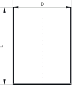 | 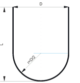 | 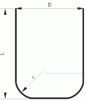 |
| Double radial mill: length, diameter, rounding radius at the cylindrical part, rounding radius of the peak; | Limited double radial mill: length, diameter, rounding radius at the cylindrical part, rounding radius at the peak, height; | Conical mill: length, diameter, rounding radius at the cylindrical part, rounding radius of the peak, angle; |
| 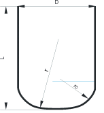 | 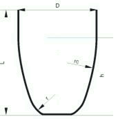 | 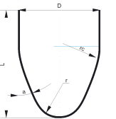 |
| Limited conical mill: length, diameter, rounding radius at the cylindrical part, rounding radius at the peak, angle, height; | Engraver: length, diameter, angle, height, peak diameter; | Drill: length, diameter, grinding angle; |
| 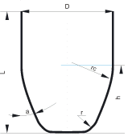 | 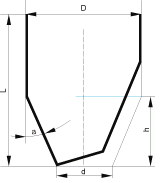 | 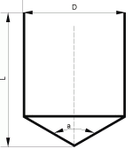 |
| Center drill: | Undercut mill: | Two stage drill: |
|  | 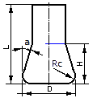 | 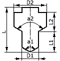 |
| Threading mill: | Shaped tool: |   |
| 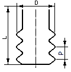 | 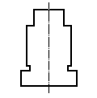 |   |

Besides the parameters that describe the shape of the mill, the user can also define for the tool:

- linear dimensions assignment units (millimeters or inches);
- rotation direction (CW or CCW);
- number of teeth;
- material;
- durability (in hours).

The NC program can be calculated for the end or the central tool programmed point. The end-programmed point implies a point on the tool rotation axis with the Z coordinate equal to the very bottom cutting point of the tool. The central programmed point – is the point on the tool axis with the Z coordinate equal to the top edge level of the profiled part of the tool (or the bottom edge of the cylindrical part).

Mill parameters can be defined on the [Tool page](201.md).
