# Mill 用の工具

フライス加工では、刃先形状やそれを定義するパラメータが異なるいろいろな種類の工具に対応して、ツールパスが計算されます。フライス加工においては、刃先形状およびその定義パラメータが異なる各種工具に対応して、ツールパスが計算されます。

| <strong>フラットエンドミル：</strong> 長さ、直径 | <strong>ボールエンドミル：</strong> 長さ、直径 | <strong>ラジアスエンドミル：</strong> 長さ、直径、コーナー半径 |
|---|---|---|
| 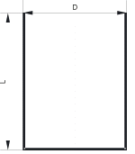 | 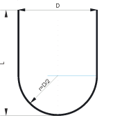 | 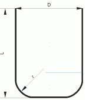 |
| <strong>バレルエンドミル:</strong> 長さ、直径、円筒部のコーナー半径、ピークのコーナー半径 | <strong>制限型バレルエンドミル：</strong> 長さ、直径、円筒部のコーナー半径、先端のコーナー半径、高さ | <strong>テーパーボールエンドミル：</strong> 長さ、直径、円筒部のコーナー半径、ピークのコーナー半径、角度 |
| 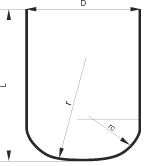 | 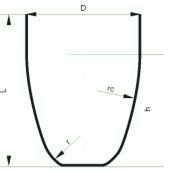 | 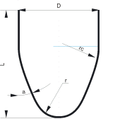 |
| <strong>テーパーエンドミル：</strong> 長さ、直径、円筒部のコーナー半径、先端のコーナー半径、角度、高さ | <strong>彫刻用エンドミル：</strong> 長さ、直径、角度、高さ、ピーク直径 | <strong>ドリル：</strong> 長さ、直径、研削角度 |
| 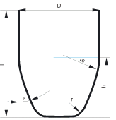 | 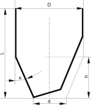 | 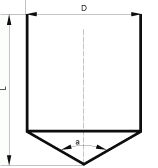 |
| <strong>センタードリル：</strong> | <strong>アンダーカットミル：</strong> | <strong>二段階ドリル：</strong> |
|  | 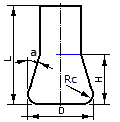 | 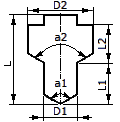 |
| <strong>ねじ切りミル：</strong> | <strong>カスタム工具：</strong> |   |
| 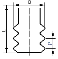 | 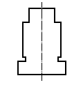 |   |

ミルの形状を記述するパラメーターの他に、ユーザーは工具を定義することができます。

- 線形寸法の割り当て単位（ミリメートルまたはインチ）
- 回転方向（正転、または反転）
- 刃の数
- 素材
- 耐久時間（h）

NCプログラムは、工具の先端点または中心プログラム点のいずれかを基準として計算することができます。先端プログラム点とは、工具の回転軸上にあり、Z座標が工具の最も下側の切削点（最下端）に一致する点を指します。一方、中心プログラム点とは、工具軸上にあり、Z座標が工具のプロファイル部の上端高さ（または円筒部の下端）に一致する点を指します。

ミル（エンドミル）のパラメータは、[工具ページ](201.md)で定義することができます。
