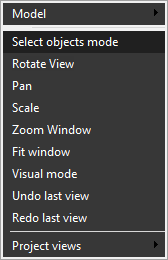

# Objects selection mode

Enable the "Select Objects Mode" option in the drop-down menu of the viewport to activate object selection in the graphical window (this mode is enabled by default). The mouse pointer will change to its usual form. After that, objects can be selected with the mouse cursor in the graphical window. When you move the pointer over the screen, the object beneath it will be highlighted if it can be selected. A [<strong>Left Mouse Button</strong>] click will select the highlighted object.

See the [Objects selection](10.md) topic for more advanced methods of selecting objects from the screen.
