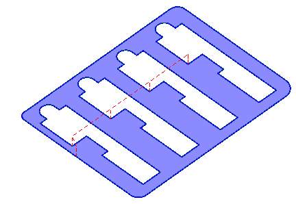
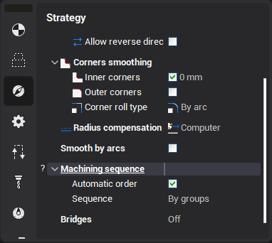
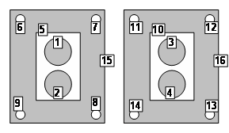
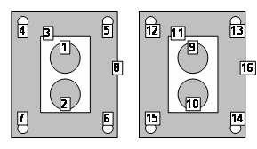
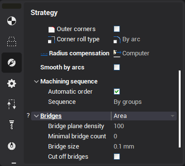
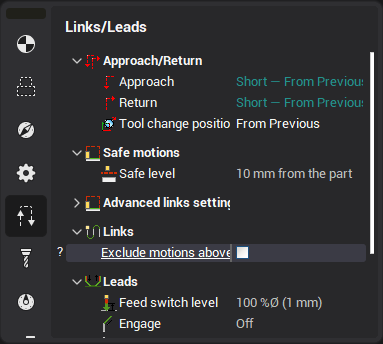

# Jet cutting

The operation is intended to carve the details from the sheet workpiece. The contours of the detail are defined by the curves projections.

The main differences from the [2D contouring](404.md) is: the machining order, the definition bridges and the step over strategy. At the first the inner contours are machined. The outer contour is always machined at the last. The reason of this rule is the next. In the outer contour is machined at the first then it is impossible to carve the inner holes because the detail is not fixed yet.

Use the panel below to define the machining order. The panel is located on the **Strategy** page of the parameters window.

If the option is ticked then the contours with the maximal nesting is machined at the first. The contours with the progressively less nesting are machined at the nest. And the outer contours are machined at the last.

If the option is off then the machining is performed by groups. The contours are machined from with the maximal nesting ones to the outer ones. After that the next group is machined. This machining has not much idle motions.

Every model item (contours) has the machining parameters. The contour can be machined from the left or from the right side. It is possible to set the tool.

Every object can have its own machining method: either the tool center passes along the contour or by touching it with the left or right of the tool. If the contour is machined from right or left, then it is possible to define an additional stock for it. Positive stock is laid off towards machining. If the center of the mill follows the contour, then the stock value will be ignored, for it is impossible to define exactly which side the additional stock should be laid off.

If in the operation there is a [workpiece](738.md) or [restricted areas](10283.md) that have been defined, only those areas of the defined contours will be machined, which lie within the workpiece and outside the restricted areas. If neither a workpiece nor restricted areas are defined, then the system will machine all the defined contours without any limitations.

The operation tool is the cylindrical milling cutter or the jet. It is assumed that the tool length is unbounded. So the machining levels ([top](10153.md), [bottom](10153.md) and [safe levels](100117.md)) are not defined.

If the operation is performed using a [local coordinate system](726.md) or if using a [swivel head](260.md) then the system performs machining using the XY plane of the local coordinate system, and all work passes are consequently parallel to the XY plane of the local coordinate system.

The start point for machining an open curve corresponds to its first or last point (depending on the settings used on the **Model** page and **Inverse** tick, and also the **Allow reverse direction** setting). For closed curves, if the initial point has not been defined on the **Model** page, approach to the first machining point is performed to an external corner or to the longest section automatically, to optimize the tool movements.

When the joining of the resulting toolpaths is calculated, the approach type selected will be added at the beginning of each toolpath and the retraction type at the end. The toolpath joining sequence depends on a combination of the settings of: curve/offset, compensation.

If **Allow reverse direction** is selected, then the cutting order will be set with regard to the **Idling Minimization** setting. The side of contour machining will not change. Otherwise the contours are machined in the order that they appear on the **Model** page. It is possible to define a start point for each of the profiles being machined.

Modes of definition of quantity of bridges:

- **None** – a mode of processing without bridges.
- **Count** – is defined concrete quantity of bridges. The equal quantity of bridges for all curves (for not closed curves a quantity of bridges on 1 less) will turn out.
- `Length (L)` – quantity of bridges is defined as length of a curve divided into the size specified in parameter **C** (for not closed curves a quantity of bridges on 1 less). The quantity of bridges for each curve varies proportionally to its length.
- `Area (A)` – quantity of bridges is defined as the curve area divided into the size specified in parameter **C** (the opened curves are processed without bridges). The quantity of bridges for each curve varies proportionally its areas.

Parameter of **Minimal count** defines is minimum possible quantity of bridges for a separate curve. If under settlement formulas the quantity of bridges turns out smaller the quantity of bridges is accepting equal to parameter of **Minimal count**.

Parameter the **Bridge size** defines length of a bridge (it is calculate along a curve).

The flag a **Cut off bridges** allows to leave bridges and to process them after processing of all curves. At the established flag after processing of curves the command an additional stop (**OPSTOP**) will be deduced, then will be made machining of bridges.

**Exclude motion above machining parts** establishes how to carry out transitions between contours. At the switched off strategy transitions will be made at safe level on the shortest distance between points. At included transitions are made so that the tool did not pass over contours already cut out earlier.

