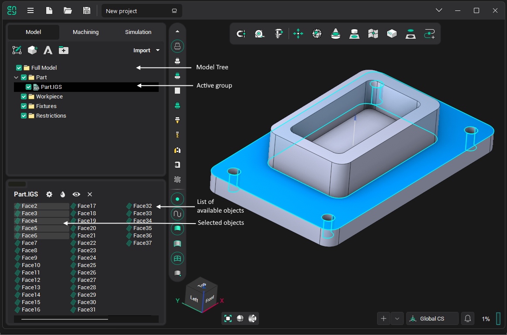

# Geometrical model structure

A geometrical model in CAM system is represented as a tree of folders. Different geometrical objects are grouped in the folders. A working with the geometrical model structure is similar to the working with the files structure which is used in the Windows operating system.

<em>Note: In keeping with most file systems, all objects inside one group must have different names. The presence of several objects with the same name is not allowed.</em>

Most functions for the model editing are found in the geometrical model structure window. When creating a new project, the main folders of the geometrical model are generated automatically. **Full Model** is contained inside these predefined folders: **Part**, **Workpiece**, **Fixtures**.

The **Part** folder is the produced part for the full machining sequence by default. Therefore, it is recommended to import and transfer into the model group those geometrical objects, which define the final produced part.

The freeform workpiece model should be placed in the **Workpiece** folder. If using simple-form workpieces (box etc.), this folder should be left empty.

The **Fixtures** folder is aimed for models of clamps, supports, vices and other machining fixtures and equipments.
