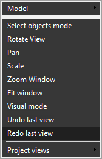

# Redo view

The <strong>Redo View</strong> feature allows the user to restore the parameters of the active viewport (scale, visualization vector, etc.) to the state that was previously discarded by the [Undo view](358.md) feature. Use the <strong>pop-up menu</strong> of the graphic window to activate it.

