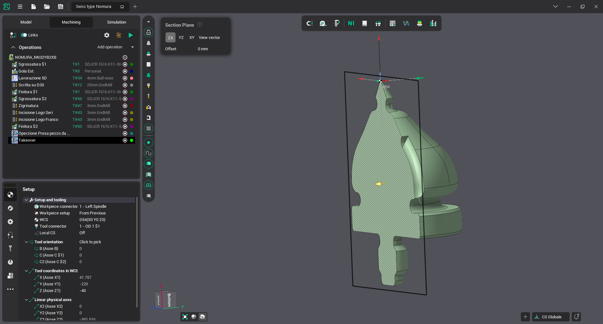

# Section plane

The Section  button enables (or disables) a special mode for displaying the internal structure of an object. When turned on, an infinite plane is created, at the intersection with which the cut-off part is marked with bar lines.

If the section plane is selected as the active object, then its <strong>settings</strong> will be available in the upper-left corner of the scene.

- The <strong>[ZX, YZ, X Y, Vector view]</strong> buttons allow you to select the direction of the section along the base axis <strong>[ZX] [YZ] [XY]</strong> or along the view vector <strong>[Vector view]</strong>.
- The <strong>[Offset]</strong> field shows the offset of the section plane from the origin. You can change the value either by specifying it directly in the field itself, or by moving the <em>slider</em>.

It is also possible to build a cross section on the first <strong>selected face</strong>. To do this, select the face and click on the "Section" button.
