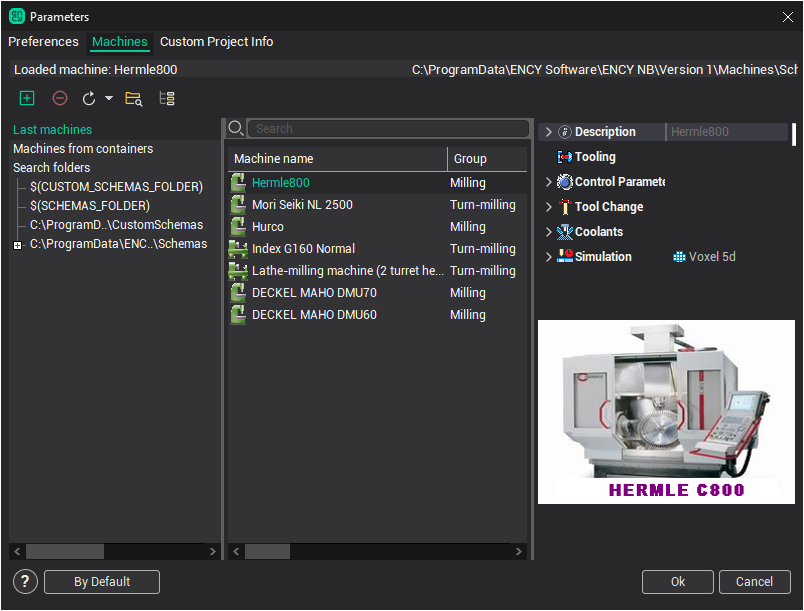

# Selection of a machine and its parameters definition

The first step of the working process after new project creation is selection of an appropriate machine. The type of the machine and its parameters define the list of available operations, the operations capabilities, the default parameters, as well as the subsequent behavior of the system. For example, if a lathe machine is selected, then only turn operations are available, for a mill machine there are only mill operations available, while for a mill-turn center are both turn and mill operations available. Selecting a five-axis mill machine makes it possible to indicate the position of the rotary head in a number of 3D operations, and so on.

To change a machine, you need to select the root node in the machining tree, then press the **Parameters** button.

The above shown dialog will appear. On the left side of this window is the list of folders where system will search machine files (they are united in Search folders group). And three additional groups are show also at the top:

- Last 30 machines. The list of 30 machines recently used on the computer, sorted by date of last use (after the first installation on a new PC it contains machines which defined by the supplier of the program).
- Top 30 machines. List of the most frequently used machines on the computer, sorted by frequency of use (after the first installation on a new PC it contains machines which defined by the supplier of the program).
- <strong>Recent projects</strong>. The list of several last opened projects. They can contain machines, and you can select any of them.

When you select one of the groups or folders in the left list the middle panel of window will contain the machines that are in this group. To set the desired machine simply select one of the machines in the list and click "Ok". When you select a particular machine on the right side of the window shows its properties and image.

At the top is a toolbar with buttons to manage the folders and lists.

-  ⁣ – It allows you to add a folder to the list of search paths. After pressing the button the standard folder selection dialog will appear. You can add a folder where you store all your machines.
-  ⁣ – removes the selected folder from the search paths.
-  ⁣ – search for machines' files in the specified folders and update the list. The same procedure is performed automatically when you open this window.
-  ⁣ – opens the folder of selected machine or selected folder in Windows explorer.
-  ⁣ – expands a folder in the left pane, in which is machine selected in the right panel. Allows you to quickly determine where the file of the machine.

By clicking on the Cancel button the window closes, and all the actions made by a list of machines and the current machine will not be saved.

Most parameters of a selected machine are shown in the properties' inspector in "read only" mode. Some basic properties are listed below.

The **Machine name**, **NC system name**, **Developer** and **Commentary** fields are filled by the machine scheme developer.

The **Postprocessor file** field specifies the name of the postprocessor, which will be used to generate CNC code by default.

The **Interpreter file** field specifies the name of the interpreter, which will be used to [Simulation of machining by NC program](10291.md).

In the **Tool library** field one enters the name of a tool library which the tools for operations will be selected from. This library is used both by automatic tool selection and by defining the tool manually via the operations parameters window.

The group called **Control parameters** contains settings for a used control. Here **Tolerance** (Digits) determines the number of digits after decimal point to output in CLDATA commands. Furthermore, a generated toolpath will not contain tool movements shorter than the specified tolerance. If the **Use arcs** box is unchecked then a generated tool path will contain only linear movements. If the box is checked, then arcs in selected planes will be generated, but only those, whose length is greater than the specified **Minimal arc length**, and whose radius is less than the specified **Maximal arc radius**. All other arcs will be approximated with lines.

The fields from **Tool Change** group contain coordinates of the appropriate points that will be used by tool path calculation.

The **Scheme section** defines the configuration of the used machine as well as availability of machine components such as index tables, rotary heads and other.

A machine is described as a tree of components, moving relative to each other. The root node **Scheme** corresponds to the machine base. The machine elements mounted direct on the base are listed under this node. Each node can contain sub nodes – the components, mounted on and moving relative to the parent. The leaf nodes of the tree have to be either a workpiece or a cutting tool. The way and direction the component moves is described in the fields **Axis Type** and **Direction**. The axis type can be either linear or rotary. For rotary axes the **Direction** defines orientation of the revolution axis.

The **Address** field specifies a prefix, by which the component is addressed in an NC program. The **Min** and **Max** fields bound ranges of available element movements. The **Point** field defines coordinates of the point in the machine coordinate system which the node axis passes through.

The distributive of system has an extensive range of machines and robots of the various groups. If none of the available machines doesn't suit your needs, turn to your dealer or to the [support team](811.md) for a help.

The machine configuration is stored in a specific XML files. They can refer to 3D models of machine components, which are usually located in separate files *.osd or *.stl, as well as auxiliary *.xml and *.supplement files in the same folder as the main machine file. Sometimes files of the machine can be placed inside the encrypted zip-archive with the extension *.stfc or inside project *.stcp files.
