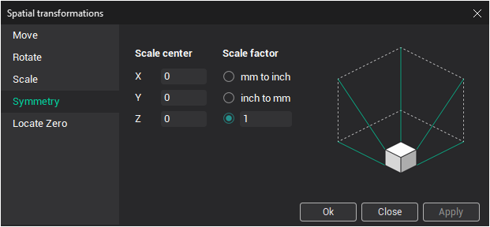

# Tool path spatial transformations

Click the right mouse button on the operation and select the **Transform tool path** item from the context menu. The opened dialog matches to the [model transformation](116.md) dialog.

The type of the spatial transformation is selected by the bookmark:

- **Move** bookmark allows to define the linear move the tool path by three axis;
- **Rotate** bookmark allows to rotate the tool path around Z axis;
- **Symmetry** bookmark allows to make the symmetry transformation relative any vertical plane;
- **Scale** bookmark allows to perform evenly and unevenly scaling of tool path;
- **Locate Zero** bookmark allows to move the tool path using the dimensions of toolpath.
