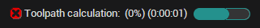

# Process indicator

The <strong>Process indicator</strong> runs when the system performs lengthy operations, such as geometrical model import, toolpath calculation, machining simulation, etc. Left-clicking on the indicator cancels these operations, but only after a confirmation prompt.

The <strong>Process indicator</strong> is located at the bottom of the main window.

