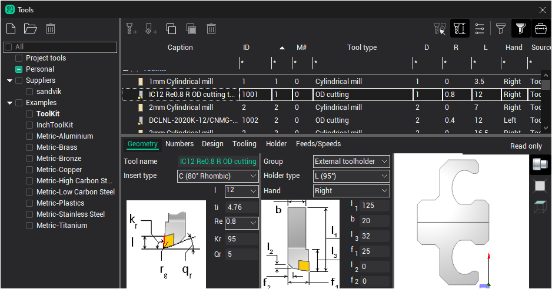
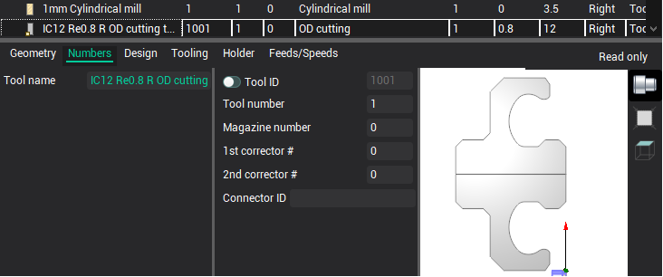
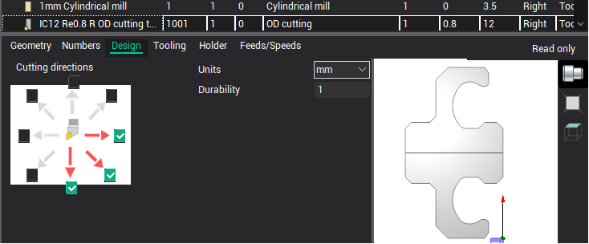
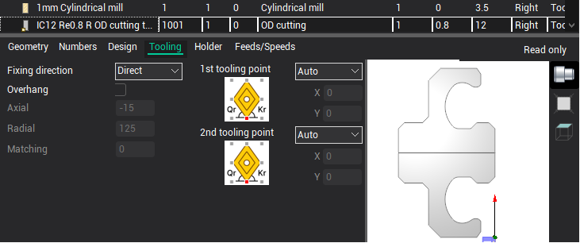
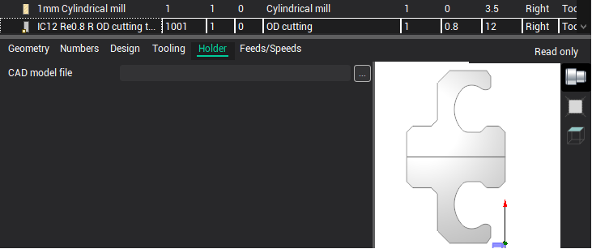
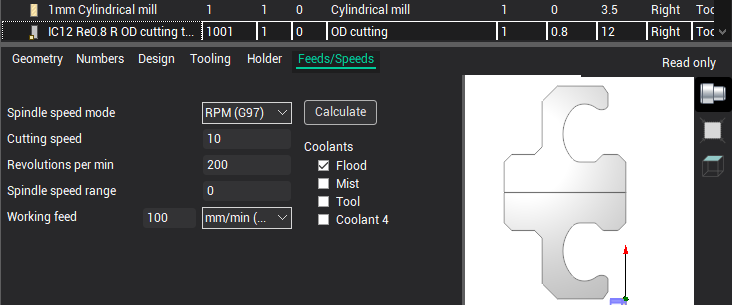

# Turn tool editing

When you select a turning tool in the [Tools window](38.md) a panel with its properties is displayed at the bottom of the window, as shown in the figure above.

Properties on the panel are divided into several tabs.

The Geometry tab displays the main geometric dimensions of the insert and holder, as well as the type of insert, type of holder, tool name. The composition of properties varies depending on the selected types.

The left panel shows all the main parameters that relate to the insert: type, geometric parameters, taking into account the characteristics of each group of inserts. Inserts compatible with the holder are marked in black, and non-compatible inserts are shown in gray. When choosing an insert type that is not compatible with the current holder, a compatible holder will automatically be selected. In order to specify an insert of any type, it is necessary to select the insert type Custom. This insert is compatible with any holder.

The right panel shows all the main parameters related to the holder: type, geometric parameters with regard to the group, direction. As with inserts, incompatible types are drawn in gray.

On the Numbers page, the tool identifier properties are displayed.

- ID - unique tool identifier independent of its location on the machine.
- Tool number - tool number on the machine. Usually corresponds to the position number in which the tool is fixed on the machine. It can change automatically on turret machines when changing the connector of the machine (the position of the turret head) in the property inspector.
- The tool magazine number is used if there are more than one magazines on the machine.
- Corrector numbers - record numbers corresponding to the tool in the table of tool offsets on the real machine.

The following parameters are listed on the Design page.

- Permissible cutting directions.
- Tool units (mm or inch).
- Tool durability in minutes.

The Tooling tab contains such parameters.

- The tool fixing direction in the turret block - direct or inverted.
- Tool overhang - distance from tool fixing point in spindle to tool tip. If the tick is off, the overhang is calculated automatically according to the dimensions of the tool.
- First tooling point - point on the tool, the movement of which is defined by the G-code relative to zero of the part.
- Second tooling point - used with some types of tools to ensure that the G-code is independent of the size of the tool.

The Holder page allows you to specify the name of the CAD model file. The button opens a standard file selection window. You can specify files in the format *.stl and *.osd. Sets the 3D model of the holder for visualization and collision control during simulation.

On the Feeds/Speeds tab you can edit such parameters as

- Spindle rotation mode: constant revolutions or constant surface speed.
- Cutting speed.
- Spindle revolutions.
- Spindle speed range.
- Spindle rotation direction.
- The value and dimension of the working feed.
- Enabled cooling tubes.

