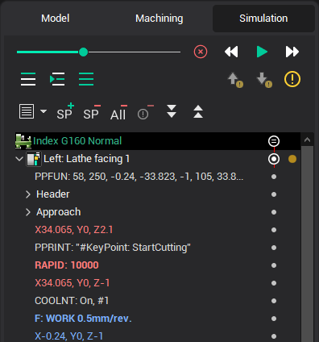

# The structure of the tool path

The simulation mode gives the access to the tool path (CLDATA) of each operation. If the operation is calculated then the calculated result is represented by the sequence of the CLDATA commands. The CLDATA commands are united into the hierarchical structure that is organized corresponding to the features of the concrete operation type.

For example, the tool path of the [plane rough operation](735.md) consists of the levels; every level consists of the strings; and the string consists of the elementary CLDATA commands like **GOTO** etc. Therefore, the complicated tool path can be examined by logical part, analyzed and edited if necessary. For example, the tool path of the plane rough operation consists of the levels; every level consists of the strings; and the string consists of the elementary CLDATA commands like **GOTO** etc. Therefore, the complicated tool path can be examined by logical part, analyzed and edited if necessary.
