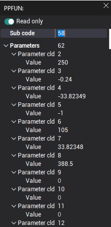
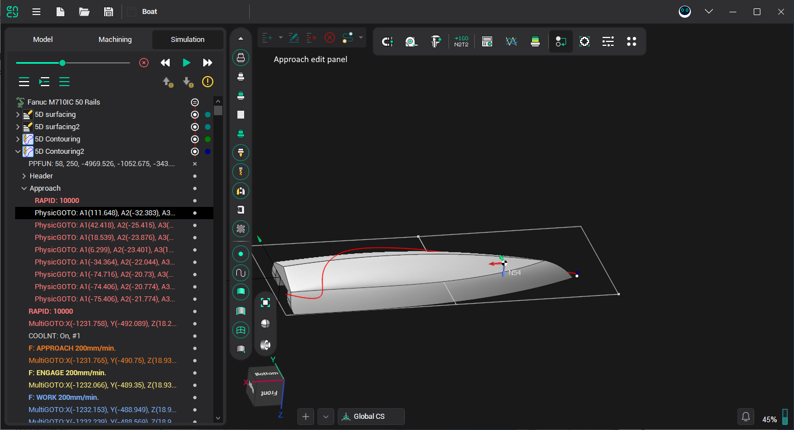
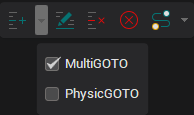
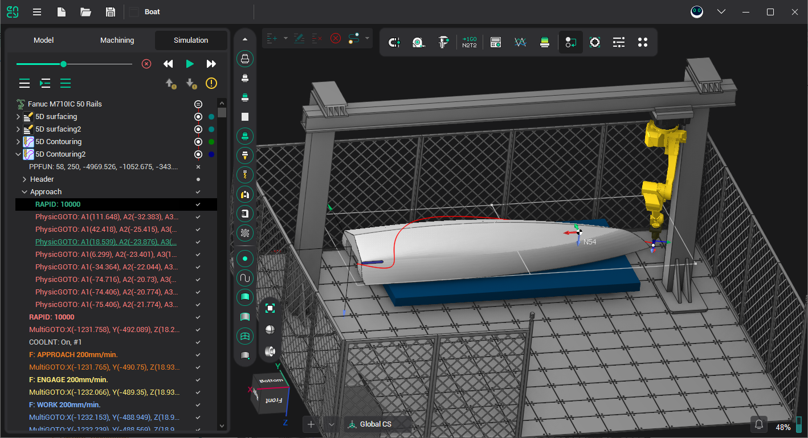

# Tool path editing

There is the possibility to edit the sequence of the CLDATA commands. The tool path re-calculation resets all changes.

The selected node of the tool path can be deleted, copied, or cut into the clipboard by the context menu or by the standard keys:

- [Del] – deletes the current node of the tool path tree;
- [Ctrl+X] – cuts the current node of the tool path tree into the clipboard;
- [Ctrl+C] – copy the current node of the tool path tree into the clipboard;
- [Ctrl+V] – inserts the command from the clipboard before the current node.

Double click on the node or select **Edit** item from the context menu to edit the parameters of the selected CLDATA command. The opened dialog is not modal i.e. there is no need to close the dialog box to edit other node. The dialog caption is a type of the edited node. The list of the parameters depends on the node type. To start editing parameters you must turn off read only mode.

<strong>Approach/Return editing</strong>

If the user selected the 'Approach' or 'Return' section inside tool path tree, additional panel becomes visible (see screenshot). On this panel the following buttons are available for more convenient editing of approach or return section (buttons are listed from left to right):

- Insert current state – this command inserts current machine state as a node of tool path tree. The state is inserted before current selected node of the tree.

Dropdown menu can be used to change type of inserted node (PhysicGOTO or MultiGOTO).

- Edit current state – press this button to start editing interactively current selected state of tool path tree. The coordinates of selected node are synchronized with current machine state. To end interactive editing process press this button again.
- Delete current state – deletes the current node of the tool path tree.
- Clear approach/return – clears all commands inside approach or return section except last (which corresponds to the end state of approach/return).
- Calculate with Motion Planner - build trajectory of approach or return automatically using one of the algorithms for motion planning with excluding collisions between nodes of machine. Several parameters of the motion planner, such as time limit for calculation of path, can be specified in the drop-down menu.

On this screenshot whole approach trajectory was generated automatically using motion planner. If the generated trajectory is not satisfactory interactive editing can be used to fix the approach/return path.
