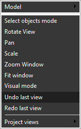

# Undo view

The <strong>Undo View</strong> feature allows the user to restore the parameters of the active viewport (scale, visualization vector, etc.) to their previous state. Use the pop-up menu of the graphic window to activate it.

