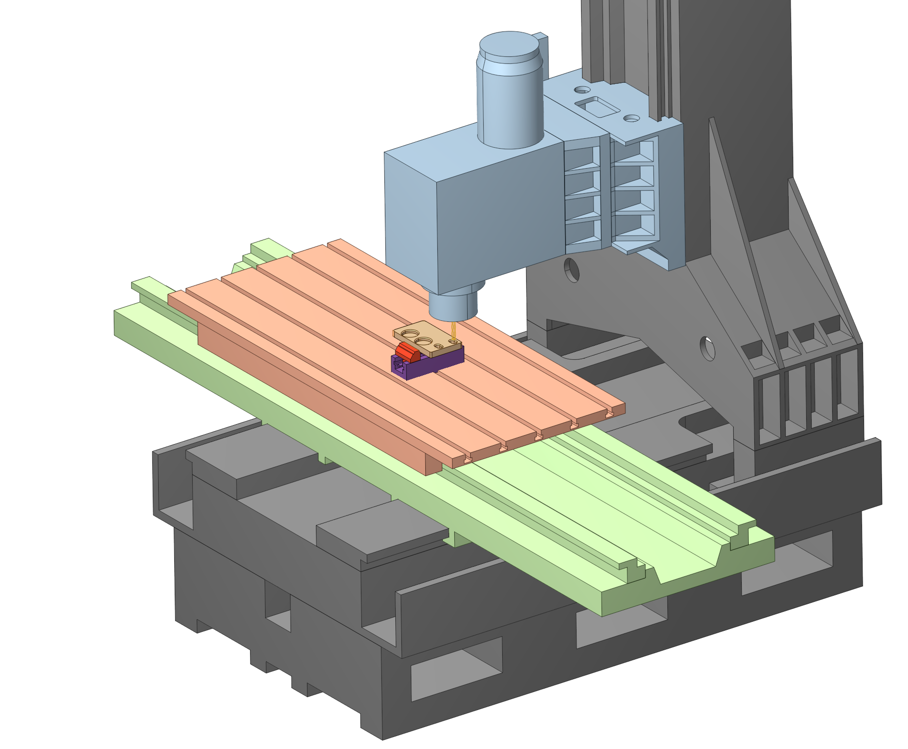
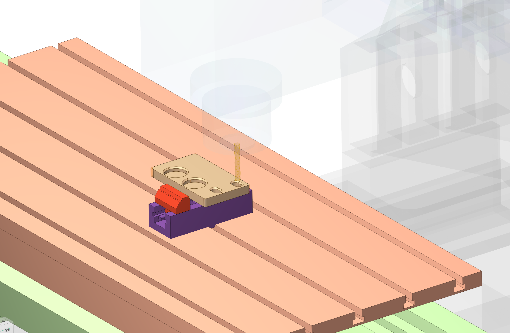
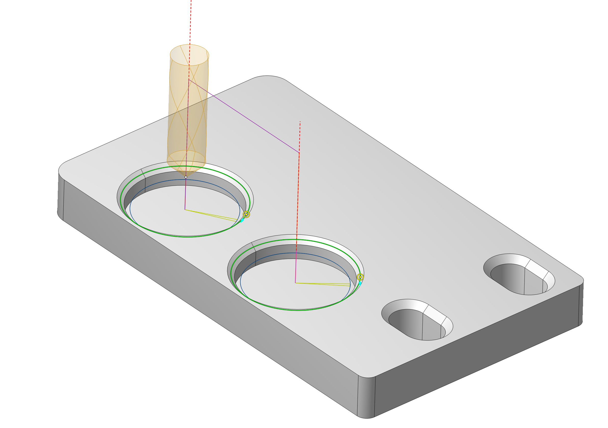
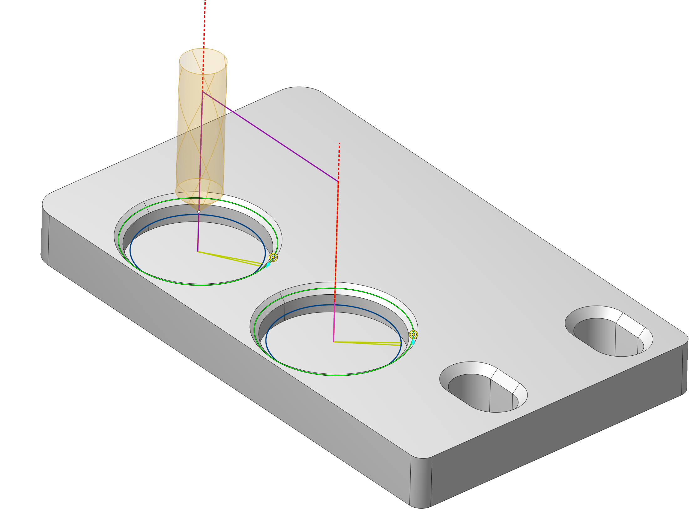
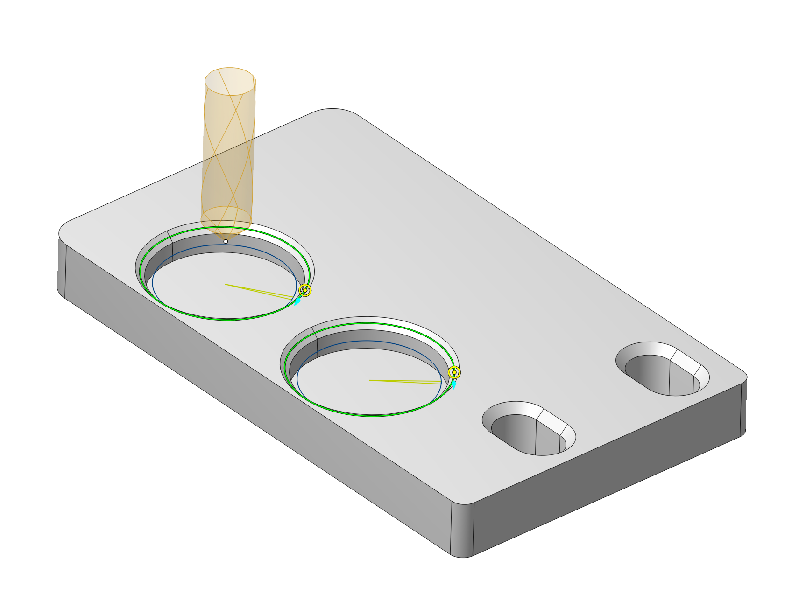
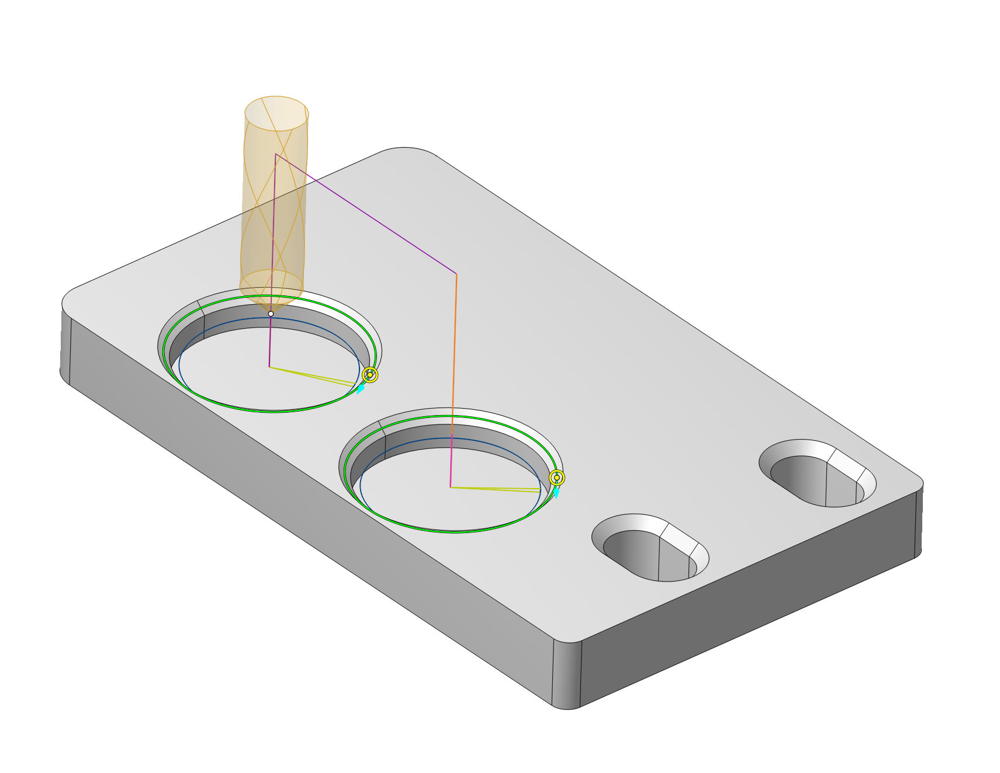
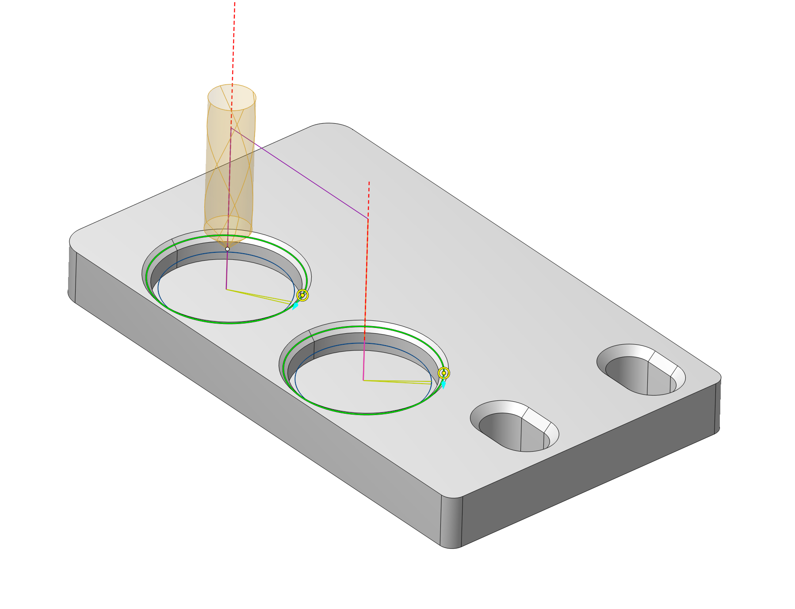

# Visibility panel

## Application area:

The **Visibility panel** controls which objects are shown in the **3D view** and how they are displayed. Visibility and display settings are defined separately for the **Model**, **Machining**, and **Simulation** working modes.

The panel provides settings for the **Geometry model**, **Part**, **Job assignment**, **Workpiece**, **Machining result**, **Holder**, **Tool**, **Fixtures**, **Machine**, and **Toolpath**.

## Opening display settings:

- **Left mouse button.** Click an object button to switch its visibility **ON** or **OFF**.
- **Right mouse button.** Click the same button to open its display settings popup. The available controls depend on the object type.

## Common display settings:

The following controls are shared by several object types. Their availability is listed in the next section; **Machine** and **Toolpath** have separate sets of controls.

**Color.** Sets the display color. Click the color swatch to select a color. For **Geometry model**, **Machining result**, and **Tool**, the popup also includes a switch for enabling the selected color.

**Material.** Selects the surface appearance used to display the object. The material list contains **Default**, **Polished**, **Gunmetal**, **Mirror**, **Plastic**, **Matte**, **Paint**, **Ceramic**, **Industrial**, and **Satin**. This setting controls visual appearance, rather than the workpiece material used for machining calculations.

**Transparent.** Switches transparent display **ON** or **OFF**. Adjust the transparency level with the slider or enter a percentage in the numeric field.

**Display mode.** Selects wireframe, shaded, or shaded-with-edges display. **Default** follows the display mode selected on the visualization control toolbar.

**Turn mode.** Selects how bodies of revolution are displayed: **3D**, **3/4**, **1/2**, or **2D**. **Default** follows the turn mode selected on the visualization control toolbar.

**Line width.** Adjusts the width of displayed edges and outlines.

**Motionless.** Keeps the corresponding object visually stationary while the other components move relative to it. This changes the reference used to display motion in the **3D view**.

## Settings by object type:

All object types in the table provide **Material**, **Transparent**, and **Display mode**. The table lists the availability of the other common controls.

| Object | Color | Turn mode | Line width | Motionless |
|---|---|---|---|---|
| [**Geometry model**](717.md) | Switch and swatch | Available | Available | — |
| [**Part**](330.md) | Swatch | Available | Available | Available |
| [**Job assignment**](301.md) | Swatch | Available | — | — |
| [**Workpiece**](738.md) | Swatch | Available | Available | Available |
| [**Machining result**](322.md) | Switch and swatch | Available | Available | Available |
| **Holder** | Swatch | — | Available | — |
| [**Tool**](37.md) | Switch and swatch | Available | Available | Available |
| [**Fixtures**](10283.md) | — | — | Available | — |

**Restrictions color.** An additional color swatch in the **Job assignment** popup sets the color of restricted machining areas.

**Machining result.** In **Simulation** mode, this button controls the display of the workpiece being machined. In other modes, it controls the machining result of the current operation, or the entire technological process if no operation is selected.

## Machine display settings:

The **Machine** popup provides controls for the appearance and visibility of machine nodes.

**Material.** Selects the surface appearance of the machine, such as **Gunmetal** or **Industrial**.

**Motionless.** Keeps the machine reference visually stationary while other components move relative to it.

**Machine node opacity.** Adjusts the opacity of machine nodes. The current state is shown beside the control, such as **Show all**.

### Machine nodes visibility:

**Machine nodes visibility.** Expands a tree of machine nodes. Expand or collapse branches to access individual components, and use the checkboxes to show or hide them. Hovering over a node highlights the corresponding component in the **3D view**.

**Opacity.** Adjusts the opacity of the selected machine node.

**Colors from schema.** Uses the colors defined in the machine schema for the selected node.

**Custom color.** Sets a custom color for the selected node when the control is available.

### Selection and transparency:

**Snap to machine nodes.** Enables snapping to machine nodes in the **3D view**.

**Click through transparent.** Allows selection through transparent machine components.

**Auto transparency.** Switches automatic transparency of machine components **ON** or **OFF**.

*Automatic transparency reveals the tool and machining area behind machine components.*

**Sensitivity.** Adjusts the sensitivity of automatic transparency.

Interactive positioning of machine nodes is described in **Interactive Machine**. [Details](10009.md)

## Toolpath display settings:

The **Toolpath** popup controls the appearance of the trajectory and which movements are shown.

**Color.** Switches toolpath coloring. The toolpath can be displayed using feed-type colors or a single color.

**Line width.** Adjusts the width of toolpath lines.

*The same toolpath displayed with different line widths.*

**Playback trace.** In **Simulation** mode, selects which portion of the current operation's toolpath is displayed:

- **Current layer.** Displays the current toolpath layer.
- **Full toolpath.** Displays the entire toolpath.
- **From start.** Displays the toolpath from its beginning to the current tool position.
- **To end.** Displays the remaining toolpath from the current tool position to its end.
- **Tail.** Displays a limited toolpath segment near the current tool position.
- **Tail ahead.** Displays a segment ahead of the current tool position.
- **Tail both ways.** Displays segments before and after the current tool position.

The rest of the program remains visible as a ghost layer.

**Toolpath visibility.** Groups the switches for displaying rapid, approach/return, and linking movements. These controls work together with **Playback trace** to determine which movements are visible during simulation.

**Rapid moves.** Shows or hides rapid movements.

**Approach/return moves.** Shows or hides approach and return movements.

**Link moves.** Shows or hides linking movements.

*Toolpath display with different movement visibility settings.*

**Show normals.** Displays direction markers for the tool orientation at toolpath points.

**Show points.** Displays markers at toolpath points.

The point and direction markers follow the selected movement visibility and the displayed portion of the toolpath.

## Saving settings:

The object display settings are saved in the CAM system configuration and restored when the application starts. Each working mode retains its own visibility and display settings.
