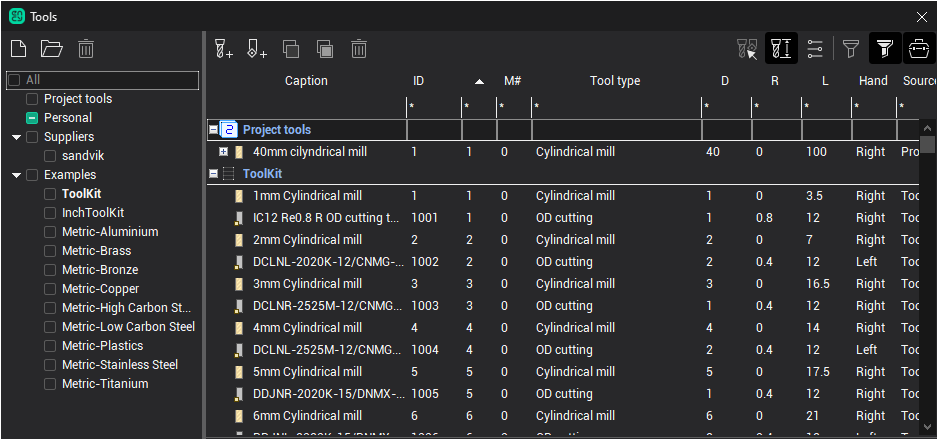
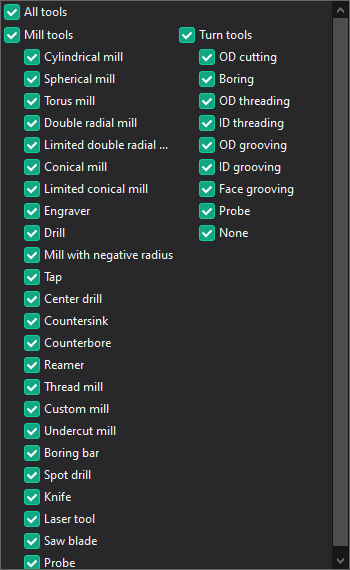
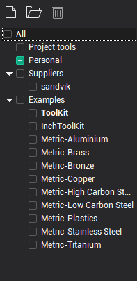
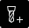
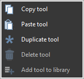
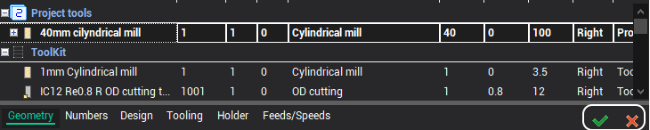
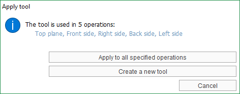

# Tools window

The purpose of the Tools window is to view and edit project tools, operations tools, create and fill tool libraries.

This window can be opened in several different ways:

- when you click the  Tools button on the main toolbar in Machining mode;
- open the operation parameters window on the Tool tab;
- double clicking on the name in the tool column in the list of operations;
- clicking on the tool select button in the property inspector header.

Depending on the method of opening, the appearance may slightly differ (the availability of some buttons changes; the sizes of panels and columns are remembered for each of the window opening modes separately).

In the central part of the window is a list of tools. Each line corresponds to a separate tool. Strings can be nested in each other. At the top level there are always storage of tools (project or library), the second level are tools and at the last nested level are operations tools that use a tool with ID same as the parent tool. Each of them can be edited individually.

Nested operations tools can be dragged from one tool node to another. This allows you to quickly change the tool used by the operation.

The right part of the top toolbar is occupied by filter buttons, with which you can limit the list of visible tools.

-  — show properties of the tool under cursor
-  — turns on the visibility of the columns of the main geometric properties of tools.
-  — turns on the visibility of the cutting condition columns.
-  — makes visible the tools used in project operations.
-  — makes visible tools that are not used in any of the project operations.

In addition, you can adjust the visibility of rows by imposing additional restrictions on the values of parameters that are displayed in each of the columns. To do this, use the topmost row of table filters (with *). You need to click the mouse in the desired cell and enter some value.

For string parameters, the limit is determined by matching characters. For numeric parameters, you can use additional operators to specify the constraint:

- <strong>123</strong> simple numerical value - the lines will be displayed in which this parameter strictly corresponds to the specified value;
- <strong><123</strong> - expression with the "less" operator - the lines in which this parameter is strictly less than the specified value will be displayed;
- <strong><=123</strong> - expression with the "less or equal" operator - the rows will be displayed in which this parameter is less than or equal to the specified value;
- <strong>>123</strong> - expression with the "greater" operator - the lines in which this parameter is strictly greater than the specified value will be displayed;
- ><strong>=123</strong> - expression with the "greater or equal" operator - the lines in which this parameter is greater than or equal to the specified value will be displayed;
- <strong>12..34</strong> or <strong>12:34</strong> - expression with the "range" operator - the lines in which this parameter is included in the specified range of values will be displayed.

The <strong>filter by the type of tool</strong> is specified in a special way. When clicking in the filter cell in the Tool type column an <strong>additional window</strong> appears on the screen. Here you can select the desired tool types with checkmarks.

<strong>Sorting</strong> table rows is controlled by clicking on the desired column header.

The following columns are available.

- <strong>ID</strong> - ID of the tool, independent of the location of the tool on the machine.
- <strong>Caption</strong> - the name of the tool or the name of the operation depending on the type of node.
- <strong>#</strong> - tool number in G code. Usually it corresponds to the number of position in which the tool is attached to the machine. The number in this column can be displayed in red. This means that it is incorrect and conflicts with some other tool that is used in the project. Tools are considered conflicting if they have a different ID, but
  1. have the same tool number, magazine number and corrector number at the same time;
  2. or inserted into one connector of the machine (in one position of the turret).
- <strong>M#</strong> - magazine number, for the case of machine with several tool magazines.
- <strong>Tool type</strong> - indicates the type of machining tool (cylindrical mill, drill, boring tool, etc.)
- <strong>L</strong> - tool overall length.
- <strong>D</strong> - for milling tools, the diameter of the tool; for turning tools, it either does not fill up or is filled with different parameters depending on the tool subtype.
- <strong>R</strong> - key tool radius (different depending on the specific type).
- <strong>F</strong> - working feed.
- <strong>S</strong> - spindle speed.
- <strong>Direction</strong> - spindle rotation direction.
- <strong>Coolant</strong> - set of included cooling piping.

In the left part of the window there is a panel for choosing libraries. The list of tools is always displayed for libraries which are nested in the selected node and which are marked. In addition to the library, a list of tools for the current project can be selected. Favorite library is shown in bold. The Favorite Library is the one that appears first in the list and from which the system tries to automatically select tools when creating operations. Libraries from Suppliers and Examples folders are available in read-only mode.

A more detailed description of the actions that can be performed on libraries using this panel can be found in the [Managing libraries](615.md) chapter.

On the top toolbar focused actions on the tools.

-  — Adding a new milling tool.

-  — Adding a new turning tool.

-  — Copy selected tools to clipboard. Multiple tools for copying can be selected at once.

-  — Paste copied tools from clipboard. Using copy-paste, you can quickly transfer tools from one library to another.

-  — Delete selected tools. Several tools can also be selected for deletion.

From the Popup menu of a tool you can additionally

- Duplicate tool - quick duplicate selected tool.
- Add tool to library - quick add selected tool to the favorite library.

At the bottom of the tool window is a panel for viewing and editing properties. The window is built on the principle of "I'm editing what I see", i.e. editing is always performed for the tool that is in focus in the list. Edited can be any of the tools in list. Right on the panel displays a live preview of the edited tool. In the main graphics window, the model of the selected tool is also drawn in the correct position on the machine.

The list of properties depends on the type of tool. The values for some properties can be displayed in green font. This means that the property has a default value, which depends on the values of other properties. For example, the tool name contains the diameter. Then, when changing the diameter, the name will be updated automatically. To return the property to its default value, you need to delete the entire contents in the edit field using the Delete key on the keyboard.

Properties on the editing panel are divided into several tabs according to the meaning of the information.

- Geometry - the main geometric dimensions of the tool, as well as its type and name.
- Numbers - the tool ID is independent of the machine, the tool number on the machine, the magazine number, the numbers of the correctors.

- Design - Number of teeth, maximum plunging angle, units, tool durability.

- Tooling - tool overhangs are set, as well as the type and location of the adjustment points.

- Holder - You can edit the name and size of the holder, specify the CAD-model file (in stl or osd format). Here you can also call a [dialog to select (and edit) the holder of a milling tool](10341.md) from the library.

- Feeds/Speeds. Here you can set the mode, speed and direction of rotation of the spindle, the work feed and the enabled cooling pipes. If a line with an operation is selected in the tool list, then the cutting conditions of the operation are displayed and edited; if the project or library tool is selected, then the conditions of tool. If the conditions in operation and the conditions in tool are different, then the corresponding caption appears in the header of the panel, as well as buttons that allow them to be synchronized. 

If the operation tool is being edited,

- The  Apply button assigns cutting conditions from the operation to the project tool,

- The  Reset button copies the cutting data from the project tool to the operation.

If a project tool is being edited,

- The  Apply button copies the conditions from the project tool to all operations using this tool.

- The  Reset button copies the cutting conditions from the first operation tool, whose modes are different, to the project tool.

Similar buttons to apply and reset are also available for general tool parameters.

They appear at the top right of the edit panel if the operations tool and the project tool are different from each other (different tools are highlighted in bold in the list). Buttons allow you to easily synchronize project tools and operations, as well as allow you to roll back random or unwanted changes.

If there are several operations using this tool and the parameters of the tool in these operations are different, then after pressing the Apply button, an additional dialog box will be displayed.

The Apply to all specified operations button will copy the tool parameters from the current operation to the project tool, as well as into all operations that use the tool with the same ID.

The Create a new tool button assigns a new ID to the tool of the current operation (it will be generated automatically) and creates a copy of this tool in the global list of project tools. Thus, the connection with copies of the tool in other operations is broken.

Some tools in the list may be read-only, as evidenced by the inscription on the right above the editing panel. This was done, firstly, in order to limit some undesirable work scenarios, for example, accidentally edited the project tool instead of an operation, and after closing the window did not see the changes made, secondly, to be able to roll back random changes.

If the window is opened in the tool selection mode for the current operation, the button "Select tool for the operation" becomes available at the bottom right. When pressed, the tool selected in the list will be applied to the operation.
