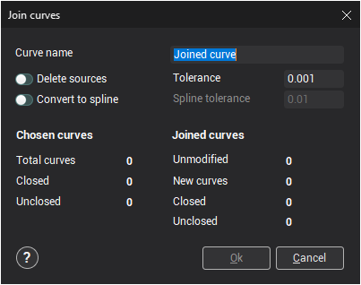

# Join curves

The  button opens the **Join curves** window.

Sometimes, when [importing](109.md) curves, the file contains non-joined curves, but the contour is split into several separate sections. When working with these contours, the separate sections require to join. The curve joining function allows users to obtain a joined curve by linking neighboring curve sections.

- **Curve name** or **Folder name** – name of the new curve or folder. If as the result of curve joining several curves will be obtained, then they will be put into the newly created folder with the name defined in this field. The new curve or group will be created in the currently [active group](1.md).
- **Delete sources** – a tick in this field means that when the joining operation is completed, all source objects will be deleted.
- **Tolerance** – maximum distance between ends of neighboring curves which can be joined. By altering the tolerance value one can achieve the desired result for joining (the ends of imported curves are often not coincident with each other).
- **Convert to spline** - will allow with a given tolerance(by parameter **Spline tolerance**) convert joined curves to spline.

The panel **Chosen curves** shows the number and type of source curves.

- **Total curves** – total number of selected curves.
- **Closed** – number of closed curves.
- **Unclosed** – number of unclosed curves.

The panel **Joined curves** shows the number and type of obtained curves.

- **Unmodified** – number of curves left without modification.
- **New curves** – total number of new curves created.
- **Closed** – number of obtained closed curves.
- **Unclosed** – number of obtained unclosed curves.

When the joining tolerance is changed, the field values in **Joined curves** will be automatically recalculated.

If the result of the defined parameters is correct, then the window should be closed using the **Ok** button. The joined curve or a group of curves will be put into the [active group](1.md). Source curves will be deleted if **Delete sources** was selected.

To cancel performing the joining function, press the **Cancel** button.
