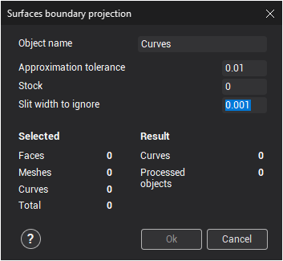
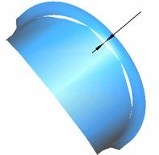
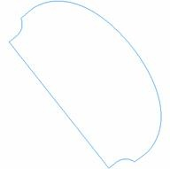

# Surfaces boundary projection

The  button opens the **Surfaces boundary projection** window. The function is used for the construction of outer enveloping projections of the selected surfaces and meshes onto the XY plane of the current [coordinate system](753.md). In addition to surfaces borders the function allow to project ordinary curves on the plane. The curves it creates can be used when assigning parameters for machining operations.

- **Object name** – the name of the resulting curve. If several curves are created as the result of projection, then they will be put into a new group with the name defined in this field. The new curve or group will be created in the currently [active](1.md) group.

- **Approximation tolerance** – maximum outer deviation of the resulting curves from the surface borders. For ordinary curves this value used as approximation tolerance by arcs.
- **Stock** – offset value for the resulting curves away from the surface borders. Positive value gives an outwards offset from the surface, negative – inwards (equivalent to equidistant curve projection). For ordinary curves will built offset on stock value.
- **Slit width to ignore** – maximum value of gaps between surfaces which will be ignored. If surfaces are joined with high accuracy, then the surfaces contour will be projected, if with low – then any gaps between neighboring surfaces will be included in the projected curve.

 

The panel **Selected** displays the type and the number of object selected for the boundary projection.

- **Faces** – number of surfaces selected.
- **Meshes** – number of meshes selected.
- **Curves** – number of curves selected.
- **Total** – total number of geometrical objects selected.

The panel **Result** shows the number of objects selected for the projected boundary operation, and the number of curves that will be created (if the projected objects are very complex, projection calculation may take some time).

- **Curves** – number of obtained curves.
- **Processed objects** – total number of processed objects.

When changing any projection parameters, the values in the **Result** panel will automatically be recalculated.

If the results of the defined parameters is correct, then the window should be closed using the **Ok** button. The boundary projection of the selected objects will be put into the [active group](1.md). To cancel the projection function, press the **Cancel** button.
