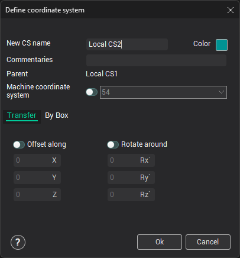
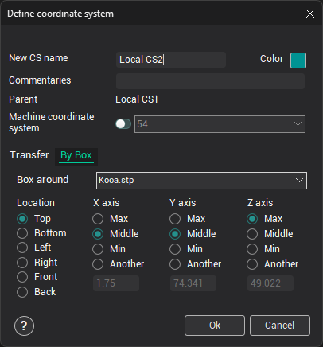
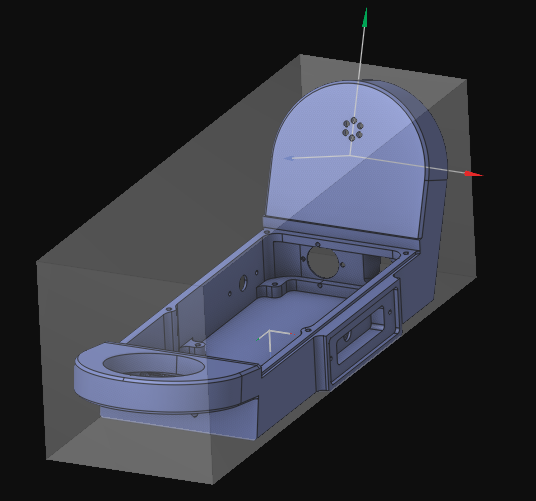

# Creation of the coordinate system via dialogue window

The window for creating a new coordinate system opens by pressing the  menu item on the [coordinate systems panel](753.md). If, at the time of the click, any geometric element is selected, the window does not open, and the [smart CS creation](10007.md) procedure starts instead.

In this window, you assign the New CS name, its Color, and Commentaries.

There are two methods available for defining the position:

1. **Transfer** – All transformations are performed relative to the active coordinate system. The newly created system can be displaced and/or rotated relative to the parent coordinate system.
2. **By Box** – The newly created system is set on the external dimensions of the [group](603.md) selected in the <strong>Box Around</strong> list. In <strong>Location</strong>, select how the coordinate system will be positioned, and provide the origin point. The coordinates of the point on the corresponding axes can be selected as <strong>Max</strong>, <strong>Middle</strong>, or <strong>Min</strong> relative to the box of the group, or in absolute coordinates (<strong>Another</strong>).

All changes will be previewed in the [graphic window](169.md) immediately.

