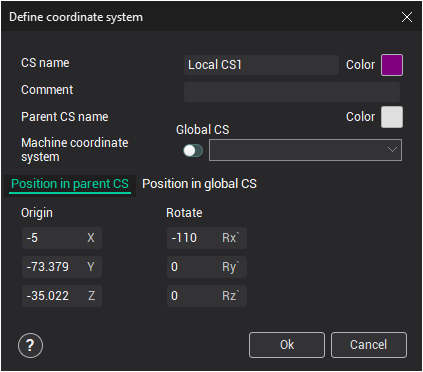

# Changing properties of an existing coordinate system

To open the coordinate system properties window, press the  <strong>Edit active CS...</strong> menu item on the [coordinate systems panel](753.md).

The coordinate system properties window is shown below:

In this window, the <strong>CS name</strong> can be changed, as well as its <strong>Color</strong> and <strong>Comment</strong>.

To move or rotate the coordinate system, define the displacement value for the <strong>X</strong>, <strong>Y</strong>, and <strong>Z</strong> axes or the corresponding rotation angles. These values are relative to the <strong>Parent</strong> or <strong>Global</strong> coordinate system, depending on the active tab.
