# 2D contouring

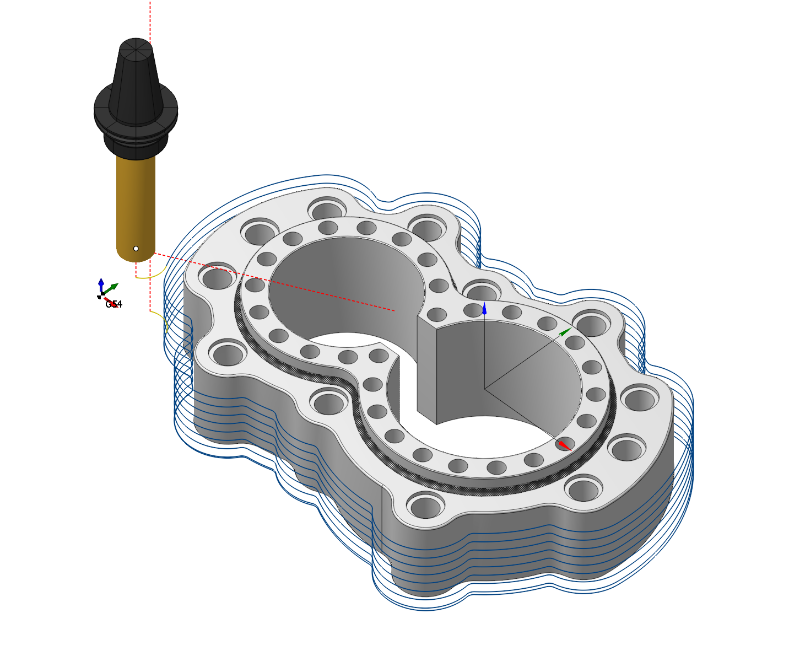

## Application area:

The operation is designed for machining along horizontal contours or curve projections on the horizontal plane, cylinder or figure of revolution. It is also possible machining with the cylindrical and polar interpolation. "Project on part" option using allow to get a complex five-axis toolpath, when orientation of the tool is changing. Operation in conjunction with the "Tool contact point" parameter allows you to easily machine chamfers on the parts. The operation's list of processes could consist of several contours and curve projections. Every object can have its own machining method: either the tool center passes along the contour or by touching it with the left or right of the tool. If the contour is machined from right or left, then it is possible to define an additional stock for it. Positive stock is laid off towards machining. If the center of the mill follows the contour, then the stock value will be ignored, for it is impossible to define exactly which side the additional stock should be laid off.

### Setup:

The <strong>Setup</strong> tab is used to configure the primary parameters of the project. This can involve the positioning of the part on the equipment, the coordinate system of the part, and more. [Details](1022.md)

### Job assignment:

<strong>Base surface.</strong> This is the surface on which the trajectory is constructed according to the curve projected onto it. [Details](10156.md)

<strong>Curve.</strong> Set work order along curve <strong>.</strong> [Details](707.md)

<strong>Pocket.</strong> A typical prismatic or turn-milling part consists of many simple shapes.To simplify this task, we can recognize the parts elements in a 3d model and automatically convert them to basic job assignment items, such as job zones and machining levels. [Details](10154.md)

<strong>Top level.</strong> Specifying the top level by model elements. [Details](10153.md)

<strong>Bottom level.</strong> Specifying the bottom level by model elements. [Details](10153.md)

<strong>Add tabs.</strong> Adds tabs along the contour.[Details](102012.md)

<strong>Properties.</strong> Displays the properties of an element. It is possible to add the stock. You can also call this menu by double clicking on an item in the list.

<strong>Delete.</strong> Removes an item from the list

<strong>Restrictions.</strong> It allows you to restrict areas that should not be machined. [Details](101231.md)

### Strategy:

#### Depth of cut.

The material removed in a single pass along the tool axis between <strong>Top level</strong> and <strong>Bottom level</strong>. By default, it equals % of the cutting tool diameter.

Click here to expand..

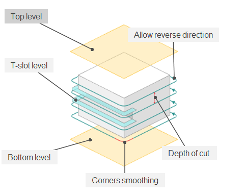

<strong>Top level.</strong> The Top level for machining can be set dynamically or dimensonally. The default is based on the workpiece level.

<strong><strong>Bottom</strong> level.</strong> The Top level for machining can be set dynamically or dimensonally. The default is based on the workpiece level.

<strong>Z cleanup.</strong> The function adds an additional passage in front of the bottom level at a distance specified in the parameter.

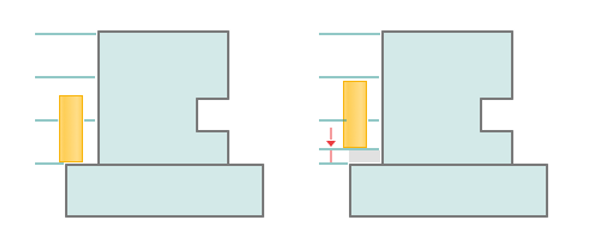

<strong>T-slot level.</strong> Designed for <strong>undercut tools</strong>.

The first (top) pass is made at a distance of the tool height from the <strong>top level</strong>.

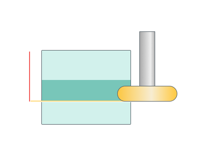 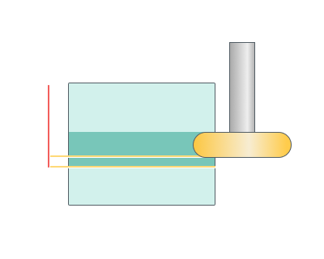

If the thickness of our tool is greater than the distance between the top and bottom levels, then the error will appear: Tool size is more than T-slot. When activating this option you need to check this condition.

#### Helical machining.

Machining of a contour using a helical motion.

Click here to expand..

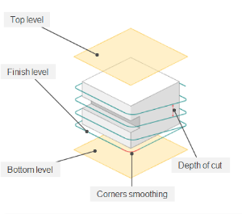

<strong>Adjust step. <strong>If enabled:</strong></strong> (by default) - adjusts the step to ensure the number of revolutions is an integer. If it's possible to round to a smaller or larger number of revolutions within the Max Step Deviation %, it adjusts the step for this specific number of revolutions. However, if the step would deviate beyond the acceptable deviation percentage, it completes the majority of revolutions with the initially set user step, and the first revolution is completed with a step that fulfills the remaining portion to complete a full revolution.

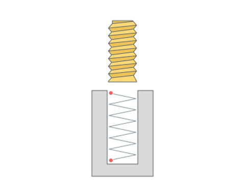

<strong>If disabled:</strong> maintains the step.

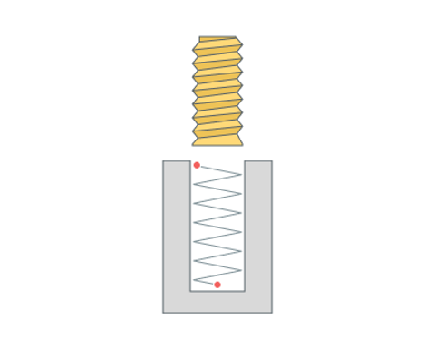

<strong>Max step deviation.</strong> The allowable deviation of the step when <strong>Adjust step</strong> is enabled. By default, it's set to 10%

<strong>Finish level.</strong> At the end of the helical machining, a final pass at full depth is added to remove any remaining 'ski-ramp'.

<strong>Smooth by radius.</strong> When choosing a <strong>Helical machining</strong>, a transition is created in the area where the slope of the spiral intersects with a flat area.

.png) .png)

#### Roughining passes.

Toolpath is offset in plane by the 'Roughing passes' thickness amount. Additional passes are added to the contour by the value specified in the parameters with the specified number of steps.

Click here to expand..

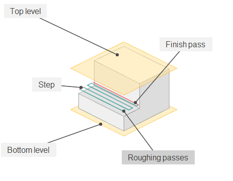

<strong>Step.</strong> Step between roughing passes.

#### Finish pass.

The contour specified in the <strong>Job assignment</strong> becomes finishing. An additional roughing pass is added to it at a distance specified in the parameter.

Click here to expand..

 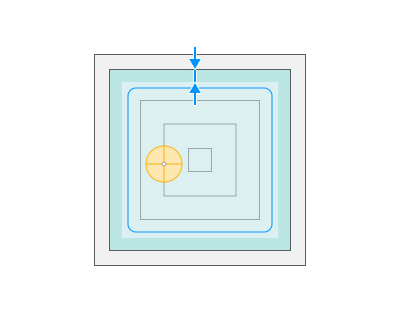

<strong>At the bottom level only.</strong> The finish cut is only applied at final depth.

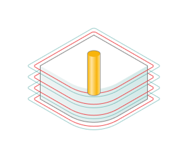 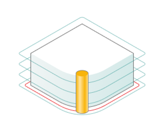

#### Tool contact point.

Tool Contact Point (TCP) is a specific location on a cutting tool that defines the primary interaction point between the tool and the workpiece surface or geometric entities during machining operations.

The parameters of this group are the same as in the <strong>5D Surfacing operation</strong>. [Details.](10135.md)

#### Sorting.

Controls the sequence of toolpath passes during the surface machining.

Click here to expand..

<strong>By cavities.</strong> All levels of the first profile are machined first. After that all levels of the next profile are machined.

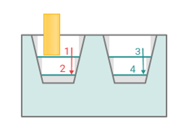

<strong>By layers.</strong> The first layer of all profiles is machined in the beginning. After that the next layer is machined.

<strong>Machining direction.</strong> Determines where to start processing.

<strong>Downwards.</strong>

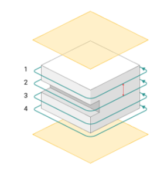

<strong>Upwards.</strong>

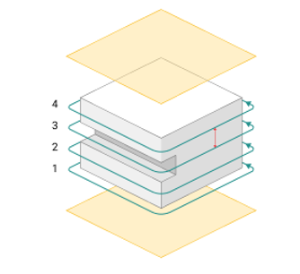

<strong>Idle moves minimization.</strong> The order of the profiles machining is sorted to minimize the idle motions.

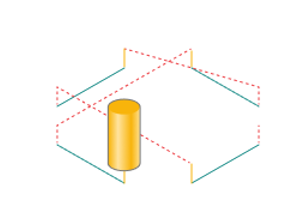 

<strong>Allow reverse direction.</strong> The direction of machining (climb / conventional) alternates at each level.

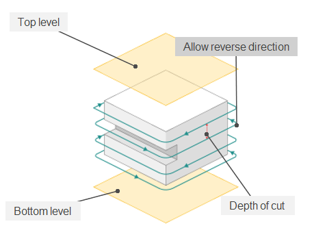

#### Corners smoothing.

When there is a sudden change of the tool direction, the milling control performs deceleration before starting the turn, and then accelerates again. This fact can lead to vibrations and high tool and milling machine wear. The problem can be solved if the toolpath has very few or no breaks. For this reason, in the system there is the toolpath smoothing function using the defined radius for machining inner or outer corners of the model.

Click here to expand..

<strong>Inner corners.</strong> Rolling the inner corner to the value entered in the parameter.

.png) .png)

<strong>Outter corners.</strong> Rolling the outter corner to the value entered in the parameter.

.png) .png)

<strong>Corner roll type.</strong>

<strong>By arc.</strong> When rolling by arc, an arc whose radius is equal to the offset value will be inserted into the toolpath.

<strong>By tangent.</strong> In the tangent mode, linear moves are used to transit the corner. The tool path before and after the corner is extended by the offset length. If the extended path intersects then it is truncated to the intersection point, else a connection move is created.

#### Tabs.

Tabs are needed to hold the part or fragments of the workpiece from falling out at the final stage of processing, which can lead to tool breakage or defective parts.

Click here to expand..

.png)

<strong>Default tab size.</strong> Specifies the values for the default tab sizes.

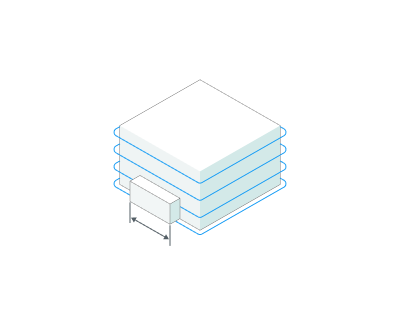

<strong>Default tab height.</strong> Specifies the values for the default tab sizes.

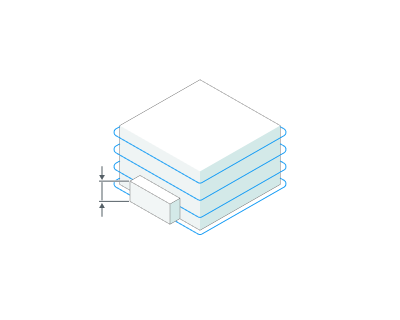

<strong>Go up.</strong> Method of climbing to the upper level of the tabs.

<strong>Off.</strong> There is no lift, rapid is activated. We go to the end of the tap right at the current level.

.png)

<strong>Rapid vertical.</strong> We lift at an accelerated speed to the height of the <strong>Go above</strong> the bridge.

.png)

<strong>Go above.</strong> Method of horizontal movement over the taps. Can be rapid, on transition feed, on work feed.

.png) .png) .png)

<strong>Go down.</strong> Drop method on Plunge feed.

.png)

Click here to expand..

<strong>Vertical plunge.</strong> Plunge feed runs on vertical plunge.

.png)

<strong>Plunge by angle.</strong> Plunge feed runs on plunge angle.

.png)

<strong>Plunge angle.</strong> Plunge feed runs on plunge angle.

.png)

<strong>Gap above tab.</strong> The height of the gap from Tap height to the level at which the bridge bypass path will be located.

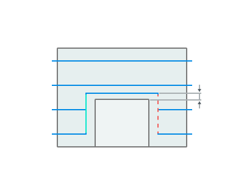

<strong>Return by angle.</strong> Lift on the <strong>Return feed</strong> at a given angle

.png)

<strong>Merge tabs of neighbor curves.</strong> This option allows you to take into account tabs from the current contour and the nearest ones.

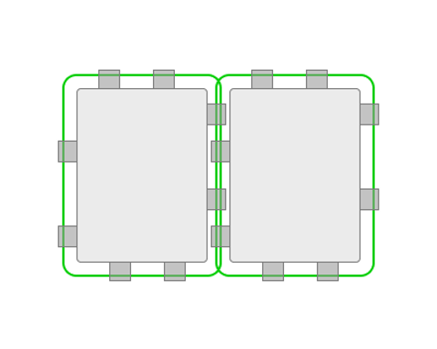 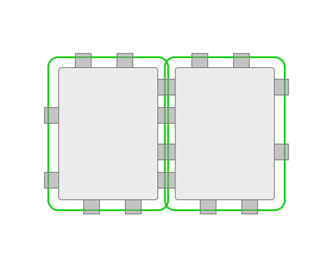

#### Output.

Click here to expand..

<strong>Radius compensarion use.</strong>

<strong>Computer.</strong> A toolpath offset by the cutter radius is calculated. No Cutter Radius Compensation (CRC) commands are included in the toolpath.

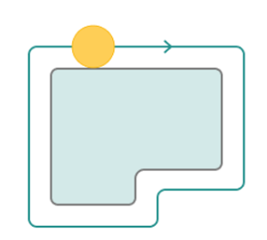

<strong>Control.</strong> A centreline toolpath is calculated. Cutter Radius Compensation (CRC) commands (e.g. G40 / G41 / G42) are included in the toolpath. In this case CAM system cannot check for cutter interference etc. so error messages can occur at the CNC controller if there is cutter interference e.g. tool radius larger than part radius.

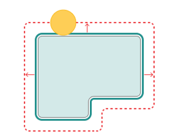

<strong>Wear.</strong> A toolpath offset by the cutter radius is calculated. Cutter Radius Compensation (CRC) commands (G40 / G41 / G42) are also included in the toolpath. The cutter is moved closer to the part by the 'wear' value entered into the CNC controller. The 'wear' amount is the difference between the 'nominal' and the 'undersize' cutter. In the CAM system, the trajectory does not change visually.

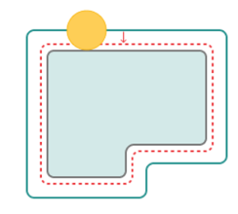

<strong>Reverse wear.</strong> A toolpath offset by the cutter radius is calculated. Cutter Radius Compensation (CRC) commands (G40 / G41 / G42) are also included in the toolpath. The cutter is moved away from the part by the 'wear' value entered into the CNC controller. The 'wear' amount is the difference between the 'nominal' and the 'oversize' cutter. In the CAM system, the trajectory does not change visually.

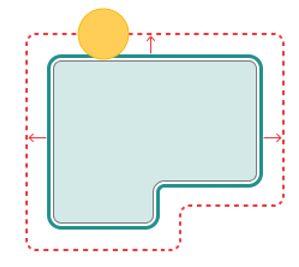

<strong>Compensation radius.</strong> This value is used by the simulator for simulating the offset toolpath. This value has no effect on the calculated toolpath.

#### Transformations.

A dialogue for transforming the toolpath.

Click here to expand..

<strong>Project toolpaht onto the part. <strong>If enabled:</strong></strong> The toolpath is projected onto the part model. The 'Top level' and 'Bottom level' values are incremental. If the 'Bottom level' value is set to 0, the tool will follow the 3D shape of the part. If the 'Bottom level' value is set to -1, the tool will cut into the 3D part shape at a depth of 1.

<strong>If disabled:</strong> The toolpath is not projected onto the part. The (absolute) 'Top Level' and 'Bottom Level' values are used.

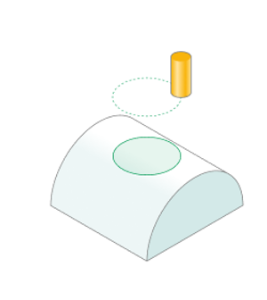 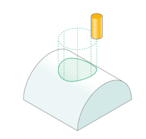

<strong>Tool axis orientation.</strong> Various methods of tool orientation.

<strong>Fixed.</strong> Processing is carried out along 3 axes.

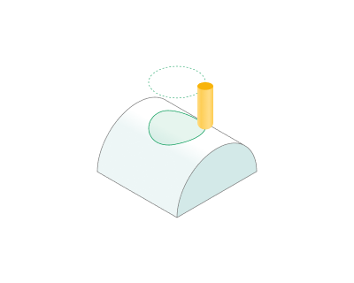

<strong>Normal to surface 4D.</strong> Processing is carried out along 4 axes. The <strong>part axis</strong> must be located along the <strong>global X</strong> axis. Work with <strong>Project toolpaht onto the part.</strong>

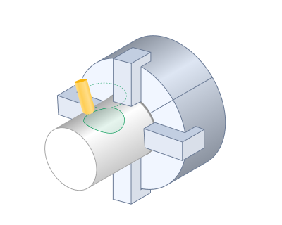

<strong>Normal to surface 5D.</strong> The machining process can be carried out using <strong>4</strong> or <strong>5 axes</strong>. Work with <strong>Project toolpaht onto the part.</strong>

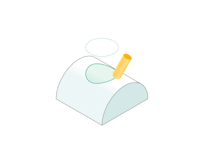

<strong>Normal to base surface.</strong> Processing is carried out along 3 axes. You need to specify the <strong>base surface</strong> on the <strong>Job assignment</strong> tab. Differs from <strong>Fixed</strong> in that the 3rd axis can be rotary.

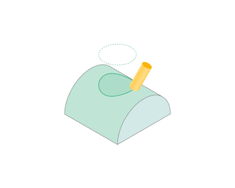

<strong>By Default.</strong> Equals <strong>Normal to base surface.</strong>

### Parameters:

This tab contains the main parameters for controlling the part, workpiece, fixture and other items, which allow you to change the trajectory. [Details](100112.md)

### Links/Leads:

In the Links/Leads tab, you define the parameters for rapid movements. These movements include tool approach from the tool change position, engage to the start of the working stroke, retraction after the final cutting motion, transitions between working passes, and return to the tool change point. You can configure the sequence of movements along the coordinates, the trajectory of these motions, and the magnitude of displacements.

Click here to expand..

<strong>Сonsists of:</strong>

<strong>Approach/Return.</strong> This group of parameters manages the tool movements from the tool change position to the start of the engage toolpathes, and back. [Details](100116.md).

<strong>Safe motions.</strong> Defines the type of Safety Surface and the distance from the workpiece to it. This surface facilitates transitions between the processed surfaces or tool paths, and the first stage of approach or return occurs toward it. [Details](100117.md).

<strong>Advanced links settings.</strong> This group of parameters specifies the features of trajectory formation for primarily five-axis operations, considering optimal movements of rotational axes. [Details](100118.md).

<strong>Links.</strong> Defines the rules governing Entry/Exit links and links between work moves. [Details](100132.md).

<strong>Leads.</strong> Allows you to add additional engage and retract to the working moves using their feed. [Details](101147.md)

<strong>Distances.</strong> Distances used in Links rules. [Details](100138.md)

### Feeds/Speeds:

Using this dialogue the user can define the spindle rotation speed; the rapid feed value and the feed values for different areas of the toolpath. Spindle rotation speed can be defined as either the rotations per minute or the cutting speed. The defining value will be underlined. The second value will be recalculated relative to the defining value, with regard to the tool diameter. [Details](100142.md)

### Transformations:

Parameter's kit of operation, which allow to execute converting of coordinates for calculated within operation the trajectory of the tool. [Details](10168.md)

### Part:

A Part is a group of geometrical elements that defines the space to check for gouges. [Details](330.md)

### Workpiece:

A workpiece model of an operation defines the material to be machined. [Details](738.md)

### Fixtures:

As the Fixtures the fixing aids such as chucks, grips, clamps, etc., and the restriction areas of any other nature are usually specified. [Details](10283.md)
