# Creating hole pattern

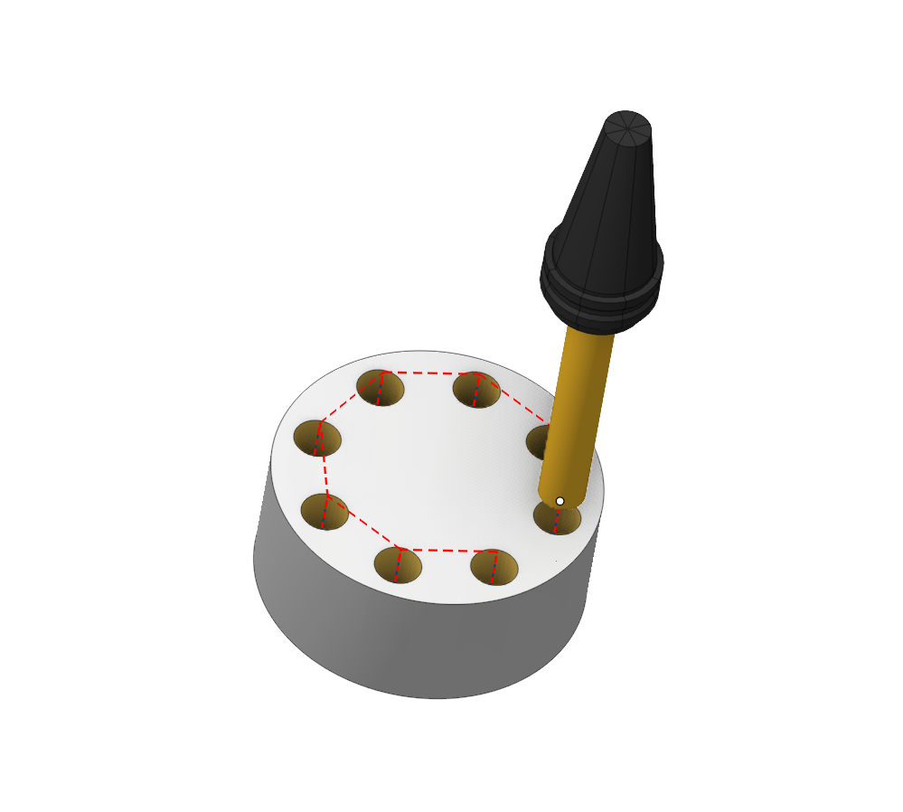

## Application Area:

In the CAM system, it is possible to set various types of hole templates. It is not necessary for a template to have a geometric construction of the hole.

### Pattern types

Using certain rules, you can define the following templates:

- Linear
- Circular
- Angular
- Concentric
- Parallelogram

The system uses five types of pattern: **Linear**, **Circular**, **Angular**, **Concentric** and **Parallelogram**.

**Linear**

On the **Linear** page user can create linear holes pattern:

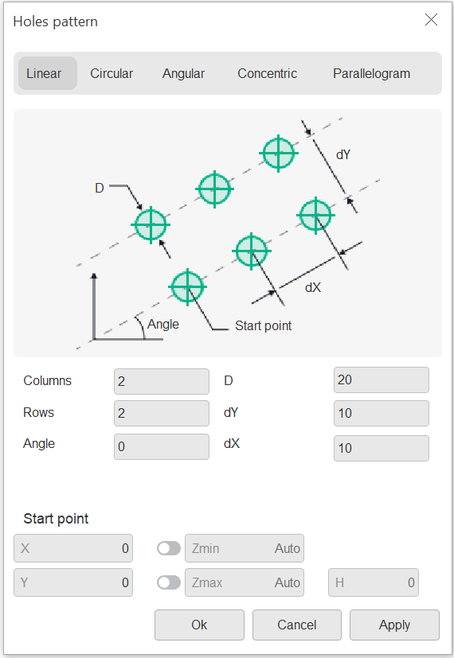 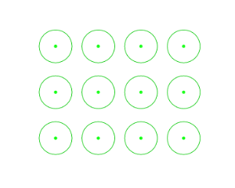

**Circular**

On the **Circular** page user can create circular holes pattern:

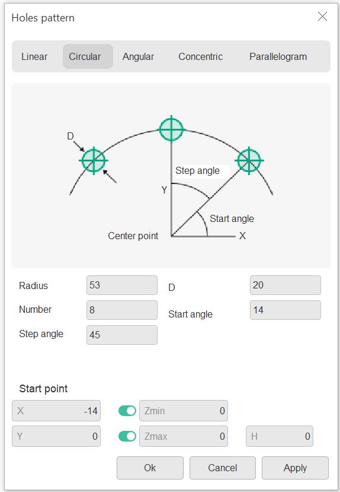 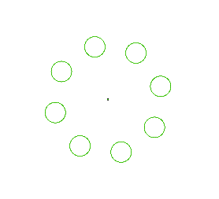

**Angular**

On the **Angular** page user can create linear holes pattern:

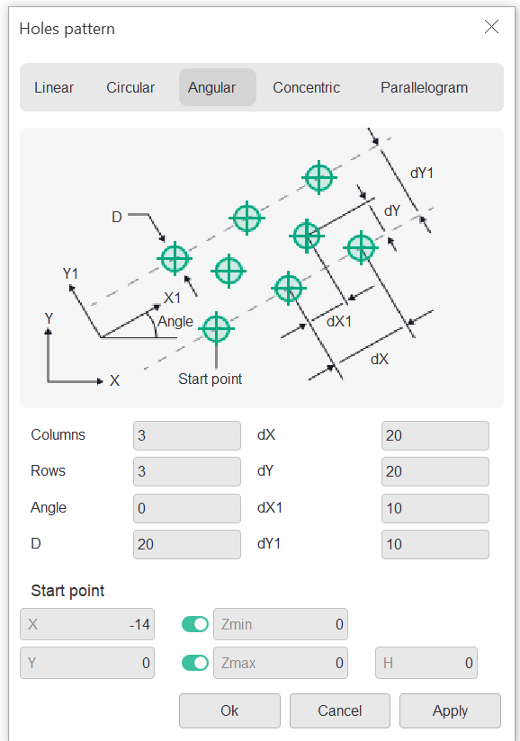 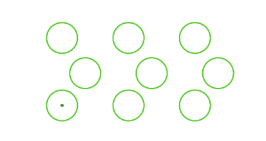

**Concentric**

On the **Concentric** page user can create concentric holes pattern:

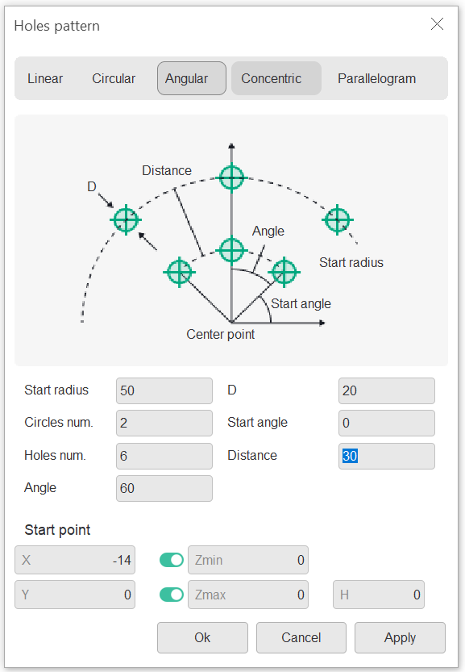 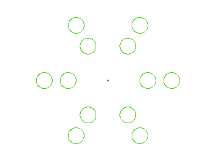

**Parallelogram**

On the **Parallelogram** page user can create parallelogram pattern:

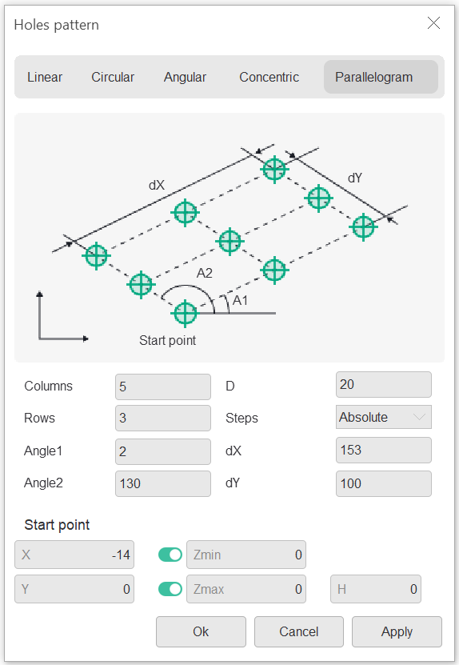 

### Using patterns for axial plunging

Using the hole patterns together with automatic determination of hole levels allows someone perform roughing machining of the part by the axial plunging strategy.

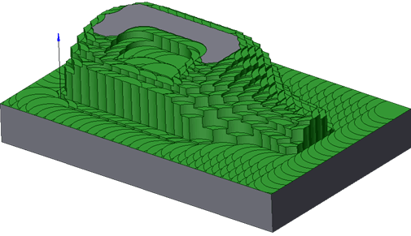
