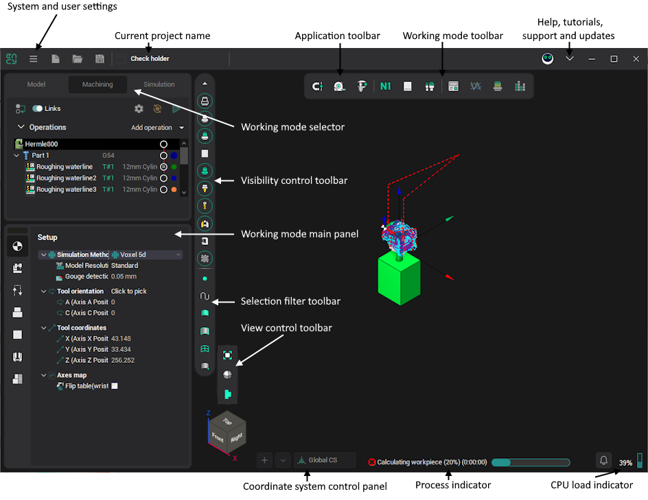

# System's main window

The system's main window has the following view:

[The graphics window](169.md) is in the center. Depending on the current working mode, it displays geometry models, machine and technology, or machining simulation.

Along the edges of the window are the main toolbars. There are drop-down menus associated with many buttons on these toolbars. Just hold the mouse pointer over the button or click on it so that the drop-down menu is displayed.

[The application toolbar](51.md) is in the top-left corner of the window. It contains buttons to manage projects and control global features like [Smart Snap](10005.md).

[The working mode toolbar](86.md) is at the center of the window's top bar. It contains features useful in current system mode.

The project title bar shows the name of the current project.

[Utilities](10012.md) and [Help](10014.md) buttons are located on the left and right sides of the window's toolbar, respectively. <strong>The utilities</strong> drop-down menu, located on the left, provides system and user utilities, such as [the Postprocessors generator](730.md). Use <strong>the Help</strong> drop-down menu, located on the right, to access help, tutorials, and get support.

[The working mode](86.md) main panel is on the left. Depending on the current system mode, it shows geometry model items, the technology tree, the properties inspector, or [the toolpath tree (CL-data)](352.md). Click on one of the tabs (**Model**, **Machining**, **Simulation**) to change working mode.

Use [the view control toolbar](169.md) to change the view vector and visualization properties of the current mode.

Use [the visibility control toolbar](359.md) to change which objects should be visible in the current mode.

Use [the selection filter toolbar](127.md) to change whether objects of the appropriate type should be selected from the screen. These settings also control which objects are visible in the list view in <strong>Model</strong> mode.

[The process indicator](35.md) displays the current calculation progress.

Use [the Coordinate System control panel](753.md) to add, remove, and modify coordinate systems.

The CPU indicator displays the current overall load on the CPU.

Sometimes, [pop-up notifications of the application](10015.md) may appear in the lower right corner of the main window. A panel with a general list of such notifications can be opened by clicking the corresponding icon.
