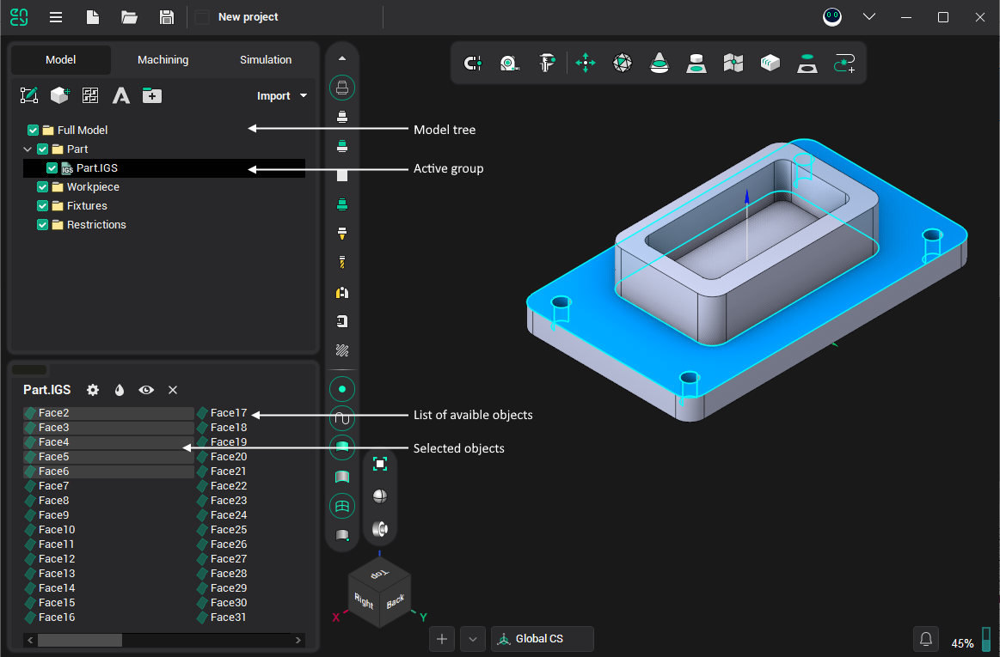

# Geometrical model structure editing

When editing the model structure one can [create new groups](755.md) (model structure tree nodes), delete, cut/copy to the [exchange buffer](749.md) or paste geometrical and structural objects ([surfaces, meshes, curves, points](283.md) and [groups](603.md)) from the exchange buffer.

Predefined groups (**Full model**, **Part**, **Workpiece**, **Fixtures**, `2D Geometry`), and all objects inside `2D Geometry` group cannot be deleted or cut into the exchange buffer. However copying the objects into the exchange buffer is possible without any limitations. Objects copied from `2D Geometry` will lose their connection with that environment, and if any subsequent changes made in the [2D geometry mode](833.md), these objects will remain unaltered.
