# Tool path template

The toolpath template defines the control data output format. Later this template can be saved and used many times.

Editing of auxiliary operation properties are made in window, which is opening by pressing **Parameters** button in technological window.

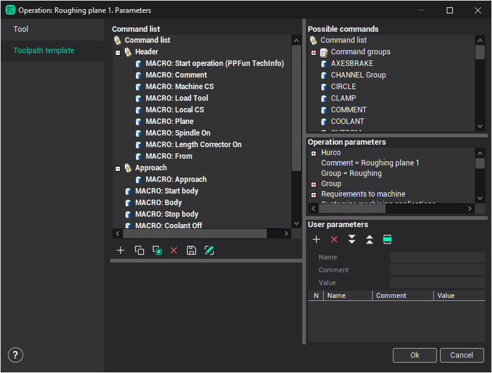

In parameter's editing window five primary objects exists:

- command list;
- list of possible commands;
- property inspector;
- operation parameters;
- user parameters.

**Command list** includes list of technological commands CLData (command of turning on the spindle shaft, cooldown, feed transmission, movement by circle, directly and so on), which will be contained in operation after it's calculation. The list may be formed by user from the beginning or may contain a list of defaults commands, which was made by developer of that operation.

List of **Possible commands** includes all CLData commands which exists in CAM system and [macro command](10074.md) (**MACRO**), and which can be used by user for forming a template. The macro command is a procedure, that do output of standard sequence of operations to the control data.

For adding one of commands needs to select a row with a corresponding name and drag it into wishful place in command list. The root element of the list of available commands MCDTree also may be inserted into command list, and inside of MCDTree unit other CLData command may be placed. Thus, commands in the list may be grouped by any other concept. For editing of the list the tools panel may be used.

Any CLData command has special set of parameters (feed magnitude, coordinate position, comment string and so on). Destination of property inspector is on representation and editing pointed parameter, it display choosing command in list. To properties of technological operation may be assigned either simple values (number, string, elements from the given kit), or expressions using common arithmetic operations and mathematical functions (`+`, `-`, `*`, `/`, **sin**, **cos**). As an argument of operators and functions may be not only numerical or symbol constants, but also named parameters from the **Parameter list**, created and edited in the same window. For example, a node **DELAY** have property **Pause value**, that can be defined in inspector by this way:

[2*Parameters List(Pause)]

The expression is framed by square brackets specially to show the system that the expression contains references to the list of parameters and that before the computation it is necessary to replace parameters by their concrete values. In indicated example in the parameters' list the parameter **Pause** must exist. The string **ParametersList** is reserved key word for access to the parameter's list.

Each parameter from the list has two fields: **Name** – unique descriptor of parameter in the list and **Value** – in general, expression that contains numeric or string constants, and also references to other parameters from the list. The editing of parameter's list is carried out with the help of the buttons on the tool's panel. To create the reference of property of technological command to the parameter from the list in addition to manual editing of the text field it is possible to use drag transfer of corresponding parameter from the list to the required block in the list of commands. The values from parameter's list are available for editing not only from parameter's window but also in global inspector of operation's properties and in the window technical process.

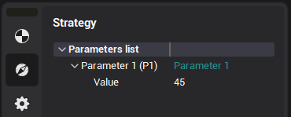 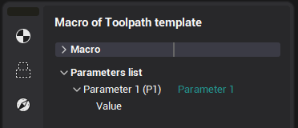

So, toolpath template represents parametrized list of CLData technological commands.

The buttons of control board of parameter's window have the following meaning.

The buttons of the left board:

-  **Add new command**. It adds the command, indicated from the list of **Possible commands** to the place which is indicated in the **Command list**.
-  **Copy command to clipboard**. Copies command to clipboard.
-  **Paste command from clipboard**. Pastes command from clipboard. The command will be inserted immediately after the end of selected group or after selected command.
-  **Delete command**. It deletes the detailed command from the **Command list**.
-  **Save group**. It saves selected group of commands.
-  **Edit expression**. Opens next window:

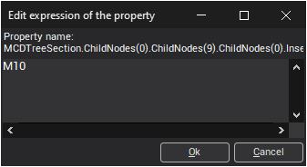

The button of the right board:

-  **Add new parameter**. It adds new parameter to the detailed place in the **Parameter list**.
-  **Delete parameter**. It delete parameter from the **Parameter list**.
-  **Move parameter down**. It lows down the parameter in the **Parameter list**.
-  **Move parameter up**. It raises up the parameter in **Parameter list**.
-  **Insert parameter**. It substitutes as a value of a property in the **Command list**, the parameter, what is selected in **Parameter list**.

Once created the template may be saved for the next use during the creation of other CAM system projects. For that it should be used mechanism of operations' [named default parameters](10069.md). The functions of saving and loading of the default parameters executing from the context menu which opens at the click of mouse right button on the name of concrete operation in the list of technological operations in regime **Technology**.

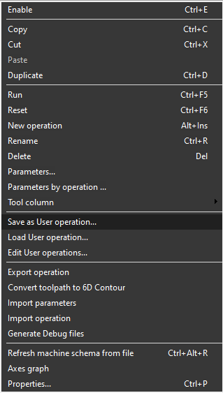

On choosing the `Save as User operation...` the current operation parameter's kit organize into the separate object which is kept safe in a special file independently from the current project and, so, may be used in other projects. After saving the default parameters become available during the creation of new operations (in the window of creation the new operation and drop down menu of new operation creation).

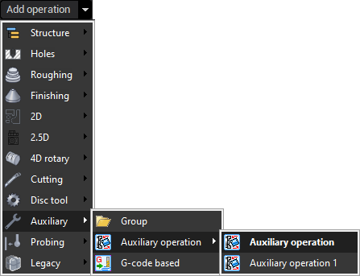

The default parameters may be applied to the operation not only during its creation but also to already existing operation. For that in the context menu of operation should be chosen `Load User operation...`. On the screen it will appear available for this type of operation list of defaults.

It is possible to add new group to the **Commands list** by choosing **Empty group** item in **Possible commands** list. You can set the group name an parameters count.

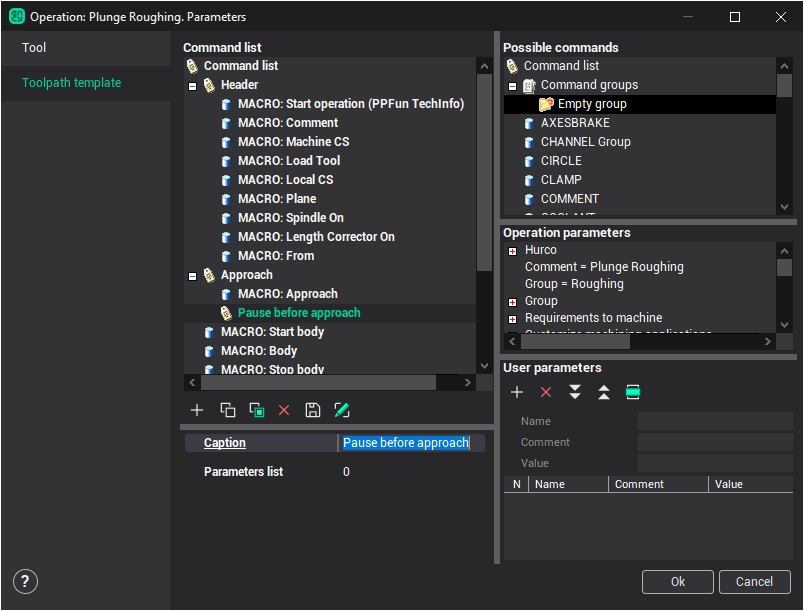

It is possible to add commands from **Possible commands** list to the group. So, you can form the set of commands for a specific task.

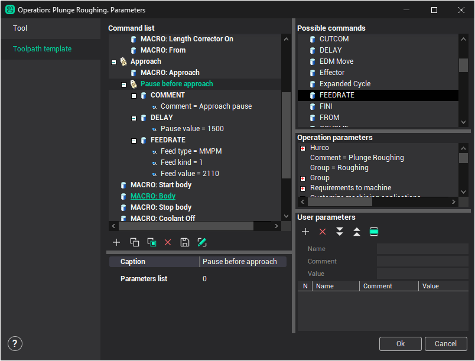

It is possible to save formed set of commands .

Saving parameters window will be shown:

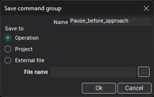

Set the name for group. Specify the name space parameter to provide a unique name.

There are 3 group saving modes:

**Operation**. Saves group inside the operation. Saved group becomes visible in the **Possible commands** list. Saving the template will save the group too. But this group becomes unavailable in the other operations.

**Project**. Saves group inside the project. At the next loading of the project, all operations and this group will be loaded too.

**External file**. Saves group in the external file. This allows you to use the group in all operations and projects. But it is necessary to remember that parameters specified on the **ParametersList** are unavailable in the other operations. So, it is impossible to use that parameters.

To use the parameters, create them directly inside the group. These parameters will be saved with group. To create parameters inside the group, set the parameters count and specify them all.

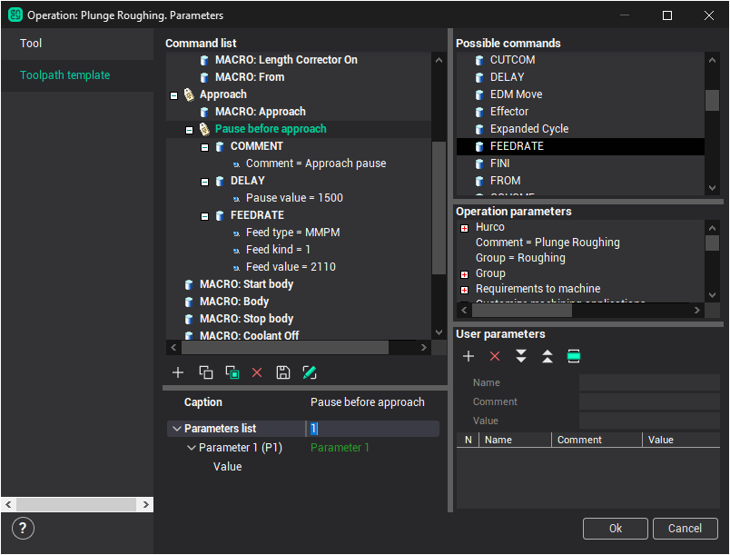

These parameters will be available inside the group.

So it is possible to save all typical groups of commands to external files and even use them on the another computer. To load the group of commands from an external file, open the context menu by right-clicking on the list of possible commands and choose **Load group from file** item.

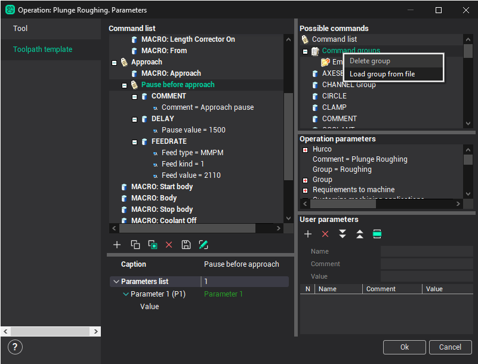

There is the example of using groups.

Suppose you want to close workpiece holder's jaws before the machining. It is necessary to send M10 command to the NC program to do this.

Step 1. Create the empty group in the command list and set the name **Closing jaws** for it.

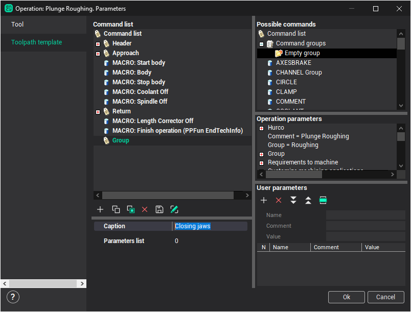

Step 2. Provide the sending M10 command to the NC program. Add INSERT command to the group and set value = "M10".

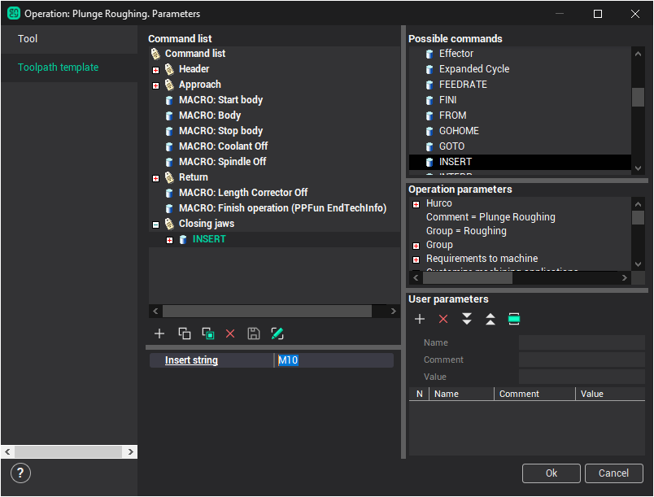

Step 3. Save formed group to the external file.

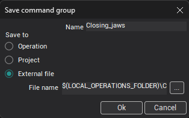

Formed group is available in the **Possible commands** list.

Step 4. Add closing workpiece holder's jaws before the machining operation. Select the **Header** operation group and add saved **Closing jaws** group

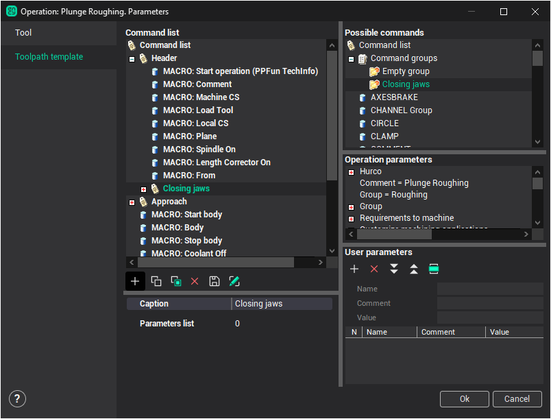

Ready! The closing workpiece holder's jaws command (M10) will be generated before the machining.

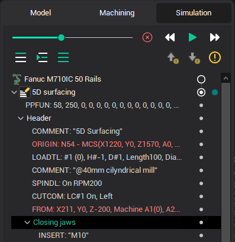

In this realization the system does not visualize closing jaws process. Closing jaws command must move jaws to the some position. To do this, it is necessary to send MULTIGOTO command to the NC program. It is possible to specify the movement value in the **ParametersList**. But if the group will be saved in the external file, it is necessary to add parameter to the group, not to the **ParametersList**.
