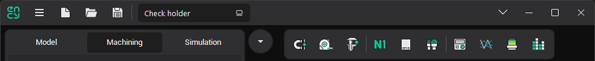
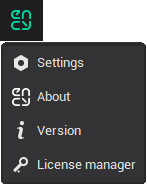
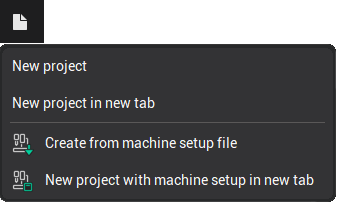
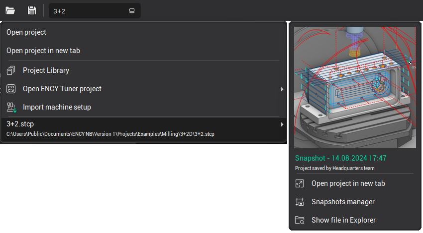
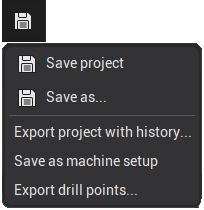

# Application Toolbar

The <strong>Application Toolbar</strong> is positioned on the top panel of the main window. Several buttons within this toolbar include associated drop-down menus, allowing for expanded functionality.

## Application Button Menu

-  <strong>Settings</strong>: Opens a [window for editing system settings](90.md).
-  <strong>About</strong>: Displays the splash screen of the application. 
-  <strong>Version</strong>: Opens the window that provides [version information for the application.](10429.md)
-  <strong>License Manager</strong>: Opens the [License Manager](10025.md) window.

## New Project Button Menu

The New Project button menu includes the following options:

- <strong>New Project:</strong> Closes the current project and initiates a new project in the current tab.
- <strong>New Project in New Tab:</strong> Opens a new tab and creates a new project inside it.
- <strong>Create from Machine Setup File:</strong> Closes the current project and creates a new one from a [machine setup](10427.md) file. You can choose from recently opened machine setup files or browse your drives to select a file.
- <strong>New Project With Machine Setup In New Tab</strong>: This option allows you to start a new project in a separate tab using a machine setup file. You can select from your recently used setup files or browse your drives to select a file. The current project will remain open in its original tab, while the new project is created in a new one.

## Open Project Button Menu

The Open Project Button provides several options:

- <strong>Open Project</strong>: Loads an existing project via a standard file selection dialog.
- <strong>Open Project In New Tab</strong>: Opens an existing project in a new tab, allowing you to keep your current project open while working on another one simultaneously. You can select the project file via a standard file selection dialog, making it easy to switch between multiple projects without closing your current workspace.
- <strong>[Project Library:](1020141.md)</strong> Opens a window to search for and open sample projects from around the world.
- <strong>Open ENCY Tuner Project:</strong> Loads a project created within ENCY Tuner. Holding the cursor over this item reveals the option to open the project in a new tab.
- <strong>Import Machine Setup</strong>: Imports data from a [machine setup](10427.md) file into the current project.
- Additionally, a list of recently loaded projects is available. Each project in this list has a drop-down menu offering further actions, such as:
  - <strong>Load Recent Backup Versions ([Snapshots](10424.md)</strong><strong>):</strong> Quickly load backup versions of the project.
  - <strong>Open Project in New Tab</strong>: Opens the selected project in a new tab.
  - <strong>Snapshots Manager</strong>: Opens [the snapshot management window](10424.md) to manage all snapshots (backup versions) of the project.
  - <strong>Show File in Explorer</strong>: Opens Windows Explorer and selects the project's file.

## Save Project Button Menu

The Save Project Button offers the following options:

- <strong>Save Project</strong>: Saves all changes to the current project. If the project has not been saved before, the system will request a new name.
- <strong>Save As...</strong>: Saves the project under a new name via a save dialog.
- <strong>Export Project With History</strong>: Exports the project along with its full modification history, including snapshots made throughout the project lifecycle.
- <strong>Save as Machine Setup</strong>: Saves the current project template to [a machine setup](10427.md) file.
- <strong>Export Drill Points</strong>: Opens a window to export drill points of the current operation (if a Holes page exists in the properties) to a DXF file. This file can be imported into another project's model page.

## Additional Tools and Buttons

Several additional tools and buttons are available for further functionality:

-  [Smart Snap:](10005.md) Enables or disables snapping to objects in the graphics window.

-  <strong>[Geometry Measuring:](10006.md)</strong> Activates the measurement mode for objects within the graphics window.

-  <strong>[Measure Tool:](10006.md)</strong> Allows for measuring distances between two arbitrary points on the screen.

-  [Help:](10014.md) Provides access to the help menu.
