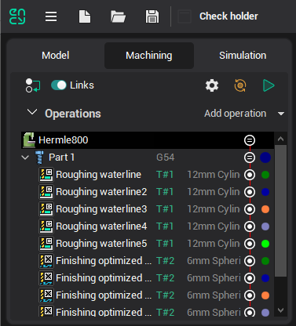
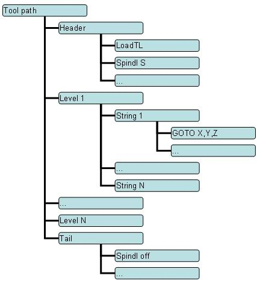
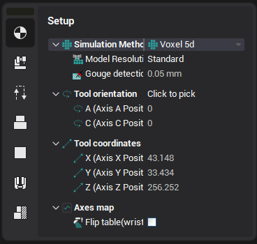

# Common principles of technology creation

The process of <strong>creating a machining technology</strong> in Cam system in general consists of the following consecutive steps:

1. Selecting or creating the <strong>machine</strong>. The machine schema is created in CAM system format if needed.

- During the opening, CAM system loads the last used machine. If you need another machine for your purposes, you can select it in the machine selection window (you might need to specify the directory where the machine representation files are located).
- If there is no item for your particular machine in the library, you would need to create it using the Machine Maker or manually editing the.xml file.

2. Importing the <strong>part</strong>(s) and setting up their positions. System supports [Part (group)](1025.md), also you can define different positions for each part using the <strong>Setup Stages</strong> (below there is more information about setup stages and project structure). Additional mechanisms and devices can be added to the project as [fixtures](10283.md).

3. Creating the <strong>operations</strong> describing the technological process. For each operation you need to select the tool and define the job assignment, the strategy and other parameters. After that you can calculate the toolpath, verify the trajectory using simulation and generate the CNC code using the [postprocessor](69.md).

## Machine schema

The machine kinematics is represented as the hierarchical set of nodes in the.<strong>xml</strong> file. Each node can represent a linear or rotary machine axis, a tool or a workpiece holder. A node can reference an image file with the 3d model.

## Machining sequence

The <strong>operation</strong> is the basic unit of the technological process in Cam system which defines the particular way of manufacturing/production. The main parameters of the majority of the operations are:

1. The cutting tool
2. [Job assignment](301.md) consisting of the geometrical objects such as splines, faces, edges etc. These objects define the machining toolpath
3. The strategy and other parameters

See the [Defining machining sequence](293.md) article for more info about the operations' common user interface.

## Operations tree

The machining sequence in Cam system is organized into a hierarchical tree with operations as nodes. A machining tree may have an arbitrary complexity to meet any certain requirements. An example of such tree is shown below.

Basic node of the tree is an **Operation**. In particular the operation is determined strategy of parts machining containing the set of parameters, that is individual for [every type of machining](95.md).

To bring an order into the machining sequence the operations groups, such as <strong>parts</strong> and <strong>setup stages</strong>, are introduced.

<em>Operations tree example.</em>

## The operation tool path

The tool path at the bottom level is a sequence of the machine commands in the **CLDATA** format that include both the tool motion commands and the technological commands such as the feed rate switch, spindle and coolant switch on/off, etc. A tool path has a hierarchical structure like the machining tree: the elementary commands are united into the logical groups. The types and the contents of groups depend on the operation type.

The work on creating a machining sequence as well as defining its input data and specifying the parameters of operations is performed on the [Machining](86.md) tab.

For example, the structure of the tool path of the [Roughing plane](735.md) is shown below:

## Setup stages

Setup stage is the special group of operation to machine the once placed part(s). If you need the manual part fixturing you need to create another setup stage. A new setup stage contains all the same parts that the previous stage contains. All the parts can be overturned or fixed in another place, but the initial workpiece for these parts are taken as the machining result of the previous stage. If create/destroy/rename a part in a setup stage, it will be created/destroyed/renamed in all the next stages.

The workpiece position is defined by the **Workpiece connector** and **Workpiece setup** parameters. If the setup stage contains one or more parts, these parameters are hidden, rather they must be defined for each part separately. The operations which are inside the setup stage or part group don't have this parameters, meaning that they work with the **fixed** workpiece (only special [Move part operations](10402.md) can also alter the workpiece setup). If these parameters were changed for an ordinary operation in the project of the older version, a special compatibility mode is activated after opening such project, which enabled the workpiece setup parameters for such operations.

The machine (the very first operation of the tree) also has the workpiece setup parameters for the usual mode of working with the single part.

<em>Workpiece setup parameters in the Setup stage operation</em>.
