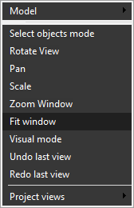

# Zoom extents

For quick scaling of the view to display all visible objects, use the  button or the <strong>Fit Window</strong> item from the pop-up menu of the graphic screen.

This function can also be activated by double-clicking the <strong>[Middle Mouse Button]</strong>, but it will also activate the closest [standard view](728.md).
