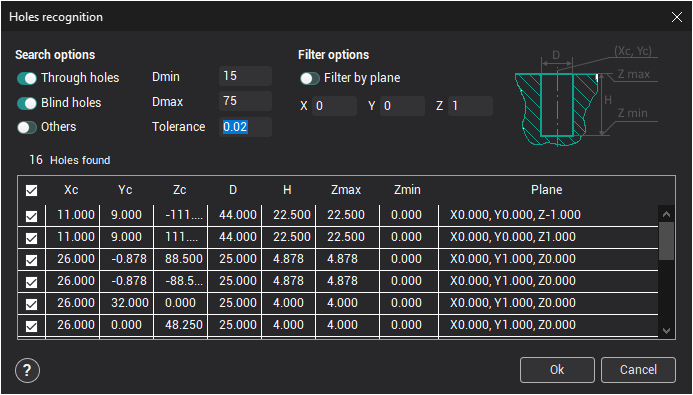

# Automatic hole recognition

## Application Area:

The holes are found in the [part](330.md). When a hole is found, it will be automatically added to the holes list.

### Search options

Hole recognition is performed according to the selected search options. Only those holes that lie within the defined range will be added to the list. All holes are divided into three types:

- **Through** – holes, which go through the model, or with a bottom level that is lower than the bottom machining level of the operation.
- **Blind** – holes, the end of which lie in the model between the top and the bottom levels for the operation.
- **Others** – holes, for which only the center coordinates, can be defined but not the diameter and/or the depth of the hole. Such holes might have a variable diameter e.g. with facets, or just be curves.

### Editing and adding recognized holes

Parameters for the holes found in a search operation can be edited. When the parameters for a hole are being edited, the hole is highlighted in the graphic area. The parameters for holes can be altered by left clicking on it in the search window and typing the new values.

When the **Ok** button is pressed, all holes selected with a tick will be added to the holes list. Left clicking on the heading of the first column will activate or deactivate all holes.
