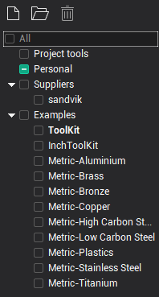
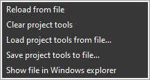
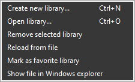

# Manage libraries

To manage tool libraries and project's tools, use the panel that is in the left part of the [Tools window](38.md).

The panel displays all tool libraries connected to the system and divides them into several groups:

- <strong>All</strong> - a root node that makes it convenient to view tools from all sources of interest at once.
- <strong>[Project tools](10342.md)</strong> - the list of tools for the current project.
- <strong>Suppliers</strong> - the list of libraries from the "$(CommonAppData)\Libraries\Tools\Suppliers" folder and which are installed by the distribution. Libraries from this group are available in read-only mode.
- <strong>Examples</strong> - the list of libraries from the "$(CommonAppData)\Libraries\Tools\Examples" folder and which are installed by the distribution as an example. Libraries from this group are available in read-only mode.
- <strong>Personal</strong> - the list of libraries located elsewhere in the file system. If the library is located at "$(CommonAppData)\Libraries\Tools" folder then the system will add it to this group automatically.

The list of tools is always displayed for libraries which are nested in the selected node and which are marked.

There is a concept <strong>Favorite library</strong> - this is a library that appears first in the list, just after Project tools. When creating a new operation, a tool is automatically searched for that is suitable for it. First, the search is performed in the list of project tools, then in the favorite library. Favorite library is shown in bold and can be changed from popup menu.

In the first place is always the <strong>Project tools</strong> item. This is a list of the tools of the current project, which is stored inside the stcp file, but can be saved in a separate text file (XML with *.tom file name extension). You can learn more about it in the [Project tools](10342.md) chapter. The key difference from the library is that along with the list of tools, the state of the machine is preserved, which means the correct location of the tool in the machine schema, the placement of the turret blocks. Those it is the tools setup list. The project tool list file is not intended to store too many tools.

The following <strong>actions</strong> are available for the list <strong>of project tools</strong> from the popup menu.

- Save project tools to file... - saving to an external *.tom file. The system remembers the path to the selected file and will automatically load tools from this file when creating a new project with the same machine.
- Load project tools from file... - loading from an external *.tom file. The system remembers the path to the selected file and will automatically load tools from this file when creating a new project with the same machine.
- Reload from file - reload from a previously saved *.tom file (without opening the file open dialog).
- Clear project tools - removal of all unused tools from the project and break the connection to the external *.tom file if the project tools list was saved to the external file before.
- Show file in Windows explorer - opens the Windows explorer and selects the *.tom file if the project refers to an existing one.

Subsequent items on the list are <strong>regular tool libraries</strong>. A library is a SQLite database format file. Only tools are stored in libraries and no information about the machine is stored. They can easily hold a very large number of tools (tens of thousands).

The following <strong>actions</strong> are available for the tool library from the popup menu and buttons on the top toolbar:

- Create new library... - opens a file save dialog where you can select the name and location of the new tool library *.db file.
- Open library... - opens a file open dialog where you can select an existing tool library *.db or *.csv file and system will add it to the list.
- Remove selected library - removes the library from the list.
- Save selected library - saves changes to a file. It is necessary only for special cases, since when you close the tool window, all changes in the libraries are automatically saved. If the library has old *.csv format then a message box will appear with a proposal to convert this file to a new *.db format.
- Save all libraries - saves changes to files for all connected libraries (when you close the tool window, all changes in the libraries are automatically saved).
- Reload from file - reloads all data from the file and all unsaved changes will be lost.
- Mark as favorite library - makes the selected library a favorite.
- Show file in Windows explorer - opens the Windows explorer and selects the library file.

The list of linked libraries, the state of their checkboxes and which one is favorite is saved in the system settings file (*.cfg).
