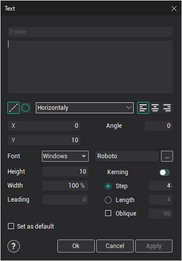
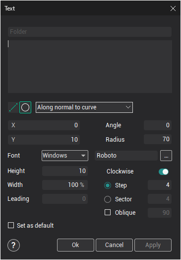
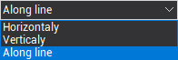
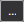

# Creating text

The text creation window can be opened either by pressing the  button on the **Model** panel, or by using the pop up menu in the [graphic window](169.md) or on the [geometrical structure window](718.md).

 

Text can be typed along a line  (default), or along a circle .

-  define letter orientation.

-  - Text alignment is define text placement from the start point.

To change text font it is necessary use the font open dialog button or font type combo box.

<strong>X,Y</strong> - define start point position.

<strong>Angle</strong> - define angle between horizon and text direction line for placement text along line or define the start angle for place text along circle.

<strong>Radius</strong> - define circle radius.

<strong>Height</strong> - define letters height.

<strong>Width</strong> - allow to change letter width in %.

<strong>Leading</strong> - define vertical space between text rows.

<strong>Kerning</strong> - allow to use kerning tables from the selected font for calculate distance between letters.

<strong>Step</strong> - define distance between letters ignore kerning information.

<strong>Length</strong> - define common width of text.

<strong>Oblique</strong> - define slope angle of the letters in degrees.

<strong>Set as default</strong> - store parameters as default for a new text.

To preview the results press the **Apply** button. If all parameters assigned were correct, the text will be displayed in the graphic window. If required, the text parameters can be corrected.

Having assigned the text parameters presses the **Ok** button. At folder with the name defined in the **Folder** field will be created in the model tree.
