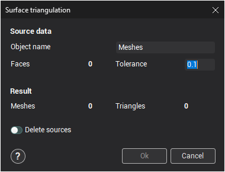

# Surface triangulation

The **Surface triangulation** window opens from the pop up menu of the [graphic window](45.md) or when the  button is pressed.

The function is designed for the alteration of selected surfaces tolerance. Used in cases when a machining operation is performed with a tolerance that is smaller than the tolerance of the surface itself, or when it is impossible to machine the detail due to problems arising because of incorrect model construction – spiral transitions, needle surfaces etc.

The **Source data** panel shows the type and number of objects selected for triangulation and other source data.

- **Object name** – name of the resulting surface mesh. If as the result of triangulation several surfaces meshes are obtained, then they will be put into a newly created group using the name defined in this field. The new surface or group will be created in the currently active group.

- **Faces** – number of selected surfaces.

- **Tolerance** – maximum deviation of the resulting surface from the source one. By altering the tolerance value, one can achieve the desired surface tolerance.

The **Result** panel shows the number and type of newly created objects. Triangulation may take some time should the selected objects be considerably complex; therefore job completion percentage may be shown.

- **Meshes** – number of obtained meshes.
- **Triangles** – total number of triangles in meshes.

When changing the triangulation tolerance, the field values in the **Result** panel will automatically be recalculated.

**Delete sources** – a tick in this field means that when finishing the triangulation operation, all source objects will be deleted.

If the triangulation results are correct, then the window should be closed using the **Ok** button. The obtained surface or group of surfaces will be put into the [active group](1.md). The source objects will be deleted if **Delete sources** has been selected.

To cancel performing triangulation, press the **Cancel** button.
