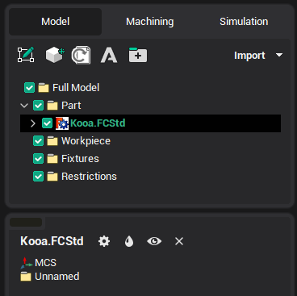
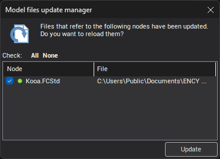
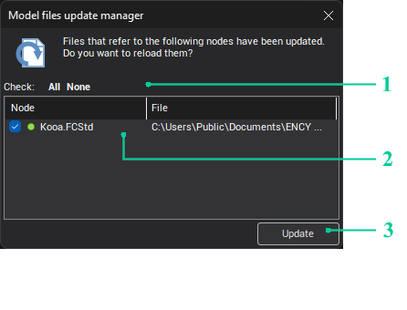
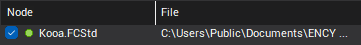
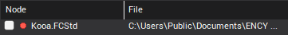
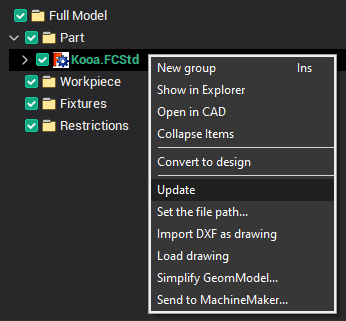
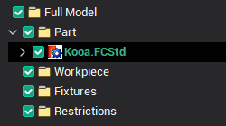
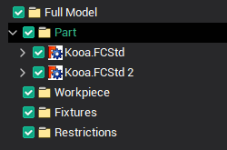

# Geometrical model structure updating

When updating, the old [groups](603.md) in the model will be replaced with new ones, this will retain all of [spatial transformations](116.md) that took place earlier and optionally created by the user (for example, [section](289.md) ), groups. Checking that the file has changed is performed when the CAM system window becomes active.

If the imported file has been changed, the name of the group will be allocated **bold**, the toolbar button appears "Model files update manager" , and in the pop-up window will be added to another team **Update**.

There are two options for the update:

- from CAM system:
  - via Model files update manager;
  - via context menu **Update**.

- from CAD system in which installed a [CAM system addin](10039.md).

## Updating from CAM system

### Model files update manager

After importing the model file, the CAM system will periodically check the modification date of this file. Once the change is detected, the following window appears:

> If you just close the <strong>Model files update manager</strong> window, the next time it appears only when a new change is detected.

This window contains a list of imported models, files that have been changed. Here you can update them.

> Model files update manager can also be opened by using the button , if it is available on the panel.

### Description of the window Model files update manager

1. **All** button select all files, **None** button deselect all marks.

2. There is a list of all the imported files that were changed in this section. Set checkbox beside the file indicates that it is marked and after the pressing the **Update** button it will be updated.

> Only the selected files will be updated.

The green round mark shows that the file is available for upgrade:

The red round mark shows that file updating is impossible (the reasons can be different: file was displaced, supplement in [Addin Manager](900.md) is disabled, CAD system is not available, etc.). In this case, it can not be set (tick the box)

> Double-click on the line will open a folder with the file.

3. **Update** / **Close** button works as follows:

- if at least one file is selected, it shows the **Update** button, otherwise **Close** button;
- when you click on **Update** — all selected files will be updated, and the window will close;
- when you click on **Close** — the window will be closed (works the same as clicking on the **X** ).

<strong>Context menu Update</strong>

## Updating from CAD system

Importing files is always in the active group, so CAM system's behavior depends on which group will be [active](1.md):

- If you want to update, imported earlier model, this group needs to make active or go to CAM system and update from it;

- If you want to re-add imported earlier model, it is necessary to make active any other node.

