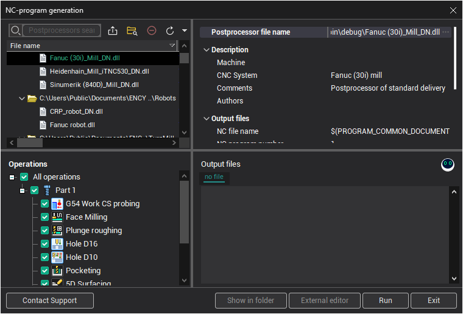
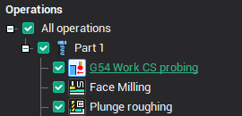
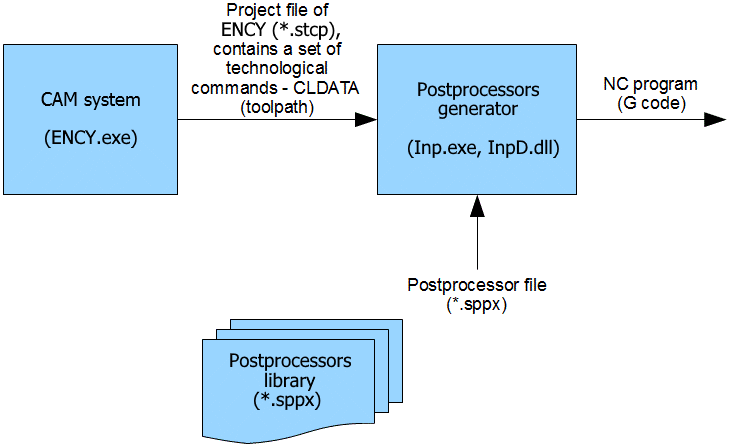

# Generating NC code

Generation of NC programs is performed by a postprocessor that transforms the CLDATA commands of a calculated toolpath into the format of the selected CNC system. The postprocessor files have the *.sppx extension. The output of CNC code is performed on a standard text file, so it can be easily transmitted from the computer, where the distribution package is installed to the CNC control using any standard methods of copying files and folders.

To generate the CNC code, press the  button. The NC-program generation panel will appear.

Here you can select the required postprocessor and run it to get an NC program. If the list doesn't contain the postprocessor you want, try to select another **Folder** with postprocessor files using the appropriate controls at the top of the panel. General information about the selected postprocessor is displayed in the left-hand bottom corner of the panel.

In the **Output file** field, one enters the name and the path to the file, which the NC program should be output to.

Use drop down button to see list of previous NC program files, or select output NC-program to the same folder as project or default folder. Default folder is set in [System settings window](90.md).

To start generating NC program for the selected CNC system, press the **Run** button. In the full version of the program, NC code is written to the output file, and, if selected, into the postprocessor window. In the demo version, output into a file will not be performed, and only the last few strings of the NC program will be displayed in the postprocessor window.

Please note, that the postprocessor only creates NC code for all calculated machining operations that are 'enabled' (, or  status icon in the [machining process list window](293.md)) and also have <strong>Generate NC code</strong> property set at the time the postprocessor is run (the operations tree below postprocessor list).

> Note:
>
> To generate several NC programs for different operations, use the operations tree to enable or disable NC code generation for operations, and then run the postprocessor to create the separate NC programs. Please note that 'Generate NC code' property is a property of operation. It will be saved in project and **User operations** default settings.

If some operations have <strong>Generate NC code</strong> property disabled when hinting  will be visible. The root  node checks or unchecks all enabled operations in the technology tree.

The postprocessor system is a separate standard module, and can, if required, be run separately from CAM system.

. The name of the executable file is – Inp.exe. [Postprocessor tuning files for CNC systems](730.md) are created and edited using the **Postprocessors generator** (INP.exe).

