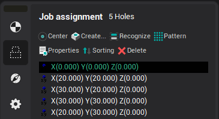
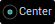
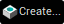
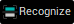
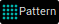
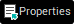
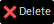
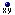
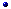

# Job assignment for hole machining operation

## Application Area:

When defining the parameters for the [hole machining operation](10100.md) it is possible to define the data for holes to be drilled. In the hole machining operation, the holes list defines the number, sequence and parameters of the holes to be machined. The order can be altered by mouse dragging.

### Job assignment controls

-  — Create hole by center point
-  — Create hole by coordinates input
-  — Automatically recognize holes in the part
-  — Create holes array by pattern
-  — Properties of the selected items
-  — Delete selected items

### Hole parameters

Each hole is defined by the coordinates for it's center, the diameter and also the value of the upper and bottom levels. There are two methods to define the center coordinates of holes: by coordinates or by a geometrical "point" object.

### Machining levels

Regardless of the center definition method used, the depth of the hole is defined directly on the **Model** page. The holes specified by coordinates are marked with the  sign while the holes defined by center point are marked with the  icon. To define the top and the bottom levels, it is necessary to select the desired points from the list on the right and enter the **Zmax** and **Zmin** values.

- **Zmax** – defines the Z coordinate of the top of the hole. The coordinate can be defined either directly or calculated automatically. When calculating automatically, transition to work feed is performed using the safe distance from the workpiece.
- **Zmin** – defines the Z coordinate of the bottom of the hole. The coordinate can be defined either directly or calculated automatically. When calculating automatically, the coordinate is taken from the model being machined.

### Drill tip compensation

In addition to the **ZMin** parameter operation can have the **Drill tip compensation** parameter specified. This parameter can be one of the following:

- **Off** – the drill tip descends to the **ZMin** level.
- **Drill tip** – drill descends below the **ZMin** level to the value of the tapered part of the drill, thus providing cylindrical drilling area to the **ZMin** depth.
- **Length** – drill top descends below the **ZMin** level to the specified value.

### Drilling direction

Hole Machining operation supports two ways to specify drilling direction for each hole center. Use the Job Assignment dialog window's **Inverse** field or specify the normal in the graphical window.

### Exporting and sorting holes

Select holes in the holes list and use the context menu **Export selected in DXF** item to export the list into the DXF-file.

To sort holes with different parameter values use the **Sorting**.
