# Curve

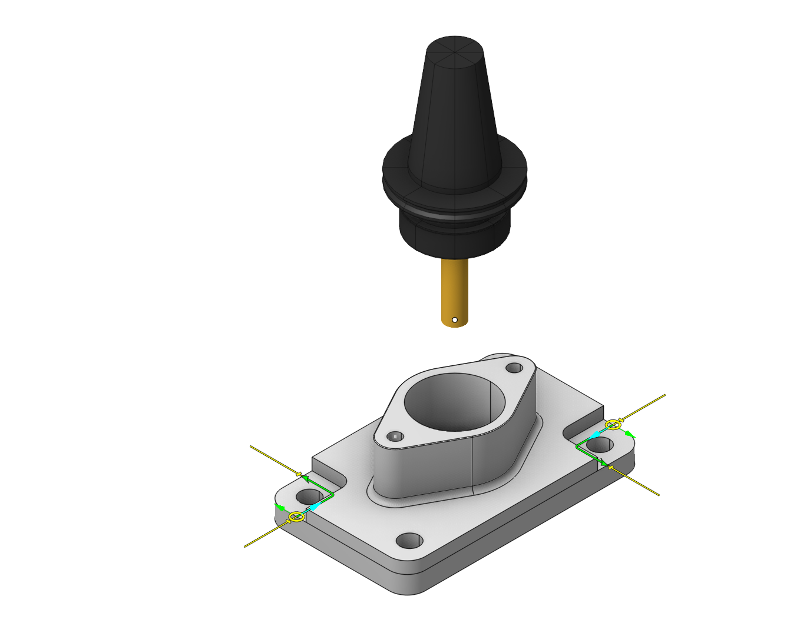

## Application Area:

The 2D and the 3D contouring operations are simple, at the same time the powerful cycle for creating planar tool paths based on specified curves, edges, faces or pockets. By defining a base surface you can also generate tool paths on cylindrical and revolution surfaces. Using the Project on part feature you can project the generated tool path onto the part, and by specifying the Tool axis orientation mode you can generate four and five axis tool paths by normal to the part or to the base surface.

You can study the features of choosing curves in the corresponding section. [Details](10029.md)

### Working with curves

<strong>1. To add</strong> a new contour into the job assignment just select curves, edges or vertical faces you want to machine and press the **Curve** button. The connected entities will be joined into contours.

Contour itself. The green line represents the curve which will be output into the CLData. Approaches are marked in yellow ( You can change them interactively or on the [Links/Leads](100115.md) page. ).

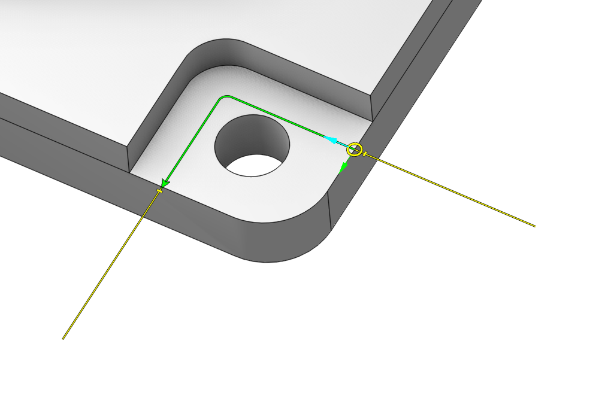

If a contour is compensated and the <strong>Radius compensation</strong> is set to <strong>Control</strong> than an additional dashed line is displayed, which represents the tool center curve (the curve along which the tool will be moved).

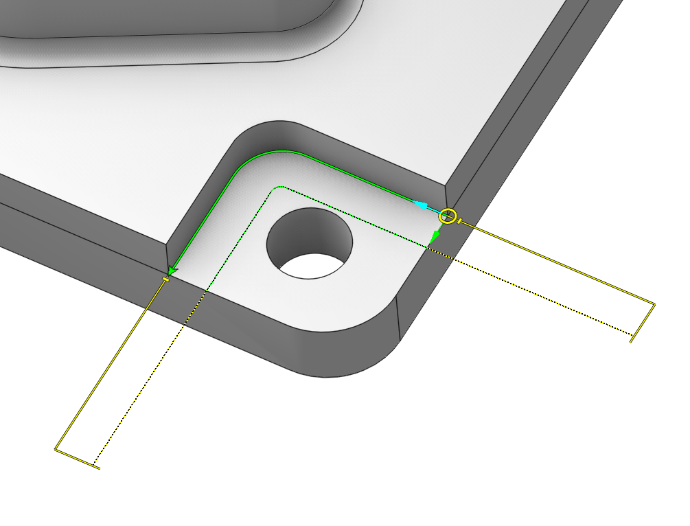

<strong>To access contour parameters</strong> just left click on a contour in the graphic view. You will see the action bar. Here you can switch the <strong>Compensated</strong> flag of a contour and its <strong>Machining with return</strong> flag. For closed contours you can also switch the <strong>Fix start point</strong> flag.

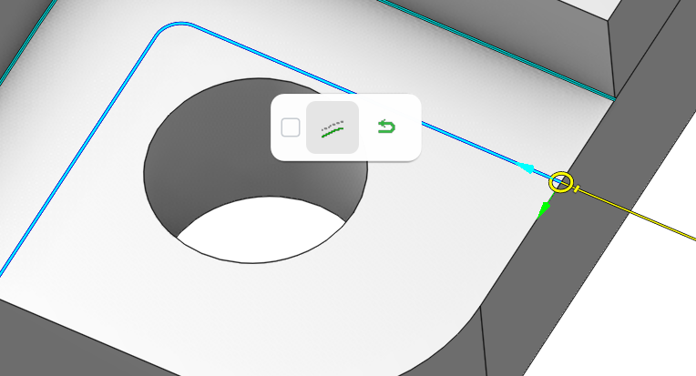

**Changing parameters of several contours together**

To do this you should select several contours and edit parameters of one of them. When you make a change to a parameter of one contour this change applies to all the selected contours. In such a way you can change the <strong>Compensated</strong> flag, the <strong>Machining with return flag</strong>, the <strong>Fix start point</strong> flag, the contour direction, the contour side.

**Selecting multiple contours**

- To select several contours you can hold the [<strong>Ctrl</strong>] key on the keyboard and select them with the mouse.
- To select all contours in the job assignment just double click on any of them in the graphic view.
- To select contours by some criteria click on a contour, than on the check box in the action bar that appears and check the criteria in the properties tree that appears.

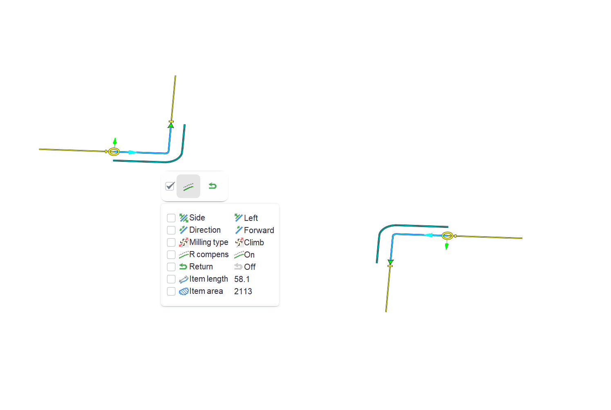

2. <strong>Contour start point</strong> (yellow circle). To change start point position just drag it with the mouse. You can also change start point position by X and Y dimensions. Just left click on the point and edit the dimensions that appear.

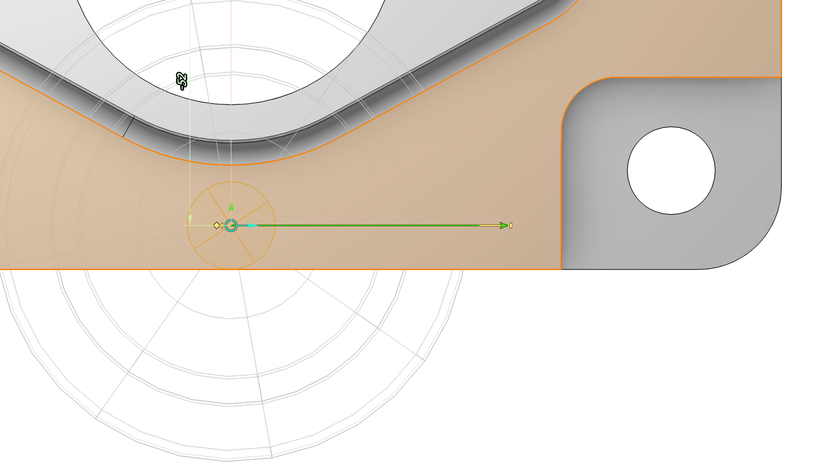

3. <strong>Contour terminate point</strong> (green arrow for an open contour and yellow dot in the middle of the yellow circle for a closed contour). You can drag the terminate point with the mouse, and you can change its position by X, Y dimensions.

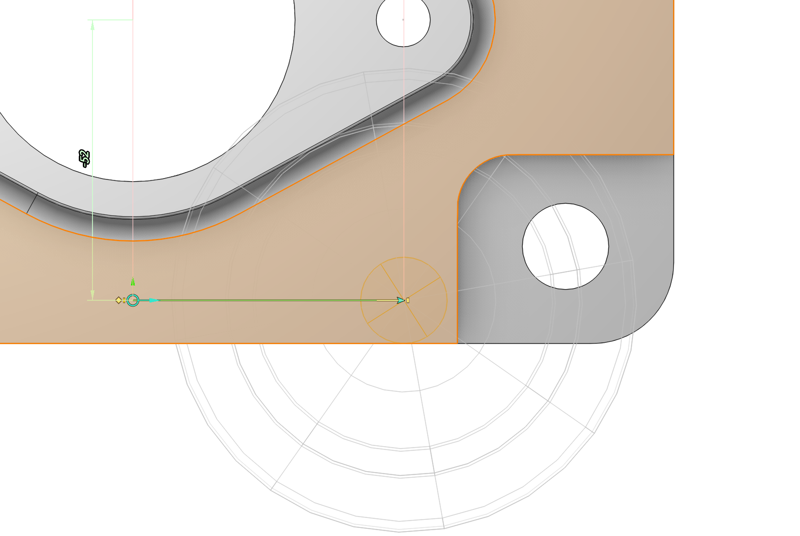

The default start point position for closed contours is <strong>Auto</strong>. It means the position of a point is determined by the operation during toolpath generation. You can distinguish auto start points from regular ones by their visual representation. Auto start points are depicted without yellow dot inside, regular ones points are displayed with a yellow dot inside.

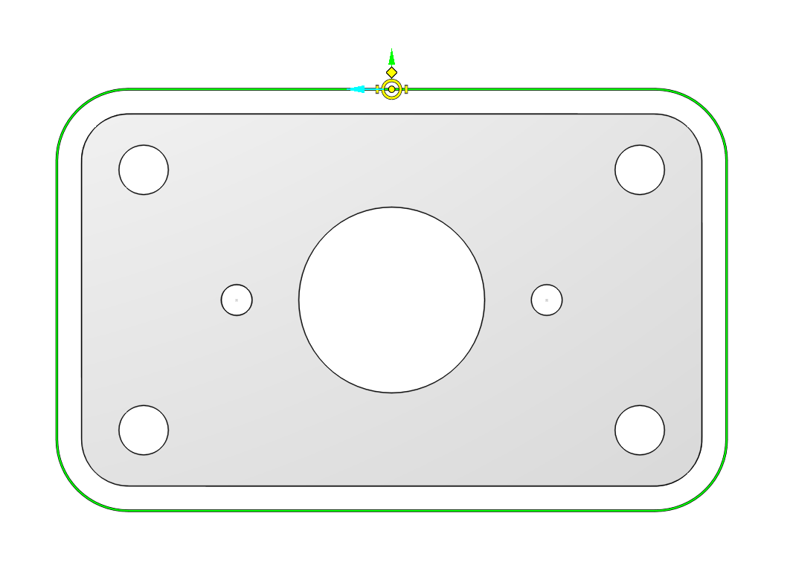 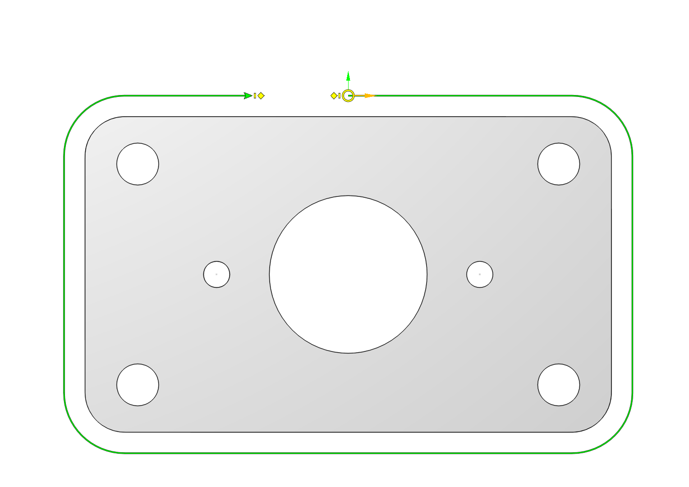

4. <strong>Contour direction</strong>. This is an aqua colored arrow attached to the start point at the above images. To change the contour direction just click on this arrow. The direction arrow can be of two colors: the aqua and the orange. The color of the direction arrow indicates milling mode of a contour, It's aqua for climb milling contours and orange for conventional milling contours.

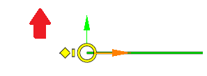 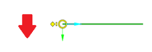

5. <strong>Contour side of machining</strong>. This is a lime arrow attached to the contour start point at the images above. To change the side of machining just click on this arrow.

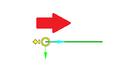 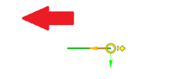

6. <strong>Contour overlaps</strong>. These are yellow dashes next to contour start and terminate points at the images above. An overlap is used to extend a toolpath beyond the contour itself. To change the overlap value you can either drag the yellow dash with the mouse or click on it and edit the dimension value which appears.

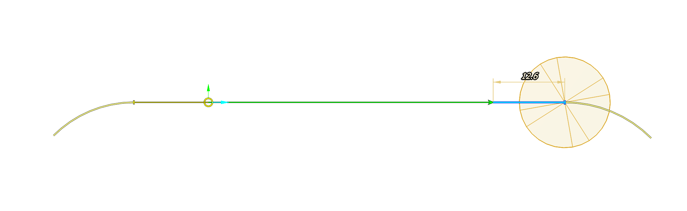

**Editing multiple overlaps in one click**

You should know that when you edit an overlap parameter this change applies to all the selected overlaps. To make the process of editing multiple overlaps quick and simple CAM system automatically highlights and selects all identical overlaps. However you can always disable this feature. Just click on the magic wand button at the top of the graphic view.

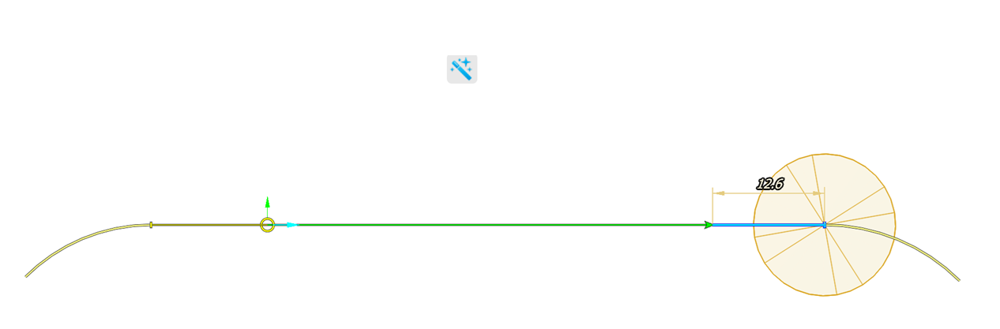 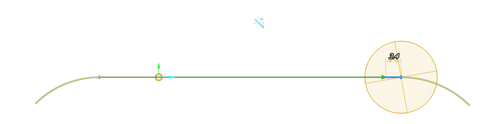

To select overlaps by a criteria you should click on one overlap, than on the check box in the action bar which appears and check the criteria on which you want select overlaps.

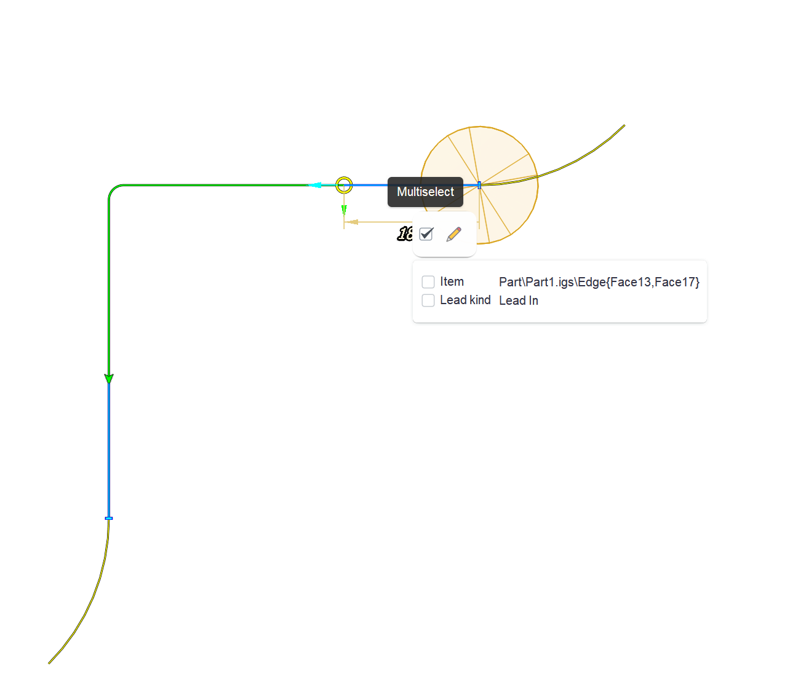

7. <strong>Contour leads</strong>. These are yellow diamonds at the above pictures. To change a lead just drag the corresponding diamond with the mouse. After that you can edit lead dimensions that appear.

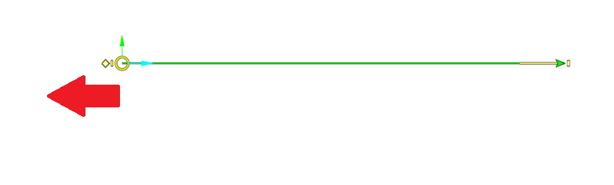 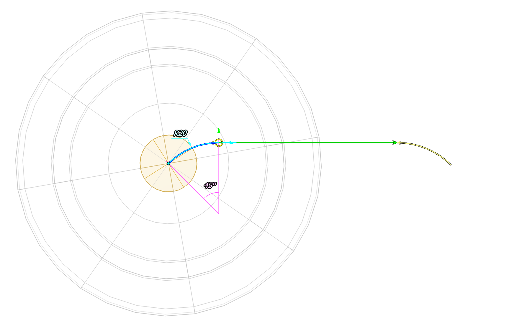

There are three lead types available: <strong>none</strong>, <strong>line</strong> and <strong>arc</strong>. To change a lead type, left click on a lead and select the lead type from the action bar that appears.

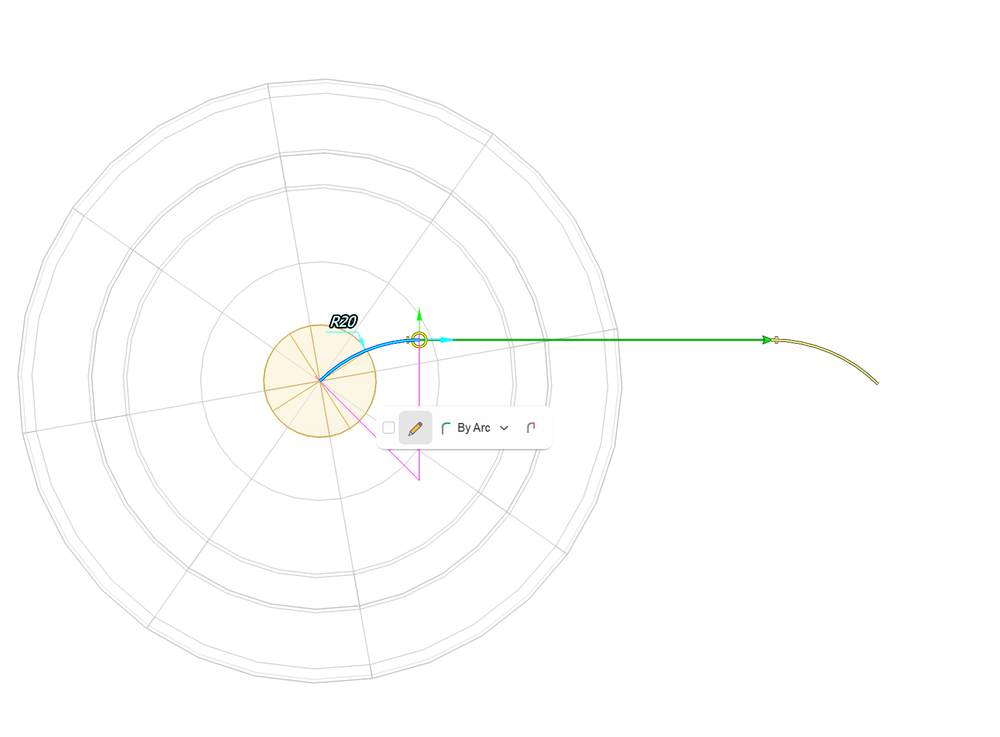

For <strong>compensated</strong> contours and <strong>Control</strong> radius compensation an additional dashed line is displayed. This line represents the tool center curve. Lead dimensions are specified for the tool center curve. This makes lead parameters independent of the current compensation type. If you want to change the size of a compensated lead using drag and drop action you should click on the yellow dot where the tool center curve is ending, and not where the uncompensated lead curve is ending.

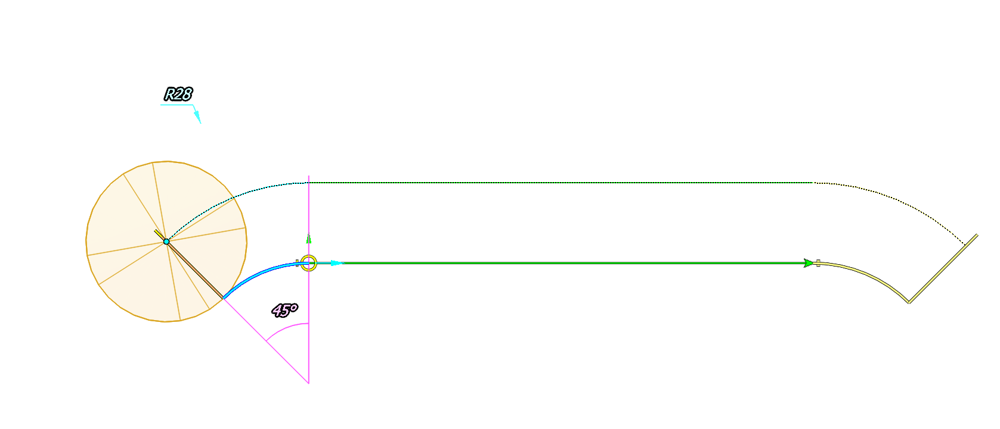

**Editing multiple leads in one click**

You should know that when you edit a lead parameter this change applies to all selected leads. To make the process of editing multiple leads quick and simple CAM system automatically highlights and selects all identical leads. You can disable this behavior by clicking on the magic wand button at the top of the graphic view. To select only one lead you should click on it twice. To select leads by a criteria you should click on one lead, than on the check box in the action bar which appears and check the criteria on which you want select leads.

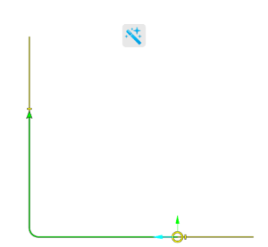 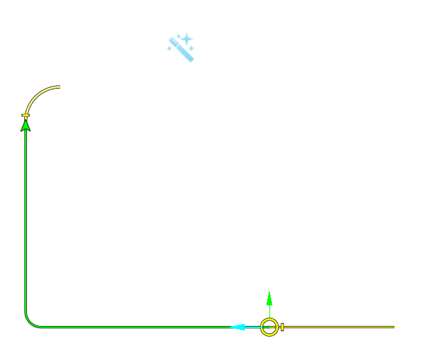

8. <strong>Contour entry lines</strong>. Entry lines are automatically added to the leads of the compensated contours when the <strong>Compensation type</strong> is other than <strong>Computer</strong>. They play the role of compensation switch lines. Entry lines are not added to leads <strong>by line</strong>, as that makes no sense. But you can also switch entry lines explicitly by clicking on a lead and checking the <strong>Use entry line</strong> button in the action bar that appears.

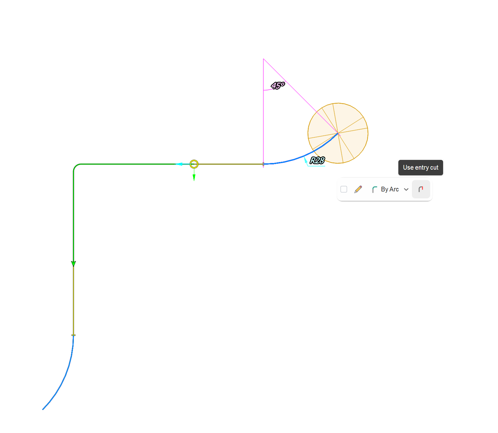 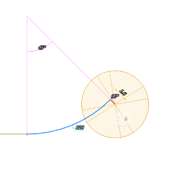

Here is an example of entry lines with <strong>Control</strong> radius compensation.

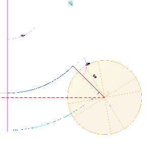

**9. Contour offsetting/radius compensation**

Contour radius compensation is generally used when you have a part line curve (e.g. an edge or a face of a vertical wall) and want to machine material from a side of this part line. To turn the contour radius compensation on just select a contour in the graphic view and click the <strong>Compensated</strong> button in the action bar that appears. The tool maximal radius is used by default as the contour offset radius. But you also can specify the tool contact point explicitly in the Tool parameters. In that case the contour offset distance will be taken from the tool contact point.

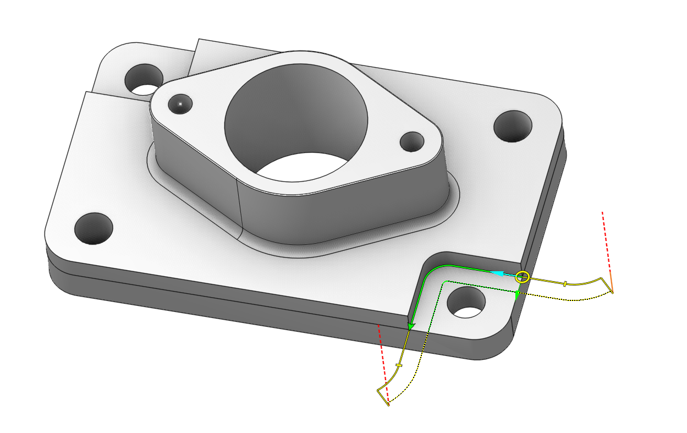

The method of radius compensation is determined by the operation parameter <strong>Radius compensation</strong>. You can select it either in the parameters inspector or in the operation parameters windows. For example for 2D contouring - Output. [Details](404.md)
