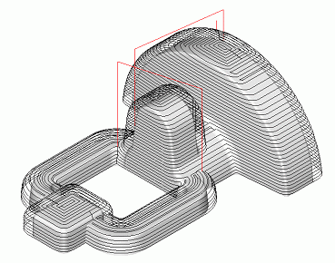

# Combined operation (waterline-drive)

By using the combined operation, an equally good finish can be achieved on both flat and steep areas. A proportionally even scallop height can be obtained even when using a fixed step. The combined strategy provides easier conditions for the cutter; this makes it possible to use longer tools with a smaller diameter. The operation gives good quality finish machining irrespective of the complexity of a models surface angle, and also minimizes the machining time.

For every geometrical object or a group of objects, an additional stock can be defined, which during machining will be added to the main stock for the operation.

If a workpiece and a restricting model are not defined, then the system performs machining of the entire available surface of the model being machined. Otherwise only those surface areas will be machined, which lie within the workpiece and outside the restricting model.

The workpiece can be assigned as a cube, cylinder, a mould with stock or prismatic form, as residual material after machining by previous operations, and also as a free-form geometrical model, consisting of solid bodies, surfaces, meshes and prisms whose bases are projections of closed curves. In the restricting model, solid bodies, surfaces and meshes which are required to be controlled during machining, and also machining areas and restricted areas, defined by projections of closed curves can be defined.

The toolpath for surface machining of a volume model is created in two stages. First, the horizontal tool paths are constructed (similar to the waterline operation), and then, by using the rules of the drive operation, toolpaths are created along a leading curve (leading curves in this case are the borders of the unmachined areas). Thus, models surface areas close to vertical are machined as a waterline operation, and flat – as drive finish. This allows the user to obtain proportionally good machining for models of virtually of any shape. The step between passes is assigned separately for the vertical plane and for horizontal plane, and also can be calculated from the defined height for the scallop.

When using a local coordinate system or a rotary axis, the position of the model being machined will not change, the tool rotation axis is parallel to the Z axis of the local coordinate system, the horizontal passes are located parallel to the XY plane of the current coordinate system, and then any unmachined areas will be milled according to the rules of the drive operation.

It is also possible to restrict machining from entering areas of the restricting model and areas of edge rounding in the resulting toolpath.

Joining of the work passes into a single toolpath can be performed going downwards or upwards. Transition between neighboring work passes can be performed on the surface, using retract and approach moves or via the safe plane.
