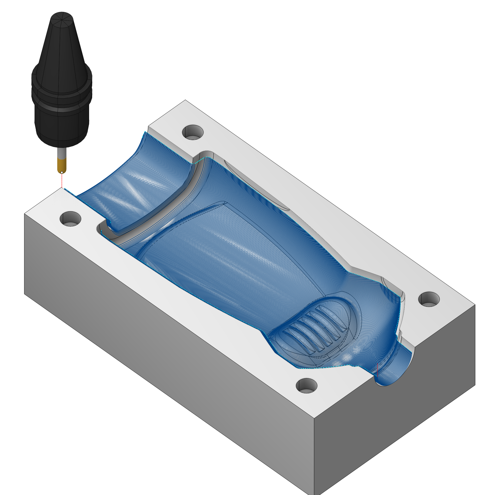
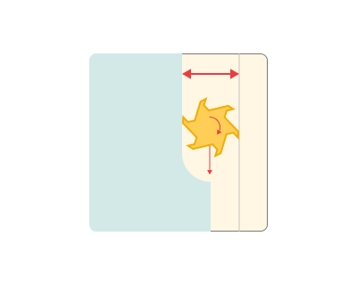
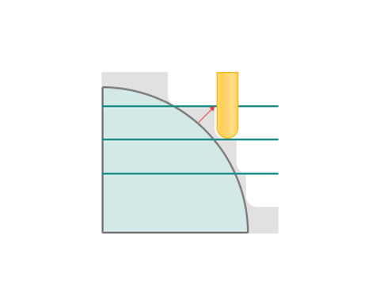
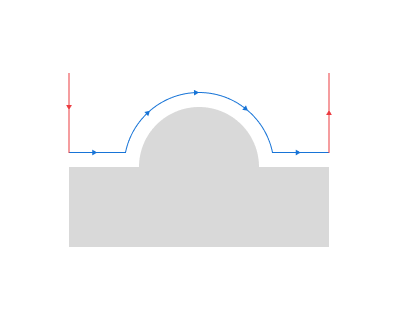
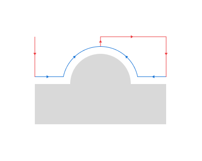
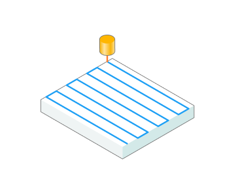
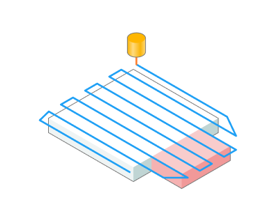
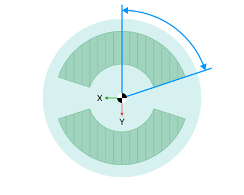

# Finishing plane

## Application area:

The plane finishing operation is designed for the machining of smooth areas of a model's surfaces, and also for areas close to vertical, whose (steep) trajectories are along the toolpath. For further remachining of other areas, it is better to use the waterline operation ([Details](841.md)) or another plane operation with a toolpath, which is perpendicular to that of the first operation.

### Setup:

The <strong>Setup</strong> tab is used to configure the primary parameters of the project. This can involve the positioning of the part on the equipment, the coordinate system of the part, and more. [Details](1022.md)

### Job assignment:

<strong>Faces.</strong> Select various surfaces of the part as the working task. The system will calculate the trajectory based on the chosen surfaces. [Details](102121.md)

<strong>Pocket.</strong> A typical prismatic or turn-milling part consists of many simple shapes.To simplify this task, we can recognize the parts elements in a 3d model and automatically convert them to basic job assignment items, such as job zones and machining levels. [Details](10154.md)

<strong>Job Zone.</strong> Job zones are used to define the part areas that have to be machined by roughing and finishing milling operations. [Details](10151.md)

<strong>Restrict Zone.</strong> In addition to <strong>Job Zones</strong> in system you can use <strong>Restrict Zones</strong> to specify the workpiece areas that have not to be machined in the current operation. [Details](10152.md)

<strong>Top Level.</strong> Specifying the top level by model elements. [Details](10153.md)

<strong>Bottom Level.</strong> Specifying the bottom level by model elements. [Details](10153.md)

<strong>Properties.</strong> Displays the properties of an element. It is possible to add the stock. You can also call this menu by double clicking on an item in the list.

<strong>Delete.</strong> Removes an item from the list.

<strong>Restrictions.</strong> It allows you to restrict areas that should not be machined. [Details](101231.md)

### Strategy:

#### Step.

The maximum allowed width of cut.

Click here to expand..

<strong>Angle.</strong> Assigns the cut angle direction for the plane operations.

<strong>Scallop.</strong> If <strong>disabled:</strong> the distance between passes is calculated using the <strong>Step</strong> parameter only.

If <strong>enabled:</strong> the step of machining is calculated automatically based on the maximum given <strong>height of scallop</strong>. Where necessary the tool passes will be generated more closely to each other to achieve the desired scallop height.

#### Machining levels.

It defines the range along tool axis for the machining. This parameter group works similarly to the <strong>Waterline roughing operation.</strong> [Details](736.md)

#### Milling type

Сan be assigned in almost all operations, except for the curve machining operations. This allows the user to control the required milling type (climb or conventional) during the toolpath calculation process. This parameter group works similarly to the <strong>Waterline roughing operation.</strong> [Details](736.md)

#### Sorting.

Controls the sequence of toolpath passes during the surface machining.

Click here to expand..

<strong>Upwards only. If disabled</strong>: the tool is allowed to move <strong>both in up and down</strong> directions.

<strong>If enabled</strong>: the tool is allowed to move <strong>only upwards</strong>. Where necessary the tool passes are split and relinked.

#### Job zone.

Enables additional modification of the working area initially selected on the <strong>Job assignment</strong> tab.

Click here to expand..

<strong>Surface Roll Type.</strong> Surface rolling method.

<strong>Surface only.</strong> It machining only on selected surfaces.

<strong>With edges.</strong> It machining on selected planes and with edges. In the <strong>With edges</strong> mode, the resulting toolpath consists of the machining areas of the form-creating surfaces and the areas of edges rolling. This mode could be used for instance, to make edges round when machining a model with a positive stock.

<strong>With restriction model.</strong> It machining on selected plane,restriction and with edges. When using the <strong>With restricting model</strong> mode, all machining and rolling areas of the model and the restricting model will be included in the resulting toolpath.

<strong>Min slope angle.</strong> In the system it is possible to perform selective machining of the model surface areas, depending on the angle between the normal to the surface and the vertical axis Z. The range being machined can be defined by the <strong>minimum</strong> and maximum slope angles.

<strong>Max slope angle.</strong> In the system it is possible to perform selective machining of the model surface areas, depending on the angle between the normal to the surface and the vertical axis Z. The range being machined can be defined by the minimum and <strong>maximum</strong> slope angles.

<strong>Frontal angle.</strong> The frontal angle is the angle between projections onto the horizontal plane of the tool movement direction and the normal to the surface at the cutting point. [Details](163.md)

#### Corners smoothing.

When there is a sudden change of the tool direction, the milling control performs deceleration before starting the turn, and then accelerates again. This fact can lead to vibrations and high tool and milling machine wear. The problem can be solved if the toolpath has very few or no breaks. For this reason, in the system there is the toolpath smoothing function using the defined radius for machining inner or outer corners of the model.

#### Trimming.

Allows for the skipping of surfaces not intended for machining and allows for the extension of the toolpath. Some parameter group works similarly to the <strong>Waterline roughing operation.</strong> [Details](736.md)

Click here to expand..

<strong>Gap capping.</strong> When enabled, gaps along cut with the size less than the given value are connected with lines.

.png) .png)

### Parameters:

This tab contains the main parameters for controlling the part, workpiece, fixture and other items, which allow you to change the trajectory. [Details](100112.md)

### Links/Leads:

In the Links/Leads tab, you define the parameters for rapid movements. These movements include tool approach from the tool change position, engage to the start of the working stroke, retraction after the final cutting motion, transitions between working passes, and return to the tool change point. You can configure the sequence of movements along the coordinates, the trajectory of these motions, and the magnitude of displacements.

Click here to expand..

<strong>Сonsists of:</strong>

<strong>Approach/Return.</strong> This group of parameters manages the tool movements from the tool change position to the start of the engage toolpathes, and back. [Details](100116.md).

<strong>Safe motions.</strong> Defines the type of Safety Surface and the distance from the workpiece to it. This surface facilitates transitions between the processed surfaces or tool paths, and the first stage of approach or return occurs toward it. [Details](100117.md).

<strong>Advanced links settings.</strong> This group of parameters specifies the features of trajectory formation for primarily five-axis operations, considering optimal movements of rotational axes. [Details](100118.md).

<strong>Links.</strong> Defines the rules governing Entry/Exit links and links between work moves. [Details](100131.md).

<strong>Leads.</strong> Allows you to add additional engage and retract to the working moves using their feed. [Details](100135.md).

<strong>Distances.</strong> Distances required to switch feeds [Details](100138.md).

### Feeds/Speeds:

Using this dialogue the user can define the spindle rotation speed; the rapid feed value and the feed values for different areas of the toolpath. Spindle rotation speed can be defined as either the rotations per minute or the cutting speed. The defining value will be underlined. The second value will be recalculated relative to the defining value, with regard to the tool diameter. [Details](100142.md)

### Transformations:

Parameter's kit of operation, which allow to execute converting of coordinates for calculated within operation the trajectory of the tool. [Details](10168.md)

### Part:

A Part is a group of geometrical elements that defines the space to check for gouges. [Details](330.md)

### Workpiece:

A workpiece model of an operation defines the material to be machined. [Details](738.md)

### Fixtures:

As the Fixtures the fixing aids such as chucks, grips, clamps, etc., and the restriction areas of any other nature are usually specified. [Details](10283.md)
