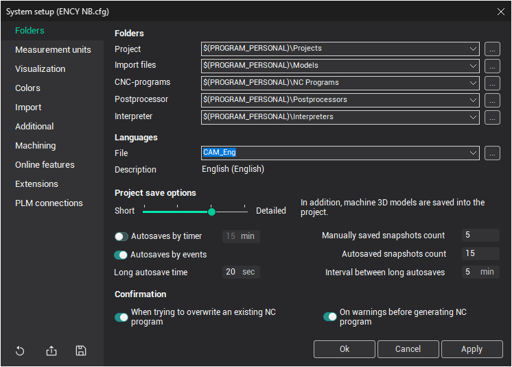

# Folders tab

In this window, the user can set default paths for the CAM system files.

- <strong>Project</strong>: The default folder for loading and saving projects.
- <strong>Import files</strong>: The default folder for loading geometrical model files (IGES, DXF, etc.).
- <strong>`CNC-programs`</strong>: The default folder for saving [NC-programs](69.md) generated by the postprocessor.
- <strong>Postprocessor</strong>: The default folder for loading postprocessor files.
- <strong>Interpreter</strong>: The default folder for loading interpreter files.

The paths can be entered manually or by using the path selection dialog, which can be accessed by clicking the  button.

## Pre-defined variables for defining directories:

- <strong>`$(ENCYDIR)`</strong>: The directory from which the CAM system was launched.
- <strong>`$(PRJDIR)`</strong>: The directory defined in the <strong>Project</strong> field.
- <strong>`$(PROGRAM_PERSONAL)`</strong>: The directory created in the user's personal documents folder <strong>My Documents</strong> during installation.
- <strong>`$(PROGRAM_COMMON_DOCUMENTS)`</strong>: The directory created in the public documents folder <strong>Public Documents</strong> on the local computer during installation.

When defining the actual directory paths used by the CAM system, these variables will be replaced by the corresponding full paths at system start-up or based on user-defined settings.

## Additional settings:

- <strong>System languages</strong> can be changed on the <strong>Languages</strong> panel. The language change will be applied to the current session.
- <strong>Project save options</strong>: These options control the size of the project files. The more detailed the information saved, the larger the project file. The following methods are available, listed from saving the minimum necessary information to the most complete:
  1. Only source data (geometrical models, coordinate systems, operations, and their parameters) are saved.
  2. In addition to the above, the toolpaths of operations are saved.
  3. In addition to the above, 3D models of the machine schema files and tools are saved.
  4. In addition to the above, intermediate workpiece states are saved.
- <strong>Autosaves and snapshots</strong>: A group of options that allows configuring the creation of backup versions of projects, including <strong>Autosaves by timer</strong>, <strong>Autosaves by events</strong>, <strong>Manually saved snapshots count</strong>, <strong>Autosaved snapshots count</strong>, <strong>Long autosave time</strong>, and <strong>Interval between long autosaves</strong>. See the [Autosaves and project snapshots](10424.md) article for more details.
- <strong>Confirmations</strong>: It is possible to disable the confirmation message during NC file generation when overwriting an existing file on the <strong>Confirmation</strong> panel. You can also configure confirmations <strong>on warnings before generating NC programs</strong>, providing additional control over critical steps in the workflow.
