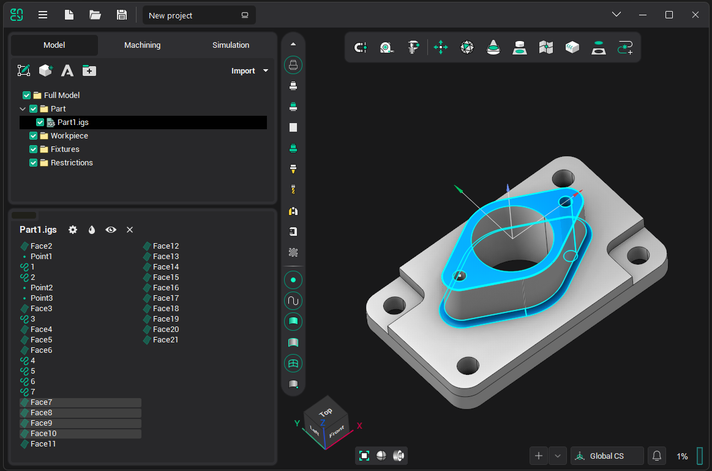
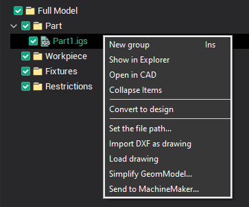
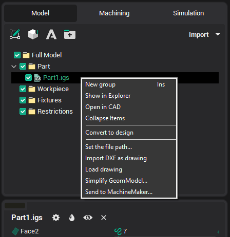
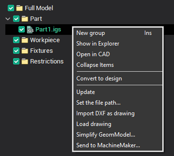
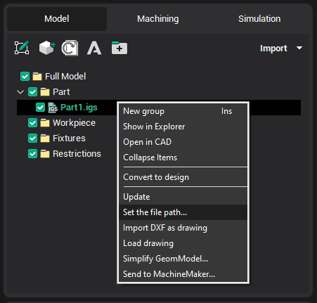
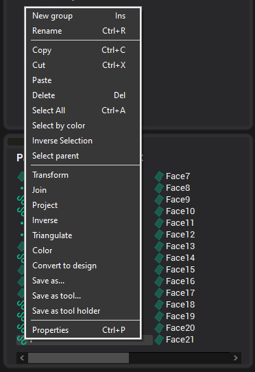
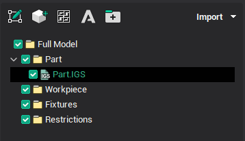

# Geometrical model structure window

The model structure window consists of three panels: the **tools panel**, the **model tree** and a **list of available objects**.

In the **model tree** panel above, the structure of the whole model is displayed. Three nodes make up the groups of the model, which are located at different levels. The [active groups](1.md) are highlighted. When selecting an inactive group using the mouse or keyboard, the group becomes active and the list of available objects changes accordingly.

> Below, commands from pop-up windows will be considered, repeated commands will be skipped.

Clicking the right mouse button on a normal group in **model tree** brings up the following pop-up window:

Commands:

- <strong>New group</strong> - adds a new object the [active group](1.md).
- <strong>Import DXF as sketch</strong>, <strong>Load sketch</strong> - commands for work with [sketches](833.md).

Clicking the right mouse button on the node of the imported model in the **model tree** causes the following pop-up window:

Commands:

- <strong>Show in Explorer</strong> - will open the folder, where contains the imported file;
- <strong>Open in CAD</strong> - file will be opened in the linked CAD, if not, then window selection appears.

> If the imported file has been changed, the name of the group will be allocated <strong>bold</strong>, the toolbar button appears "[Model files update manager](6231.md)" , and the <strong>[Update](6231.md)</strong> (update only selected group) command will appear in a pop-up window:
>
> 
>
> If the imported file has been renamed, moved or deleted, the <strong>Set File Path...</strong> (allows you to specify the new location of the imported file) command will appear in a pop-up window.
>
> 

Clicking the right mouse button on any group in the **list of available objects** causes the following pop-up window:

Commands:

- <strong>Rename</strong> - allows you to edit the name of the selected object;
- <strong>Copy</strong>, <strong>Cut</strong>, <strong>Paste</strong> - [working with the exchange buffer](749.md);
- <strong>Delete</strong> - deletes selected objects;
- <strong>Select All</strong> - selects all geometric objects;
- <strong>Select by color</strong> - selects all objects in the tree that have the same color as the selected one:
- <strong>Inverse Selection</strong> - selects all other objects, and the selection of current cancels;
- **[Transform](116.md), [Join](400.md), [Project](401.md),** **[Triangulate](619.md)** - commands are duplicated on **tool panel** and described below;
- <strong>[Inverse](34.md)</strong> - inverting normals of surfaces;
- <strong>Color</strong> - allows you to change the color of the selected object;
- <strong>Save as...</strong> - offers to save the selected geometric objects in one of the supported formats;
- <strong>[Save as tool...](10343.md)</strong> - saves the selected object in the form of an arbitrary shaped tool;
- <strong>Save as tool holder</strong> - saves the selected object in the form of an arbitrary holder;
- <strong>[Properties](57.md)</strong> - calls the properties window of geometric objects.

In the **list of available objects**, all groups and geometrical objects, which are a part of the [active group](1.md), are displayed. That is, the objects which are currently available for selection and modification. Single left mouse clicking on any of the listed objects, selects that object.

-  – Viewing and editing [properties of selected objects](57.md).
-  – Setting color of selected objects.
-  – Set selected surfaces visible/invisible.
-  – Deletes selected objects.

-  – Starts the [CAM system CAD drawing](20000.md).
-  – [Creating texts](617.md).

-  – [Spatial transformations](116.md) of selected objects.
-  – [Surface triangulation](619.md).
-  – Getting curves as [section of 3D model](289.md) by plane.
-  – [Surfaces boundary projection](401.md) on plane.
-  – [Sew faces](1000.md).
-  – [Triangulation of selected curves or patching holes in meshes](10060.md).
-  – [Joining curves](400.md).
