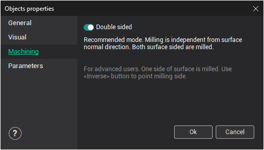
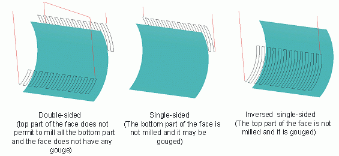

# Machining tab

**Double sided** – allows the user to define the surface type. When loading a geometrical model all surfaces are set as "double sided". This means that surface machining will be performed independently from the normal vector direction – from both sides. Thus, the side of the surface being machined is defined only by its spatial position – the top side will be machined. This mode is recommended to use for surface models. This has very little effect on the calculation time.

The user can also define the side to be machined. To do so, the tick in the **Double sided** field must be unchecked. In this case the system will allow machining only on the side that the surface normal vector is pointing to. The side to be machined is selected using the [invert](34.md) function. When surface machining in single side mode, the calculation of toolpaths is performed faster than when machining a double sided surface, but it might cut a part of the surface, where the normal is pointing downwards. This mode is recommended for use with 'solid' models, where all normals are pointing outwards or with models with a small number of surfaces.

<em>Attention: Incorrect direction of the normal vectors for non "double-sided" surfaces may cause faulty results during execution of machining operations.</em>
