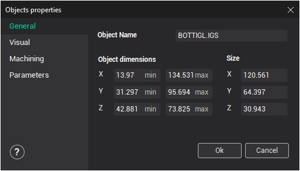

# General tab

On the general properties tab, if an object is selected, its name can be changed. Displayed also are the minimum and maximum coordinates of the selected objects along each of its axes.

**Object Name** – name of the selected object. If several names are selected, then the field will be empty.

**Object dimensions** – overall dimensions of the selected object.
