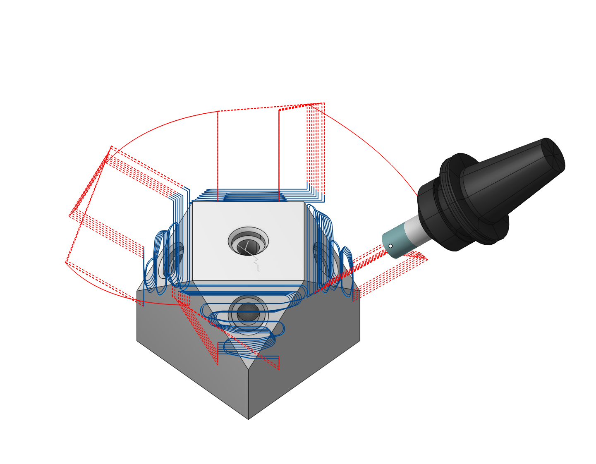
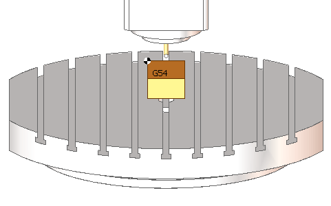
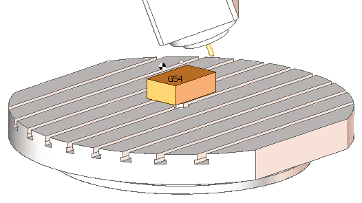
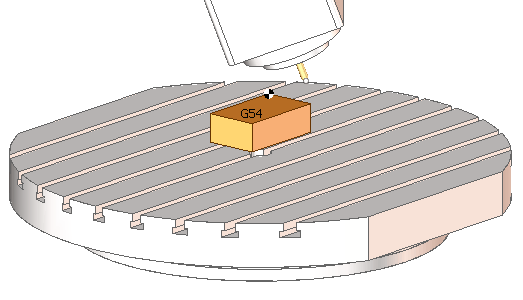

# Operation local coordinate system

 

## Application area:

Allows generating a trajectory within a coordinate system additionally offset and rotated concerning the workpiece coordinate system. For instance, a program for machining an inclined pocket concerning the workpiece coordinate system will be much simpler if derived in a local coordinate system aligned with the pocket's inclination. This method is used for positional 5-axis (3+2) machining. When selecting the 'Auto' value, the direction of the Z-axis in the local coordinate system is automatically set along the tool rotation axis, which is defined by parameters in the Tool Orientation group.

## Principles of working

An operation generates the toolpath in a local coordinate system. By default an operation generates the toolpath in the [workpiece coordinate system](10068.md) (G54). However you can change this behavior by specifying the Local CS parameter in the Setup panel.

The parameter can be set by two ways. You can select the local coordinate system from the drop down list, and you can set the local coordinate system in the interactive mode by clicking on the ellipses button.

The drop down list contains the following options:

1. **Off** - the local coordinate system is disabled - the toolpath is generated in the [workpiece coordinate system](10068.md).

<strong>Initial machine</strong> <strong>configuration (A0 C0)</strong>. G54 is at the top left corner of the workpiece, the tooling point is at the tool tip.

<strong>Machine configuration after 5 axis positioning without Local CS enabled (A20 C-40)</strong>. The workpiece and the tool are moved, but the G54 and the tooling point still stay the same. The generated toolpath will be depend on the workpiece setup and the tool length.

2. **Auto** - the position of the local coordinate system is determined by the current position of the machine rotary axes. The Z axes of the LCS is aligned to the tool axis direction. The origin of the LCS coincides with the position of the workpiece zero point (G54), but you can easily relocate it in the interactive mode (the ellipses button).

<strong>Initial machine</strong> <strong>configuration (A0 C0)</strong>. G54 is at the top left corner of the workpiece, the tooling point is at the tool tip.

<strong>Machine configuration after 5 axis positioning with Local CS set to AUTO (A20 C-40)</strong>. The G54 is again at the workpiece top left corner, the tooling point is again at the tool tip. The generated toolpath will be independent on the workpiece setup / tool length

So generally you should use the Auto option of the Local CS parameter. For more information refer to the Operation local coordinate system topic.

3. The list of geometrical [coordinate systems](753.md). To define the operation local coordinate system exactly the same as you want you can create an appropriate geometrical coordinate system and select it from the Local CS drop down list.

When you enable a local coordinate system CAM system generates the Origin command in the header section of the CLData. The origin command contains all the data required for postprocessing toolpath. These are:

1. MCS - the position of the local coordinate system relative to the machine coordinate system (G54). This matrix is used in old controls without the tool center point management function (TCPM).

2. WCS - the position of the local coordinate system relative to the workpiece coordinate system (G54 rotated together with the workpiece). This matrix is used in the controls with the TCPM function.

3. Coordinates of the rotary axes positioning the tool axis along the z axis of the local coordinate system.

By clicking on the ellipses button next to the Local CS parameter you enter the interactive mode of Local CS definition. After positioning the local coordinate system just click OK to apply the changes. [Details](260.md)

In addition some controls do not support the definition of a local coordinate system by spatial angles. Those controls require the local CS is defined by the actual machine rotary angles, aligning the tool axis direction along the Z axis of the local coordinate system. CAM system supports such controls. The corresponding option is available under the Control parameters section in the machine properties.

Another control feature is the Local CS positioning mode. This option determines the behavior of the control when it treats the Origin command. CAM system supports the following modes of the Local CS positioning. (<strong>Machine Setup - Control parametrs - Indexed 5-sxis machining - Local coordinate system (ORIGIN))</strong>

1. Stay - the origin command does not move the machine axes.

2. Turn - the origin command rotates the machine axes in such a way the tool axis direction becomes aligned with the Z axis of the local coordinate system.

3. Move - the origin command rotates the machine axes to align the tool axis with the Z axis of the local coordinate system and moves the linear axes in such a way the tool tip position stays the same relative to the workpiece.

In the next table there are commands for the most commonly used CNC controls which can be generated by the postprocessor instead of the **ORIGIN** command.

| Origin | G92 G68 | TRANS ROT | Cycle 7 Cycle 19 |
|---|---|---|---|
