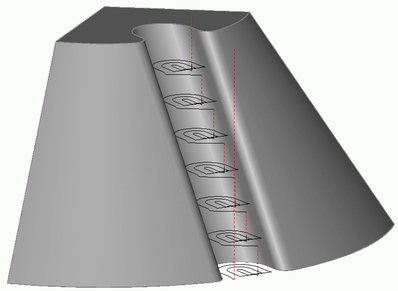

# Rest machining

The rest milling operations allow the user to perform machining only in areas where there is unmachined stock material left after previous machining operations. It is also possible to machine remaining material after 'virtual' machining performed using a user-defined list of tools. These operations are designed for rough or finish rest milling using tools that have a different shape or with a smaller diameter than those that were used for previous operations. The application of rest milling can considerably decrease the machining time for complex shaped models, thereby reducing costs.

The rest milling operations are identical to the other machining operations, the only differences are the default parameters assigned. These defaults are: a smaller diameter [tool](37.md) is selected, and the workpiece is set as 'residual material'. During rest milling, the roughing operations perform removal of the 'volume' residual material, and the finishing operations machine the model surfaces only in areas that are unfinished.

Rest milling of residual material is enabled in the system by selecting the workpiece as material that is left after all previous operations. Calculation of the workpiece and selection of unmachined areas is performed automatically by the system. This approach has some valuable benefits when compared to the widely used method of **Machine after a tool of any size**. Firstly, it can correctly calculate the residual material, even if incompatible definitions for previous operations are used. It also means that all previously used operations and their characteristics (tool types etc.) are considered when creating the rest machining strategy.

All machining characteristics for the rest milling operations are similar to the normal machining operations of the same type.
