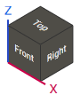

# Standard views

The standard views panel in the main window may vary depending on the type of machine, such as turning or milling, etc. When one of the buttons is selected, the corresponding view vector is set in the graphic window. If the view vector in the graphic window is changed by another method, the selected button on the panel will automatically release.

Clicking the [<strong>Middle Mouse Button</strong>] (Mouse Wheel) sets one of the nearest standard views.
