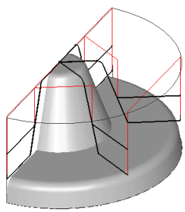

# Drive roughing operation

In some cases a model after machining with drive curve roughing can be very close to the required finished model, however, due to the unevenness of the volume of the material being removed it is not always possible to reach the optimum machining time. The drive roughing operation is recommended for use when a model's periphery (outer edge) is lower than the center and the outer workpiece contour is similar to the model contour.

A model being machined using the drive roughing operation is assigned by a set of solid bodies, surfaces and mesh objects. For every geometrical object or a group of objects, an additional stock, which during machining will be added to the main stock of the operation, can be defined.

The workpiece can be assigned as a cube, cylinder, a mould with stock or prismatic form, as residual material after machining by previous operations, and also as a free-form geometrical model, consisting of solid bodies, surfaces, meshes and prisms whose bases are projections of closed curves. In the restricting model, solid bodies, surfaces and meshes which are required to be controlled during machining, and also machining areas and restricted areas, defined by projections of closed curves can be defined.

The operation performs removal of the entire material of the workpiece, which lies outside of the model being machined and outside the restricting model. As in the plane operation, separate paths are used to perform surface machining of the volume model. Depending on the operation parameters, the work passes lie either in vertical planes (across leading curves) or in vertical mathematical cylinders, the shape and location of which are defined by the leading curves (along leading curves). The step-over between the toolpaths of neighboring work passes can be either fixed or calculated according to the defined height of the scallop. To limit the pressure on the tool, the depth of cut (Z axis) can be limited. That is, if the thickness of the workpiece material being removed exceeds the user defined depth, then the material will be removed in several passes.

When using a local coordinate system or a rotary head, the position of the model being machined will not change, the tool rotation axis is parallel to the Z axis of the local coordinate system, and all work passes are located in planes or mathematical cylinders, perpendicular to the horizontal plane of the local system.

If during machining, the tool must not cut any material that is over a user-defined angle, then the downward movement of the tool can be limited. The available types of limitation are: machining upwards only with maximum cutting angle without rest milling of the shadow areas, with a maximum cutting angle with rest milling of shadowed areas, and without downwards movement control.

Transition between work passes can be performed via the shortest distance, with the addition of approach and retract moves, or via the safe plane. If material removal is performed is divided into depths, then the system first removes the entire material at the first depth before starting on the next one.

There is can to be used quick calculation method also.
