# Roughing waterline

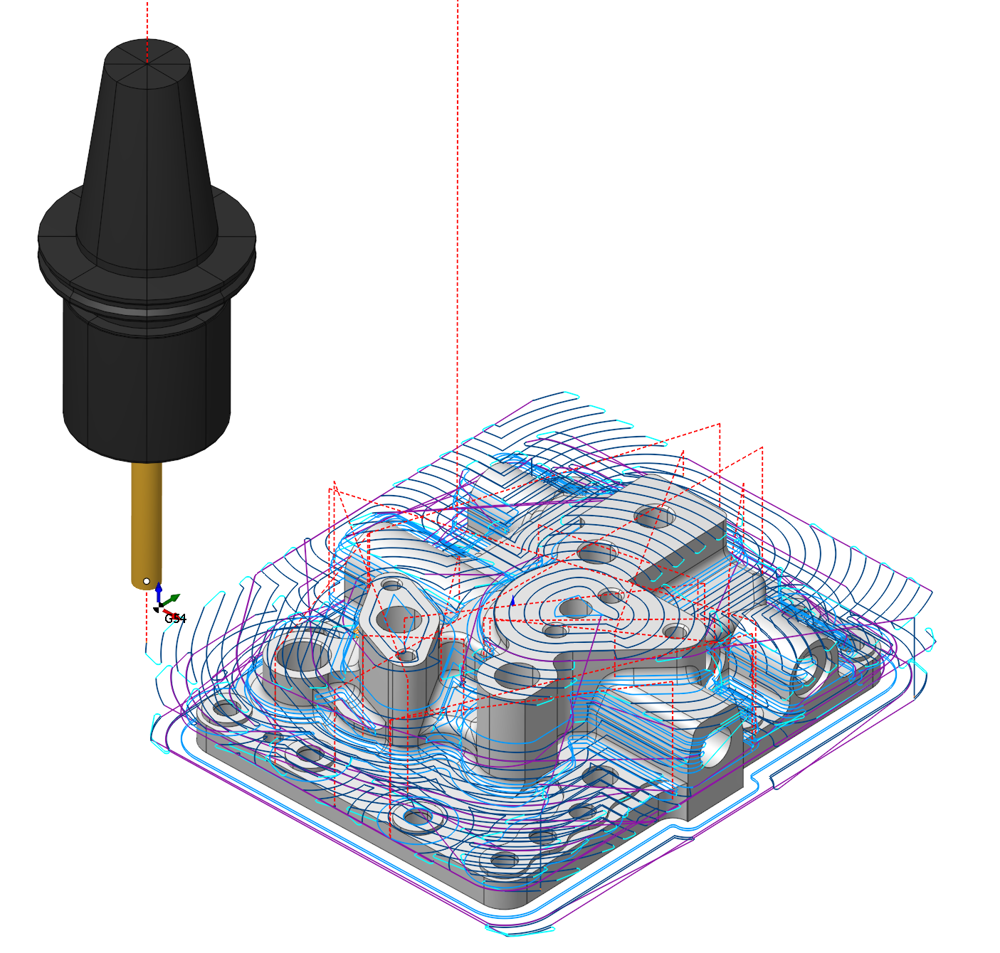

## Application area:

The waterline roughing operation is used for the initial rough machining of complex-shaped models that differ significantly from the original workpiece. A model being machined by the waterline roughing operation is assigned by a set of solid bodies, surfaces and mesh objects. For every geometrical object or a group of objects, an additional stock, which during machining will be added to the main stock of the operation, can be defined.

### Setup:

The <strong>Setup</strong> tab is used to configure the primary parameters of the project. This can involve the positioning of the part on the equipment, the coordinate system of the part, and more. [Details](1022.md)

### Job assignment:

<strong>Faces.</strong> Select various surfaces of the part as the working task. The system will calculate the trajectory based on the chosen surfaces. [Details](102121.md)

<strong>Pocket.</strong> A typical prismatic or turn-milling part consists of many simple shapes.To simplify this task, we can recognize the parts elements in a 3d model and automatically convert them to basic job assignment items, such as job zones and machining levels. [Details](10154.md)

<strong>Job Zone.</strong> Job zones are used to define the part areas that have to be machined by roughing and finishing milling operations. [Details](10151.md)

<strong>Restrict Zone.</strong> In addition to <strong>Job Zones</strong> in system you can use <strong>Restrict Zones</strong> to specify the workpiece areas that have not to be machined in the current operation. [Details](10152.md)

<strong>Top Level.</strong> Specifying the top level by model elements. [Details](10153.md)

<strong>Bottom Level.</strong> Specifying the bottom level by model elements. [Details](10153.md)

<strong>Properties.</strong> Displays the properties of an element. It is possible to add the stock. You can also call this menu by double clicking on an item in the list.

<strong>Delete.</strong> Removes an item from the list.

<strong>Restrictions.</strong> It allows you to restrict areas that should not be machined. [Details](101231.md)

### Strategy:

#### Machining strategy:

This parameter allows the user to achieve a toolpath that appears parallel or equidistant or other when performing pocketing operations.

Click here to expand..

<strong>Type of Machining Strategy:</strong>

Click here to expand..

<strong>Equidistant.</strong> Processing along curves obtained by offsetting the part contour. [Details](10172.md)

<strong>Parallel.</strong> Processing with parallel passes. [Details](10172.md)

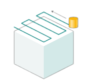

<strong>Adaptive.</strong> The strategy is used to effectively remove large volumes of material with high feedrates, maximal cutting depths (up to the flutes length) and relatively shallow cutting widths (5% to 30% of the tool diameter). [Details](10171.md)

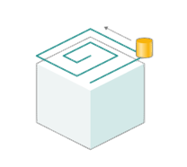

<strong>HPC.</strong> The high performance cutting strategy is designed for the efficient removing of material in the open and closed pockets. [Details](10148.md)

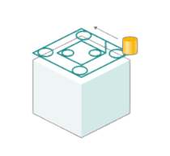

<strong>Deep HPC.</strong> Equidistant machining with additional looping motions at corners. [Details](10172.md)

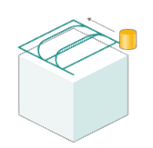

You also need to read about how to choose the pocketing strategy. [Details](10172.md)

Here are the key parameters, the set of which may vary <strong>depending</strong> on the chosen strategy in the <strong>Machining strategy</strong> section:

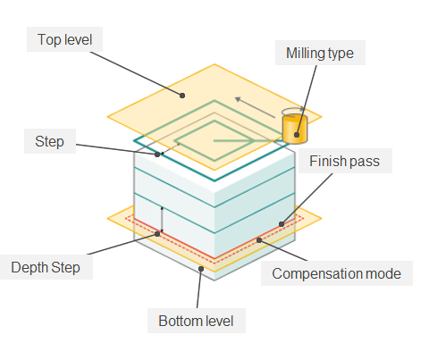

<strong>Step.</strong> The maximum allowed width of cut.

<strong>HSC step.</strong> Define the step of the trochoidal arcs as either; a percentage of the current tool diamater or, as a set distance. If the high speed cuts are disabled then unmachined areas are possible.

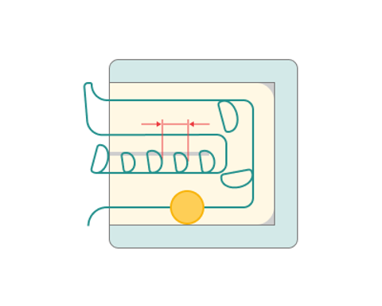

<strong>Big arcs.</strong> Expands arcs between the passes of the trajectory.

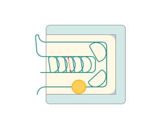

<strong>Finish pass.</strong> For some strategies, a finishing pass is added. Before the finishing pass, an allowance equal to the value specified in the parameter is added.

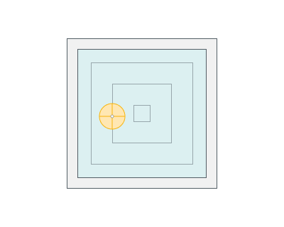 

<strong>Compensation mode.</strong> Similar to the <strong><strong>Output</strong></strong> group in <strong><strong>2D contouring</strong>. [Details](404.md)</strong>

<strong>Finish rounding radius.</strong> The parameter is necessary for rounding corners during the finishing pass.

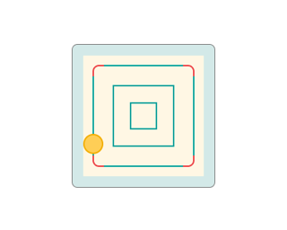

<strong>Rough rounding radius.</strong> The parameter is necessary for rounding corners during the roughing pass.

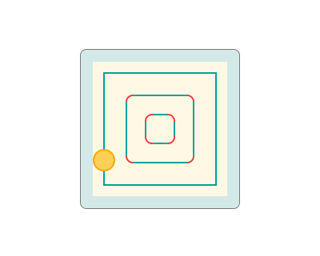

<strong>Linking radius.</strong> Linking radius for the 'links' and also the transitions for the trohoidal arcs.

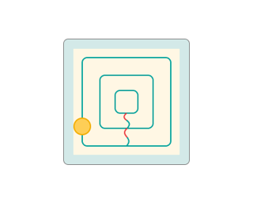

<strong>Angle.</strong> Assigns the cut angle direction for the plane operations.

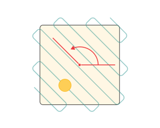

<strong>Corners smoothing.</strong> Virtually, it is used in most operations and provides toolpath 'rounding' when machining inner corners. This reduces vibrations and increases machining speed. Rough passes inside the contour do not have rounding.

#### Machining levels:

It defines the range along tool axis for the machining.

Click here to expand..

<strong>Top level.</strong> The level at which the final pass is made. By default it is the top most level of the machined part.

<strong>Bottom level.</strong> Drag the plane with the mouse or drag the plane centre circle and use 'Smart snap' to align with a feature or, click on the dimension in the graph view to set the desired bottom level for machining. If the text in the field is green in colour, the level is calculated automatically as the top of the part, wokpiece and fixtures. To return to the automatic mode, simply clear the field and press 'Enter'.

#### Depth Step:

Material removed in one pass along the tool axis between the <strong>Top</strong> and <strong>Bottom levels</strong>.

Here are the key parameters, the set of which may vary depending on the chosen strategy in the Machining strategy section:

Click here to expand..

<strong>Step up.</strong> Machining is performed strictly from top to bottom.

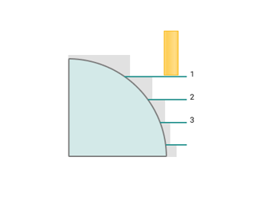 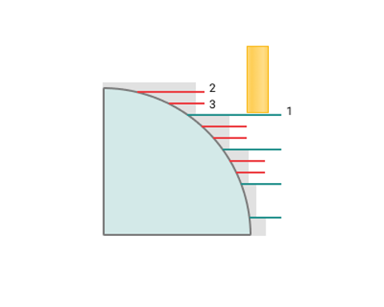

<strong>Step up value.</strong> Distance from the already machined layer to the overlying one.

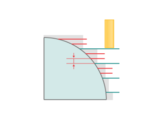

<strong>Relief angle.</strong> Inputting a positive value avoids the tool shank 'rubbing' as the machining depth increases. [Details](256.md)

#### Clear flats.

Extra passes are applied for flat faces.

Click here to expand..

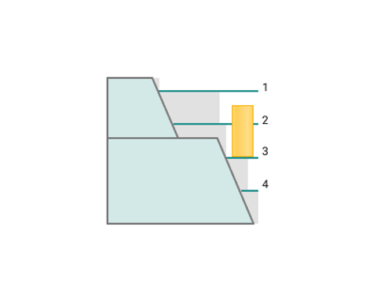 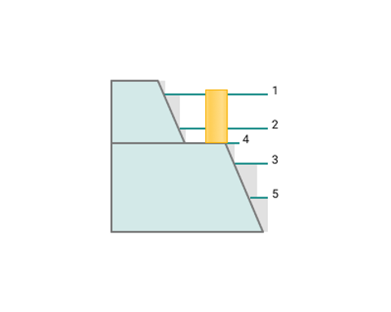

Here are the key parameters, the set of which may vary <strong>depending</strong> on the chosen strategy in the <strong>Machining strategy</strong> section:

<strong>Flats on finish feed.</strong> Outputs the Clear flats path on the finishing feed. Doesn't work with Cleanup height.

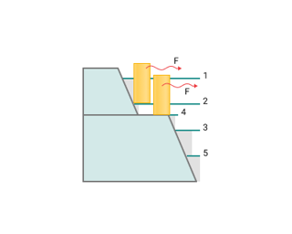

<strong>Cleanup height.</strong> The function adds a new pass at the distance specified in the parameter from the Clear flats pass, when the Clear flats option is enabled.

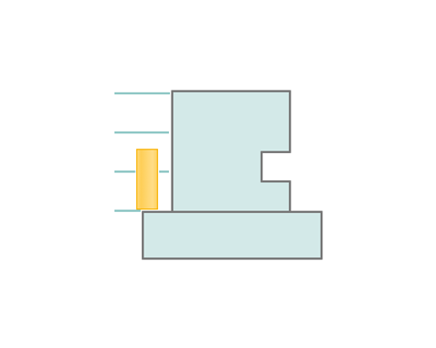 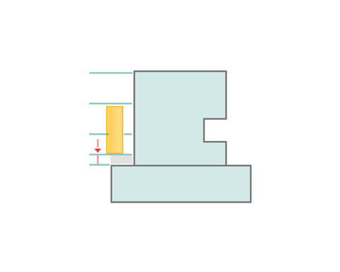

#### Milling type:

Сan be assigned in almost all operations, except for the curve machining operations. This allows the user to control the required milling type (climb or conventional) during the toolpath calculation process.

Click here to expand..

<strong>Climb.</strong> In machining refers to a cutting strategy where the tool moves in the same direction as the rotation of the workpiece. It typically results in less tool wear and a smoother finish compared to "Conventional" cutting, where the tool moves against the rotation of the workpiece. Climb cutting is often preferred when precision and surface finish are critical.

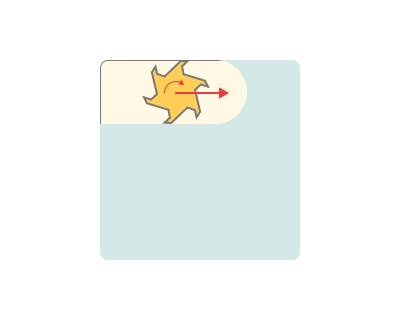

<strong>Conventional.</strong> Cutting in machining refers to a strategy where the tool moves against the rotation of the workpiece. This cutting method is used in machining operations, but it can result in more tool wear and a rougher finish compared to "Climb" cutting, where the tool moves in the same direction as the workpiece rotation. Conventional cutting is sometimes chosen when other factors, such as tool life or chip evacuation, are more important than surface finish.

<strong>Both.</strong> Refers to the practice of using both "Climb" and "Conventional" cutting strategies during a machining operation. This approach can be employed to optimize tool performance, surface finish, and other machining factors depending on the specific requirements of different parts of the workpiece or different stages of the machining process. It allows for greater flexibility and control in achieving desired results in machining.

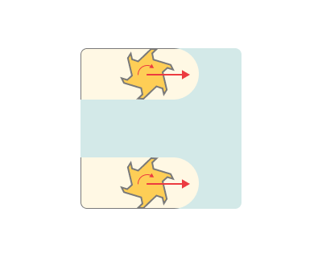

#### Sorting.

Controls the sequence of toolpath passes during the surface machining.

Click here to expand..

Here are the key parameters, the set of which may vary <strong>depending</strong> on the chosen strategy in the <strong>Machining strategy</strong> section:

<strong>By cavities.</strong> All levels of the first profile are machined first. After that all levels of the next profile are machined.

<strong>By layers.</strong> The first layer of all profiles is machined in the beginning. After that the next layer is machined.

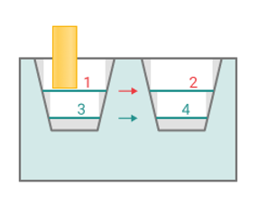

<strong>Downwards Only.</strong> Sort the machining to be strictly from the top to bottom. This can create a non-optimal toolpath. Enable this option only if you encounter errors with the level sorting. It can sometimes eliminate the problems.

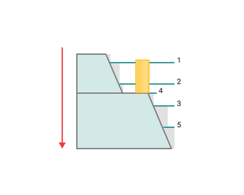

<strong>Machining Order.</strong> Defines the machining sequence in the curve machining operations.

<strong>Direct.</strong> Sort the passes in such a way that the intersection begins on the left side of the arrow (parameter Angle), when looking in the direction of the arrow. It works only with the Parallel strategy.

<strong>Inverted.</strong> Sort the passes in such a way that the intersection begins on the right side of the arrow (parameter Angle), when looking in the direction of the arrow. It works only with the Parallel strategy.

<strong>Optimal.</strong> Sort the passes in such a way that the intersection begins at the shortest distance (which reduces the number of transitions between passes). This sorting method is applicable only with the Parallel strategy.

Trimming

Allows for the skipping of surfaces not intended for machining and allows for the extension or trimming of the toolpath.

Click here to expand..

<strong>Hole capping.</strong> Quite often a geometrical model has holes the machining of which has been performed earlier or are required to be machined in a later operation. In this case, when machining the surface that has the hole, it can be ignored. The ignored holes can be of any shape (not always round). The defined size describes the diameter of a disk that can cover the hole.

 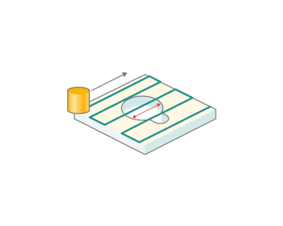

<strong>Trim waste rolls.</strong> The cutter 'rolls' around the sharp outer corners of a model. The tool path is smooth but not always optimal.

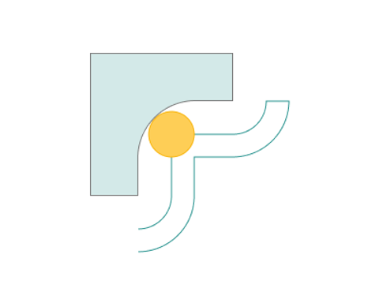 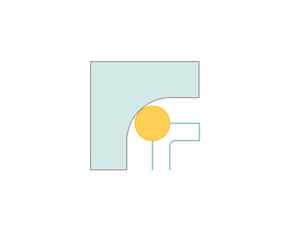

### Parameters:

This tab contains the main parameters for controlling the part, workpiece, fixture and other items, which allow you to change the trajectory. [Details](100112.md)

### Links/Leads:

In the Links/Leads tab, you define the parameters for rapid movements. These movements include tool approach from the tool change position, engage to the start of the working stroke, retraction after the final cutting motion, transitions between working passes, and return to the tool change point. You can configure the sequence of movements along the coordinates, the trajectory of these motions, and the magnitude of displacements.

Click here to expand..

<strong>Сonsists of:</strong>

<strong>Approach/Return.</strong> This group of parameters manages the tool movements from the tool change position to the start of the engage toolpathes, and back. [Details](100116.md).

<strong><strong>Safe motions.</strong></strong> Defines the type of Safety Surface and the distance from the workpiece to it. This surface facilitates transitions between the processed surfaces or tool paths, and the first stage of approach or return occurs toward it. [Details](100117.md).

<strong>Advanced links settings.</strong> This group of parameters specifies the features of trajectory formation for primarily five-axis operations, considering optimal movements of rotational axes. [Details](100118.md).

<strong>Links.</strong> Defines the rules governing Entry/Exit links and links between work moves. [Details](100120.md).

<strong>Distances.</strong> Distances required to switch feeds [Details](100139.md).

<strong>Allow plunges.</strong> Enabling plunges allows machining of closed pockets. When CAM software encounters a closed pocket that can not be machined from the outside, it forms a Plunge move. [Details](744.md).

### Feeds/Speeds:

Using this dialogue the user can define the spindle rotation speed; the rapid feed value and the feed values for different areas of the toolpath. Spindle rotation speed can be defined as either the rotations per minute or the cutting speed. The defining value will be underlined. The second value will be recalculated relative to the defining value, with regard to the tool diameter. [Details](100142.md)

### Holes (Drill points)

1. Drill points — including coordinates, depth, and tool diameter — are stored in an editable unified list and serve as approach points when external access is not possible. [Details](125146.md)

### Transformations:

Parameter's kit of operation, which allow to execute converting of coordinates for calculated within operation the trajectory of the tool. [Details](10168.md)

### Part:

A Part is a group of geometrical elements that defines the space to check for gouges. [Details](330.md)

### Workpiece:

A workpiece model of an operation defines the material to be machined. [Details](738.md)

### Fixtures:

As the Fixtures the fixing aids such as chucks, grips, clamps, etc., and the restriction areas of any other nature are usually specified. [Details](10283.md)
