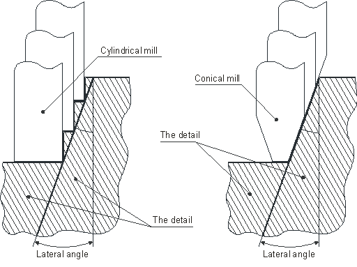

# Lateral Angle

The lateral angle defines the slope of the side surface of a (curve) model being machined in the engraving and pocketing operations. For finish machining (engraving) the system selects an engraving [tool](37.md) that has a conical angle equal to the lateral angle of the model.

If the lateral angle is equal to zero, then the model being machined will represent an extrusion, the basis of which is defined by an area at the top machining level. If the angle is greater than zero, then a linear side surface is added to the top area, with an angle between the geometry and the vertical equal to the lateral angle.

The value of the lateral angle must be more than or equal to zero and less than 90 degrees.

The lateral angle can be defined in the **Parameters** page.
