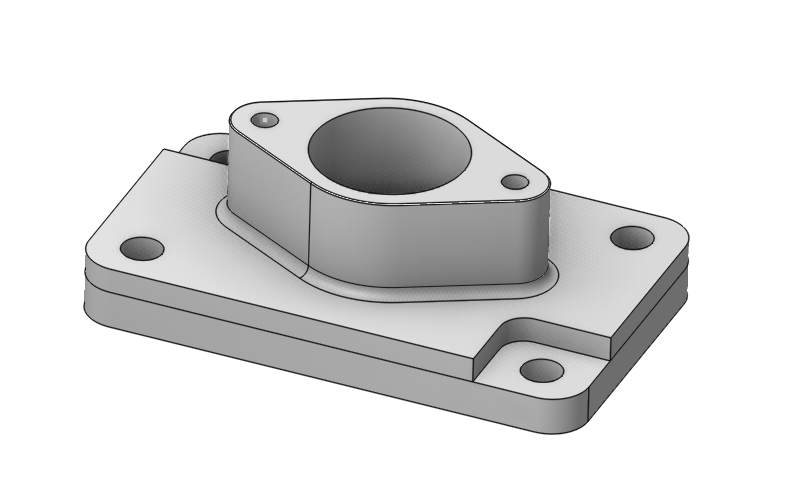
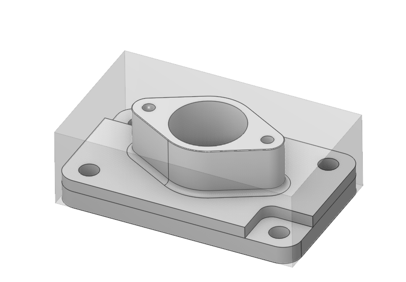

# Workpiece

 

## Application area:

A workpiece model of an operation defines the material to be machined. This means that it defines the initial shape of the workpiece from which the required finished component will be produced.

The roughing operations perform machining of the entire workpiece that lies outside of the model being machined. For the finishing operations the system machines surface areas that lie inside the workpiece area.

The initial shape of the workpiece is specified in the root node of the machining tree. It can be defined as a sum of the following elements:

- A box swept around the part;
- Box around model;
- Box around Job Assignment (only for 25D operations);
- Box around a geometrical model;
- Box by a midpoint and size, by an angular point and size, by two points);
- A cylinder swept around the part. The axis of the cylinder is the X axis.
- The cylinder around Job Assignment (only for 25D operations); calculated
- The cylinder around a geometrical model;
- The cylinder by central point, radius and altitudes;
- A prism extruded from the specified curves,
- A revolution body defined by its generating curves.
- A solid designed in a stand-alone CAD. All the surfaces should represent a bounded space in that case.
- A surface model designed in a stand-alone CAD can be converted into a solid by closing it faces to the specified Z level.

For elements **A cylinder swept around the part** radius of cylinder is calculated by part faces not a part box.

For all cylinders it is possible to be allocated along any of principal axis, to be described around box, a inscribed in box, with an axis in the middle of box or in an origin point of co-ordinates.

Also **Auto**, an definition type of workpiece or model which will be active if in the appropriate list of a model and workpiece it is added nothing has been added.

From the first operation to the last one the workpiece changes its shape as result of its machining by each operation. The intermediate workpiece is transmitted over operations since each operation has the default workpiece as the **Machining result of the previous operation**. By that way the capability to machine only the rest material is realized. If the result of a previous operation should be eliminated by toolpath calculation that always can be done by replacing the default workpiece with the **Workpiece of the previous operation item**.

<strong>Methods for determining the workpiece are indicated here.</strong> [Details](294.md)
