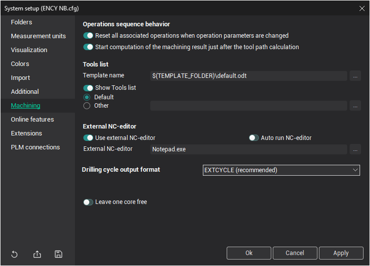

# Machining tab

## Operations Sequence Behavior:

The <strong>Operations sequence behavior</strong> panel allows you to control how operations behave when changing their status to calculated/reset:

- <strong>Reset all associated operations when operation parameters are changed</strong>: Automatically resets the toolpath of operations when input data from previous operations in the process changes.
- <strong>Start computation of the machining result just after the toolpath calculation</strong>: Automatically starts a background simulation immediately after the toolpath is calculated.

## Tools list:

Tools list is used for setting up the parameters of the [tools list generation](13.md).

The tools list can be created in <strong>ODT</strong> and <strong>PDF</strong> format.

When generating a tools list, the system uses templates. Several templates are included in the installation package, from which you can choose the desired one. It is also possible to create new templates in any text editor with ODT format support. For more information, contact the [support desk](811.md).

Once created, document can be saved immediately, or viewed and edited if necessary. To save a tools list without viewing, deselect <strong>Show tools list</strong>.

To view the created tools list file, you can use either the default program for that file type or a user-defined program. To assign a different program as the editing tool, specify the full path to the application file.

## External NC-Editor Panel:

The <strong>`External NC-editor`</strong> panel is used to specify an external application for viewing NC programs. The system recognizes specific command-line parameters:

- <strong>`$NCOUTPUTNAME$`</strong>: The name of the NC program file generated by the postprocessor.
- <strong>`$CD.**ItemName**$`</strong>: Custom data keywords that will be replaced by the appropriate item value.

If the <strong>`Autorun NC-editor`</strong> checkbox is selected, the specified NC-editor will be automatically launched after the NC program is generated by the postprocessor.

## Postprocessor Compatibility Settings:

For compatibility with older versions of postprocessors, the system provides the ability to change the output format of the drilling cycle (when the non-expanded toolpath output method is used for [hole machining operation](10100.md)). The <strong>Drilling cycle format</strong> parameter can have the following values:

- <strong>`EXTCYCLE (recommended)`</strong>: This is the new format that includes an advanced set of parameters, supporting all machining strategies implemented in the system and allowing realistic simulation of tool movements according to the chosen strategy.
- <strong>`CYCLE (for old postprocessors)`</strong>: This old format is required for compatibility with older postprocessors. It does not support some strategies (e.g., hole pocketing or spiral machining) and simulates any strategy as a simple movement to the hole's lower level.

## Performance Options:

<strong>Leave one core free</strong>: Allows one core to remain free during multi-core computing (requires restart).
